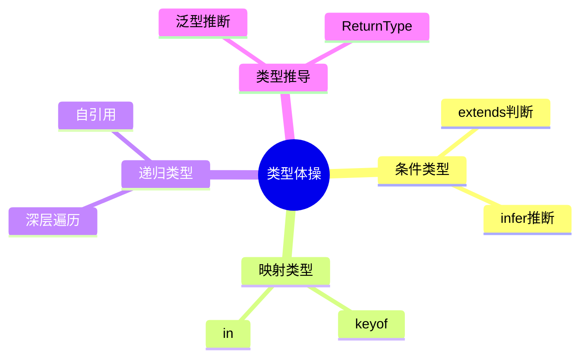
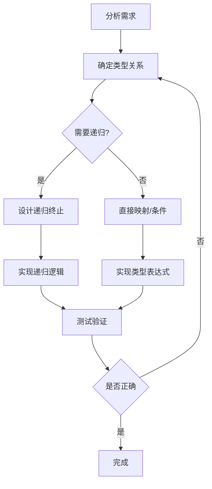

# TypeScript类型体操入门

类型体操是提升TypeScript技能的有效方式。

## 类型体操概念



## 基础练习

### Pick实现

```typescript
type MyPick<T, K extends keyof T> = {
  [P in K]: T[P];
};

// 测试
interface Todo {
  title: string;
  description: string;
  completed: boolean;
}

type TodoPreview = MyPick<Todo, 'title' | 'completed'>;
// { title: string; completed: boolean; }
```

### Readonly实现

```typescript
type MyReadonly<T> = {
  readonly [P in keyof T]: T[P];
};

interface User {
  name: string;
  age: number;
}

type ReadonlyUser = MyReadonly<User>;
// { readonly name: string; readonly age: number; }
```

## 条件类型

### 基本用法

$$
Condition = T \text{ extends } U ? X : Y
$$

```typescript
type IsString<T> = T extends string ? true : false;

type A = IsString<string>; // true
type B = IsString<number>; // false

// 分布式条件类型
type ToArray<T> = T extends any ? T[] : never;
type Result = ToArray<string | number>; // string[] | number[]
```

### Exclude实现

```typescript
type MyExclude<T, U> = T extends U ? never : T;

type Result = MyExclude<'a' | 'b' | 'c', 'a'>;
// 'b' | 'c'
```

## infer推断

```typescript
// 提取函数返回类型
type MyReturnType<T> = T extends (...args: any) => infer R ? R : never;

function greet(): string {
  return 'hello';
}

type GreetReturn = MyReturnType<typeof greet>; // string

// 提取函数参数类型
type MyParameters<T> = T extends (...args: infer P) => any ? P : never;

type GreetParams = MyParameters<typeof greet>; // []
```

infer工作原理：

$$
Infer(T) = T \text{ extends } Pattern \text{ ? } Inferred : never
$$

## 递归类型

### DeepReadonly

```typescript
type DeepReadonly<T> = {
  readonly [P in keyof T]: T[P] extends object 
    ? DeepReadonly<T[P]> 
    : T[P];
};

interface Nested {
  user: {
    name: string;
    profile: {
      avatar: string;
    };
  };
}

type DeepNested = DeepReadonly<Nested>;
// 所有层级都是readonly
```

### Promise解包

```typescript
type UnwrapPromise<T> = T extends Promise<infer U> 
  ? UnwrapPromise<U> 
  : T;

type NestedPromise = Promise<Promise<Promise<string>>>;
type Result = UnwrapPromise<NestedPromise>; // string
```

## 映射类型进阶

### 基于值的映射

```typescript
type ObjectFromEntries<T extends readonly [string, any][]> = {
  [K in T[number] as K[0]]: K[1];
};

const entries = [['a', 1], ['b', 2]] as const;
type Obj = ObjectFromEntries<typeof entries>;
// { a: 1; b: 2; }
```

### 添加修饰符

```typescript
type Mutable<T> = {
  -readonly [P in keyof T]: T[P]; // 移除readonly
};

type Optional<T> = {
  [P in keyof T]?: T[P]; // 添加可选
};

type Required<T> = {
  [P in keyof T]-?: T[P]; // 移除可选
};
```

## 实战挑战

### TupleToObject

```typescript
type TupleToObject<T extends readonly any[]> = {
  [P in T[number]]: P;
};

const tuple = ['tesla', 'model 3', 'model X'] as const;
type Result = TupleToObject<typeof tuple>;
// { tesla: 'tesla'; 'model 3': 'model 3'; 'model X': 'model X' }
```

### First of Array

```typescript
type First<T extends any[]> = T extends [infer F, ...any[]] ? F : never;

type Arr = [1, 2, 3];
type FirstEl = First<Arr>; // 1
type EmptyFirst = First<[]>; // never
```

### Length of Tuple

```typescript
type Length<T extends readonly any[]> = T['length'];

type Arr = [1, 2, 3];
type Len = Length<Arr>; // 3
```

## 类型体操难度分级

| 难度 | 类型 | 示例 |
|------|------|------|
| Easy | 基础映射 | Pick, Readonly |
| Medium | 条件+推断 | Exclude, ReturnType |
| Hard | 递归+复杂 | DeepReadonly, Unwrap |
| Extreme | 深度递归 | JSON类型解析 |

## 类型调试技巧

```typescript
// 类型调试辅助函数
type Expect<T extends true> = T;
type Equal<X, Y> = (<T>() => T extends X ? 1 : 2) extends 
  (<T>() => T extends Y ? 1 : 2) ? true : false;

// 测试类型是否正确
type TestPick = Expect<Equal<MyPick<Todo, 'title'>, { title: string }>>;
```

## 类型体操流程



## 学习资源

- [x] TypeScript官方文档
- [x] type-challenges项目
- [ ] TypeScript Deep Dive
- [ ] 社区类型库

## 最佳实践

- [x] 从简单开始逐步进阶
- [x] 使用类型调试工具
- [x] 理解而非死记硬背
- [ ] 多做练习巩固理解
- [ ] 阅读优秀类型定义

> 类型体操不是炫技，而是提升代码类型安全性的实用技能。掌握它让你的TypeScript代码更健壮。