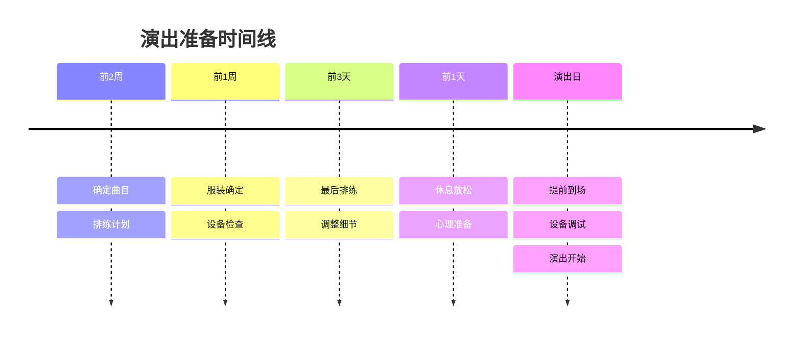

# 乐队演出初体验

人生第一次站在舞台上演出，那种感觉无与伦比。

## 演出准备



## 曲目安排

```typescript
interface PerformanceSong {
  title: string;
  originalArtist: string;
  duration: number;
  difficulty: 'easy' | 'medium' | 'hard';
  position: number; // 演出顺序
}

const setlist: PerformanceSong[] = [
  {
    title: '小幸运',
    originalArtist: '田馥甄',
    duration: 240,
    difficulty: 'medium',
    position: 1,
  },
  {
    title: '夜空中最亮的星',
    originalArtist: '逃跑计划',
    duration: 300,
    difficulty: 'medium',
    position: 2,
  },
  {
    title: '原创歌曲-追光',
    originalArtist: '我们的乐队',
    duration: 180,
    difficulty: 'hard',
    position: 3,
  },
];
```

## 设备清单

演出必备设备检查：

- [x] 吉他（备份吉他准备）
- [x] 贝斯
- [x] 鼓组（现场借用）
- [x] 键盘（自带）
- [x] 音箱/麦克风
- [ ] 备用电池
- [ ] 琴弦备用

## 演出流程


## 紧张度分析

演出前紧张程度随时间变化：

$$
Nervousness(t) = Anxiety \times (1 - \frac{t}{T})
$$

其中 $t$ 是准备时间，$T$ 是总准备时间。

### 心理调节技巧

| 时间点 | 抨态 | 调节方法 |
|--------|------|----------|
| 演出前1周 | 焦虑增加 | 多排练增加信心 |
| 演出前1天 | 高度紧张 | 深呼吸、听音乐 |
| 上场前 | 极度紧张 | 和队友互相鼓励 |
| 演出中 | 紧张消退 | 专注于演奏 |
| 演出后 | 兴奋满足 | 享受成就感 |

## 演出失误与应对

### 常见失误类型

```typescript
interface Mistake {
  type: string;
  cause: string;
  solution: string;
}

const commonMistakes: Mistake[] = [
  {
    type: '忘词',
    cause: '紧张导致记忆混乱',
    solution: '看歌词本、同伴提示',
  },
  {
    type: '节奏乱了',
    cause: '配合不默契',
    solution: '看鼓手、听贝斯',
  },
  {
    type: '设备故障',
    cause: '设备老化或意外',
    solution: '备用设备、冷静应对',
  },
  {
    type: '弹错音符',
    cause: '紧张或手滑',
    solution: '继续演奏、不要停下',
  },
];
```

### 我们的失误处理

```markdown
第二首歌吉他断弦：
- 立即切换到备份吉他
- 键盘增加音量填补
- 继续演奏不中断
- 事后观众说很有职业风范
```

## 演出评分

自我评分矩阵：

$$
Score = 0.3 \times 技术 + 0.25 \times 配合 + 0.2 \times 表现 + 0.15 \times 设备 + 0.1 \times 心态
$$

| 维度 | 评分 | 说明 |
|------|------|------|
| 技术 | 7/10 | 基本稳定，有几处失误 |
| 配合 | 8/10 | 整体默契，互相补位 |
| 表现 | 8/10 | 互动良好，有感染力 |
| 设备 | 7/10 | 断弦事故，但及时处理 |
| 心态 | 9/10 | 紧张但坚持完成 |

总分：$\frac{7.6}{10}$

## 观众反馈

```typescript
interface AudienceFeedback {
  type: 'positive' | 'neutral' | 'negative';
  content: string;
  source: string;
}

const feedbacks: AudienceFeedback[] = [
  { type: 'positive', content: '原创歌曲很好听', source: '朋友' },
  { type: 'positive', content: '配合默契，台风不错', source: '观众' },
  { type: 'neutral', content: '音响效果一般', source: '路人' },
  { type: 'positive', content: '处理断弦很专业', source: '同行' },
];
```

## 经验总结

- [x] 提前准备备用设备
- [x] 熟悉场地音响设备
- [x] 保持队内默契配合
- [ ] 更多心理准备练习
- [ ] 更多舞台表现训练

## 下次演出计划

```markdown
目标：
1. 演出前更充分的心理准备
2. 增加更多原创曲目
3. 提升舞台互动技巧
4. 准备完整的设备方案
```

> 演出的意义不在于完美，而在于站在舞台上的勇气和完成的那一刻。这是音乐梦想的开始。