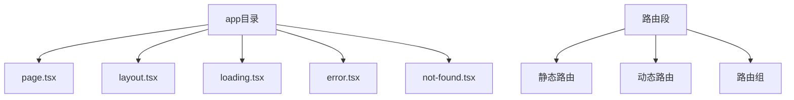
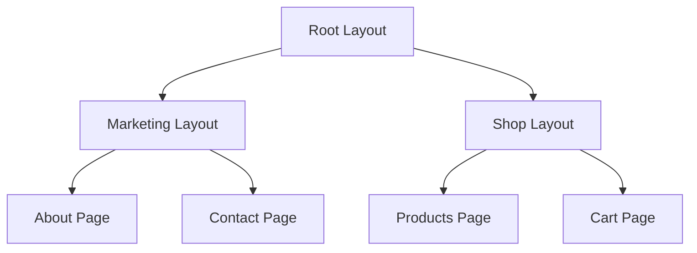

# Next.js路由系统详解

Next.js 15的App Router带来了全新的路由体验。

## 路由架构



## 文件约定

| 文件名 | 用途 | 说明 |
|--------|------|------|
| page.tsx | 页面组件 | 定义路由页面 |
| layout.tsx | 布局组件 | 共享布局 |
| loading.tsx | 加载状态 | Suspense边界 |
| error.tsx | 错误处理 | Error边界 |
| not-found.tsx | 404页面 | 未找到页面 |
| route.ts | API路由 | 后端接口 |

## 动态路由

```typescript
// app/blog/[slug]/page.tsx
interface BlogPageProps {
  params: { slug: string };
  searchParams: { page?: string };
}

export default async function BlogPage({ params, searchParams }: BlogPageProps) {
  const post = await getPost(params.slug);
  
  return (
    <article>
      <h1>{post.title}</h1>
      <p>{post.content}</p>
    </article>
  );
}

// 生成静态页面
export async function generateStaticParams() {
  const posts = await getAllPosts();
  return posts.map((post) => ({ slug: post.slug }));
}
```

## 路由组

```typescript
// app/(marketing)/about/page.tsx
// app/(marketing)/layout.tsx
// app/(shop)/products/page.tsx
// app/(shop)/layout.tsx

// (marketing)和(shop)是路由组，不影响URL
// /about 和 /products 仍然可以直接访问
```

## 布局嵌套



布局嵌套关系：

$$
Page\_Layout = Root\_Layout \circ Parent\_Layout \circ Page
$$

## API路由

```typescript
// app/api/users/route.ts
import { NextRequest, NextResponse } from 'next/server';

export async function GET(request: NextRequest) {
  const users = await getUsers();
  
  return NextResponse.json(users);
}

export async function POST(request: NextRequest) {
  const body = await request.json();
  const user = await createUser(body);
  
  return NextResponse.json(user, { status: 201 });
}

// app/api/users/[id]/route.ts
export async function DELETE(
  request: NextRequest,
  { params }: { params: { id: string } }
) {
  await deleteUser(params.id);
  
  return new NextResponse(null, { status: 204 });
}
```

## 中间件

```typescript
// middleware.ts
import { NextRequest, NextResponse } from 'next/server';

export function middleware(request: NextRequest) {
  const token = request.cookies.get('token');
  
  // 检查认证
  if (!token && request.nextUrl.pathname.startsWith('/dashboard')) {
    return NextResponse.redirect(new URL('/login', request.url));
  }
  
  return NextResponse.next();
}

export const config = {
  matcher: [
    '/dashboard/:path*',
    '/admin/:path*',
  ],
};
```

## 路由缓存策略

```typescript
// 静态路由 - 构建时生成
export const dynamic = 'force-static';

// 动态路由 - 请求时渲染
export const dynamic = 'force-dynamic';

// ISR - 重新验证
export const revalidate = 3600; // 每小时重新验证

// 细粒度控制
export const fetchCache = 'auto'; // 'force-no-store' | 'only-no-store'
```

缓存计算：

$$
Cache\_Strategy = Static + Dynamic + ISR + Revalidation
$$

## 导航组件

```typescript
import { Link, useRouter, usePathname } from 'next/navigation';

// Link组件
function Navigation() {
  return (
    <nav>
      <Link href="/about">关于</Link>
      <Link href="/blog">博客</Link>
      {/* prefetch默认开启 */}
      <Link href="/dashboard" prefetch={false}>
        Dashboard
      </Link>
    </nav>
  );
}

// 编程式导航
function SearchForm() {
  const router = useRouter();
  const pathname = usePathname();
  
  const handleSubmit = (query: string) => {
    router.push(`/search?q=${query}`);
    // 或替换当前路由
    router.replace(`/search?q=${query}`);
  };
  
  return <form onSubmit={handleSubmit}>...</form>;
}
```

## 流式渲染

```typescript
// app/blog/page.tsx
import { Suspense } from 'react';

export default function BlogPage() {
  return (
    <div>
      <h1>博客</h1>
      <Suspense fallback={<PostsSkeleton />}>
        <PostsList />
      </Suspense>
    </div>
  );
}

// 异步组件
async function PostsList() {
  const posts = await getPosts(); // 自动流式传输
  return posts.map((post) => <PostCard key={post.id} post={post} />);
}
```

## 路由性能对比

| 路由类型 | 渲染时机 | 缓存 | 适用场景 |
|----------|----------|------|----------|
| 静态路由 | 构建时 | 永久 | 内容固定 |
| 动态路由 | 请求时 | 无 | 实时数据 |
| ISR | 构建时+定时 | 可控 | 定期更新 |
| 流式渲染 | 请求时 | 无 | 大数据量 |

## 最佳实践

- [x] 合理使用布局嵌套
- [x] 利用Suspense流式渲染
- [x] 配置适当的缓存策略
- [ ] 使用路由组组织结构
- [ ] 实现错误边界处理

> App Router让路由变得更加直观和强大，理解其原理有助于构建更好的应用。