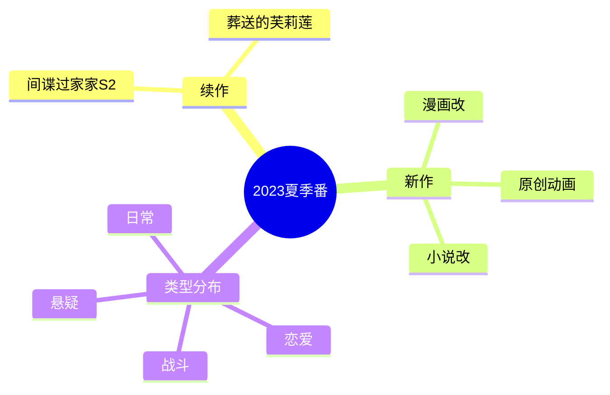
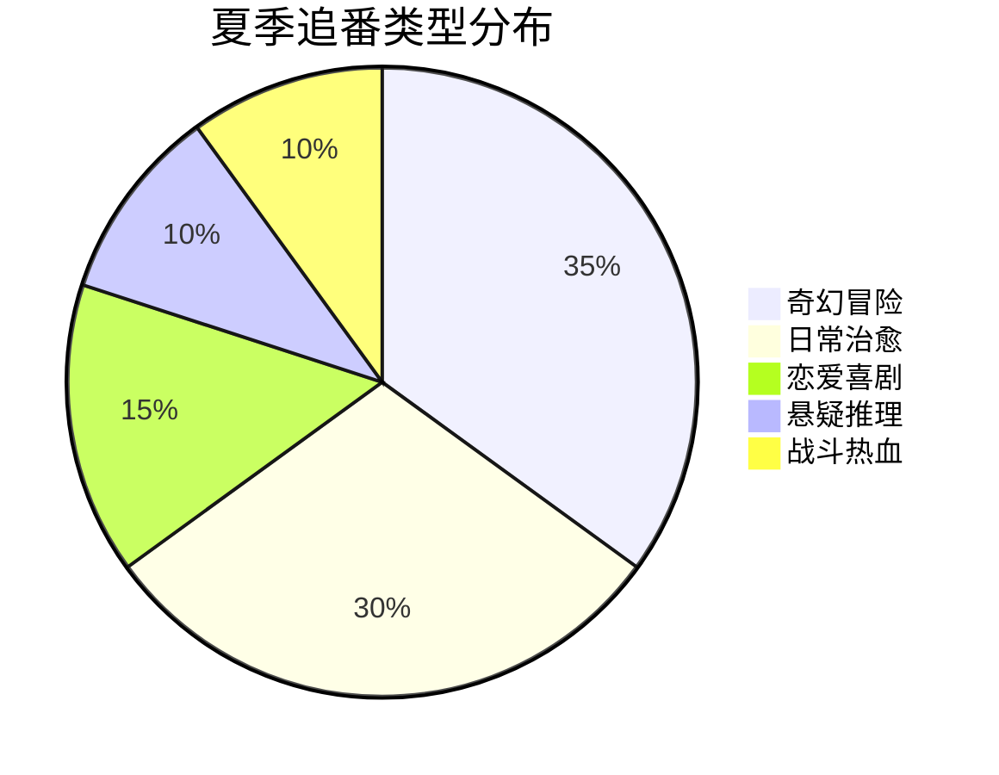
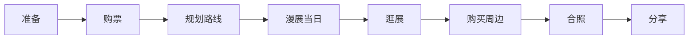

# 夏日番剧追番记

夏天最适合窝在空调房里看番。

## 本季追番清单



## 番剧评分

| 番剧 | 类型 | 评分 | 状态 |
|------|------|------|------|
| 葬送的芙莉莲 | 奇幻 | 9.8/10 | 追番中 |
| 间谍过家家S2 | 喜剧 | 8.8/10 | 追番中 |
| 药屋少女的呢喃 | 古风推理 | 8.5/10 | 追番中 |
| 我推的孩子 | 偶像 | 9.2/10 | 已完结 |

## 观番数据分析

```typescript
interface AnimeStats {
  title: string;
  episodesWatched: number;
  totalEpisodes: number;
  averageRating: number;
  weeklyTimeSpent: number; // 分钟
}

const summerStats: AnimeStats[] = [
  {
    title: '葬送的芙莉莲',
    episodesWatched: 12,
    totalEpisodes: 28,
    averageRating: 9.8,
    weeklyTimeSpent: 48,
  },
  {
    title: '间谍过家家S2',
    episodesWatched: 10,
    totalEpisodes: 12,
    averageRating: 8.8,
    weeklyTimeSpent: 40,
  },
];
```

## 夏季观番特色

夏日观番的最佳体验公式：

$$
Summer\_Anime\_Experience = AC \times Snacks \times Blanket \times Good\_Anime
$$

### 最佳观番环境

- [x] 空调温度25度
- [x] 凉爽的饮料（冰可乐/冰茶）
- [x] 夏日限定零食
- [ ] 静音环境
- [ ] 舒适的座位

## 经典夏日番推荐

### 治愈系

```markdown
1. 《夏目友人帐》 - 温暖治愈，适合夏日午后
2. 《轻音少女》 - 清新的校园生活
3. 《未闻花名》 - 夏天与回忆
```

### 活力系

```markdown
1. 《Free!》 - 游泳与夏天完美契合
2. 《吹响！上低音号》 - 热血与青春
3. 《摇曳露营》 - 户外与自然
```

## 番剧类型偏好分析



## 名台词收藏

```typescript
interface AnimeQuote {
  anime: string;
  character: string;
  quote: string;
  context: string;
}

const summerQuotes: AnimeQuote[] = [
  {
    anime: '葬送的芙莉莲',
    character: '芙莉莲',
    quote: '人类的一生对于精灵来说只是一瞬间。',
    context: '回忆辛美尔',
  },
  {
    anime: '间谍过家家',
    character: '阿尼亚',
    quote: 'wakuwaku!',
    context: '每次兴奋时',
  },
];
```

## 夏日番剧活动

### 参加漫展



漫展清单：

- [x] 购买门票
- [x] 准备相机
- [ ] 规划要逛的区域
- [ ] 带上周边预算

## 周边收藏

| 类型 | 数量 | 预算 |
|------|------|------|
| 手办 | 2 | 主要支出 |
| 画集 | 3 | 中等支出 |
| 周边 | 5 | 小额支出 |

## 下季期待

- [ ] 秋季新番预览
- [ ] 续作跟踪
- [ ] 新作发现

## 追番心得

追番不只是看动画，更是一种生活方式：

$$
Anime\_Life = Enjoyment + Community + Creativity + Memories
$$

> 夏天虽然炎热，但番剧带来的清凉让这个季节变得特别美好。每一季番剧都是一段珍贵的回忆。