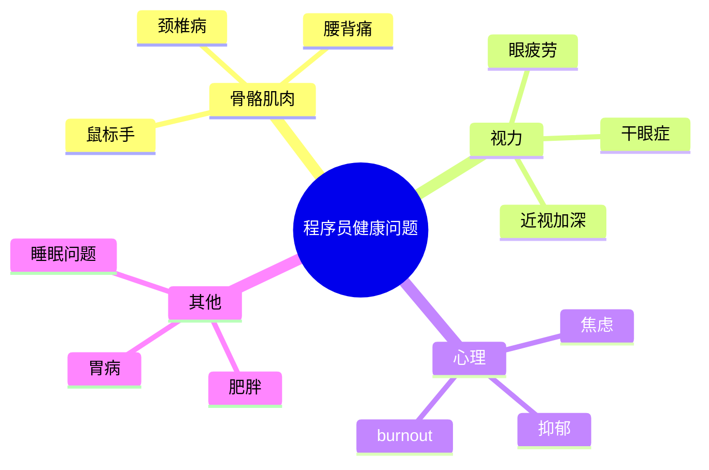
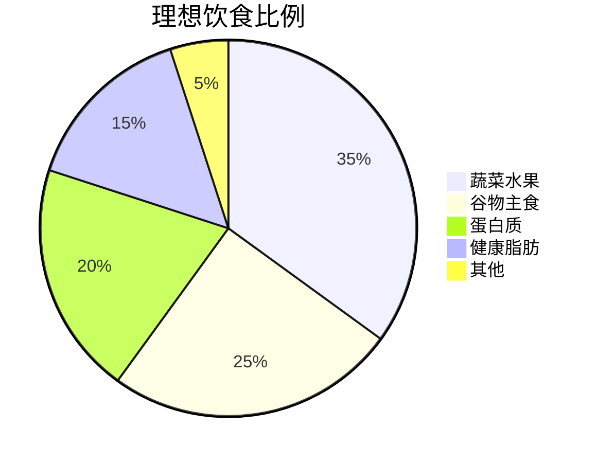
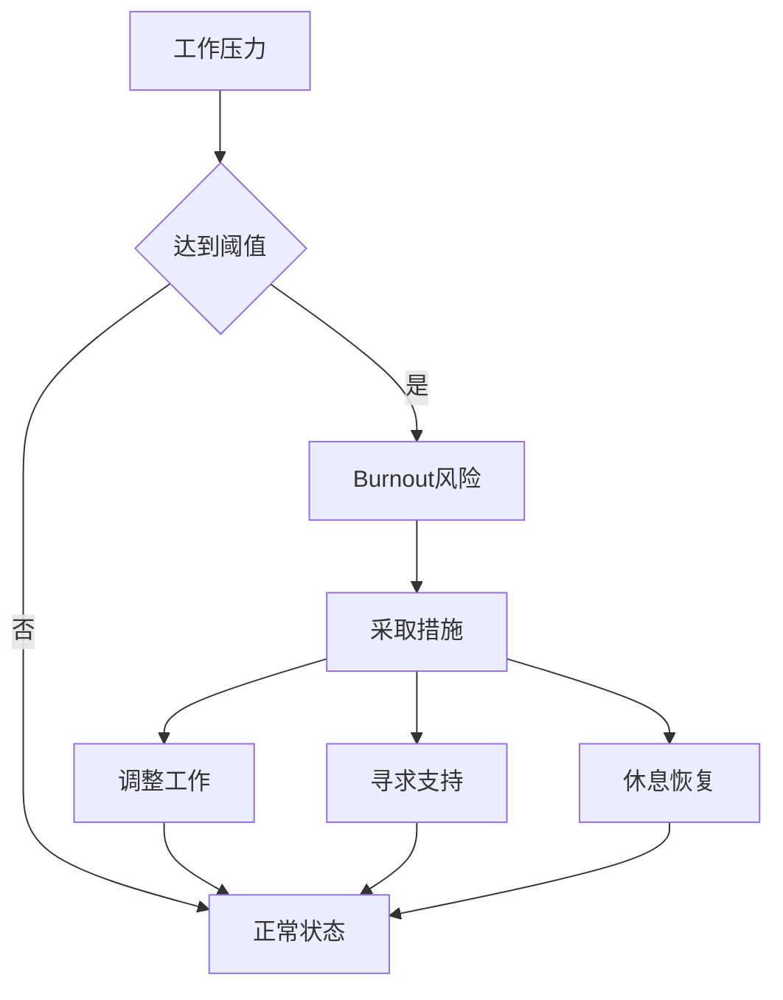

# 程序员的健康生活指南

长时间坐在电脑前，健康问题不容忽视。

## 常见健康问题



## 坐姿标准

正确的坐姿公式：

$$
Posture = Chair\_Height + Monitor\_Position + Back\_Support + Feet\_Position
$$

| 参数 | 标准 | 检查方法 |
|------|------|----------|
| 眼睛与屏幕距离 | 50-70cm | 一臂距离 |
| 屏幕高度 | 眼睛水平线略下 | 避免低头 |
| 坐椅高度 | 大腿与地面平行 | 膝盖90度 |
| 背部支撑 | 腰部有支撑 | 使用腰垫 |
| 脚的位置 | 平放地面 | 使用脚踏 |

## 键盘鼠标位置

```typescript
interface ErgonomicSetup {
  keyboard: {
    position: 'inline' | 'angled';
    height: 'desk_level' | 'below_desk';
    wristSupport: boolean;
  };
  mouse: {
    position: 'right' | 'left' | 'center';
    type: 'standard' | 'vertical' | 'trackball';
  };
}

const recommendedSetup: ErgonomicSetup = {
  keyboard: {
    position: 'inline',
    height: 'desk_level',
    wristSupport: true,
  },
  mouse: {
    position: 'right',
    type: 'vertical',
  },
};
```

## 眼睛保护

### 20-20-20法则

每20分钟，看20英尺外，20秒。

$$
Eye\_Rest = \frac{Work\_Time}{20min} \times 20sec
$$

### 屏幕设置

```markdown
- [ ] 调整亮度适中（不刺眼）
- [ ] 使用护眼模式/降低蓝光
- [ ] 定期清洁屏幕
- [ ] 保持适当距离
- [ ] 使用防眩光涂层
```

## 运动建议

### 每日运动量

$$
Weekly\_Exercise = \sum_{i=1}^{7} (Steps_i + Cardio_i + Strength_i)
$$

### 工作间隙运动

```typescript
interface BreakExercise {
  name: string;
  duration: number; // 分钟
  frequency: string;
}

const exercises: BreakExercise[] = [
  { name: '颈部转动', duration: 1, frequency: '每小时' },
  { name: '手腕伸展', duration: 1, frequency: '每30分钟' },
  { name: '站立休息', duration: 5, frequency: '每1小时' },
  { name: '眼保健操', duration: 2, frequency: '每2小时' },
];
```

### 推荐运动项目

| 类型 | 项目 | 频率 | 好处 |
|------|------|------|------|
| 有氧 | 慢跑/游泳 | 每周3次 |心肺健康 |
| 力量 | 深蹲/俯卧撑 | 每周2次 |肌肉力量 |
| 柔韧 | 瑜伽/拉伸 | 每天 |缓解紧张 |
| 核心 | 平板支撑 | 每天 |腰背保护 |

## 饮食建议



### 工作饮食原则

- [x] 多喝水，少喝含糖饮料
- [x] 定时进食，避免跳过
- [x] 均衡营养，多吃蔬果
- [ ] 减少咖啡摄入量
- [ ] 避免夜宵和过度零食

## 睡眠管理

睡眠质量公式：

$$
Sleep\_Quality = Duration \times Consistency \times Environment
$$

### 睡眠建议

| 项目 | 建议 | 原因 |
|------|------|------|
| 睡眠时间 | 7-8小时 | 身体恢复 |
| 睡眠规律 | 固定时间 | 生物钟 |
| 睡前习惯 | 避免屏幕 | 减少蓝光 |
| 睡眠环境 | 黑暗安静 | 提高质量 |

## 心理健康

### 压力管理

```typescript
interface StressManagement {
  technique: string;
  description: string;
  recommendedTime: string;
}

const techniques: StressManagement[] = [
  {
    technique: '深呼吸',
    description: '4-7-8呼吸法',
    recommendedTime: '感到紧张时',
  },
  {
    technique: '冥想',
    description: '专注呼吸10分钟',
    recommendedTime: '每天早晚',
  },
  {
    technique: '运动',
    description: '中等强度运动30分钟',
    recommendedTime: '每周3次',
  },
];
```

### Burnout预防



## 健康监测

- [x] 定期体检（每年一次）
- [x] 监测体重变化
- [x] 关注睡眠质量
- [ ] 记录运动数据
- [ ] 注意异常症状

## 日常健康检查清单

```markdown
## 每日检查

- [ ] 眼睛是否疲劳
- [ ] 颈背是否酸痛
- [ ] 手腕是否不适
- [ ] 是否喝水足够
- [ ] 是否有运动
- [ ] 睡眠是否充足
```

> 健康是1，其他都是0。没有健康，一切成就都失去意义。照顾好自己的身体，是对自己最好的投资。