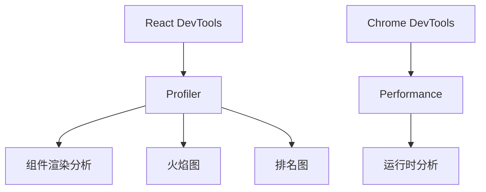
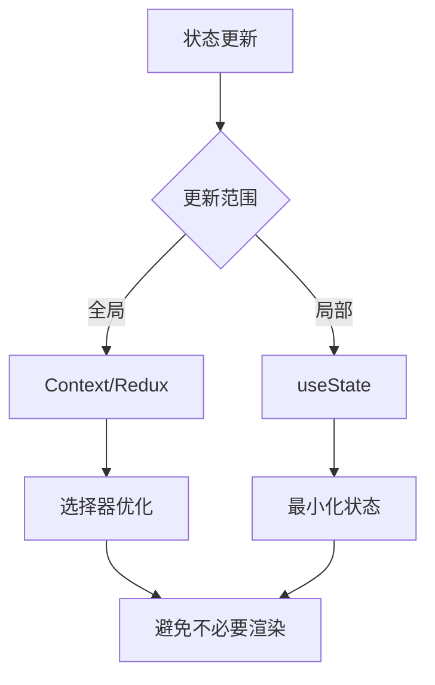

# React性能优化手册

性能优化是React应用开发的重要环节。

## 性能分析工具



## 渲染优化

### React.memo

```typescript
import { memo } from 'react';

interface UserCardProps {
  name: string;
  avatar: string;
  onClick?: () => void;
}

const UserCard = memo(function UserCard({ name, avatar, onClick }: UserCardProps) {
  return (
    <div onClick={onClick}>
      
      <span>{name}</span>
    </div>
  );
});

// 自定义比较函数
const UserCardCustom = memo(
  function UserCard({ name, avatar }: UserCardProps) {
    return <div>{name}</div>;
  },
  (prevProps, nextProps) => {
    return prevProps.name === nextProps.name && 
           prevProps.avatar === nextProps.avatar;
  }
);
```

### useMemo和useCallback

```typescript
import { useMemo, useCallback } from 'react';

function UserProfile({ user, onUpdate }) {
  // 缓存计算结果
  const formattedName = useMemo(() => {
    return `${user.firstName} ${user.lastName}`;
  }, [user.firstName, user.lastName]);

  // 缓存函数引用
  const handleClick = useCallback(() => {
    onUpdate(user.id);
  }, [user.id, onUpdate]);

  return (
    <div>
      <span>{formattedName}</span>
      <button onClick={handleClick}>Update</button>
    </div>
  );
}
```

## 虚拟列表

长列表渲染性能公式：

$$
Render\_Cost = N_{visible} \times Component\_Cost
$$

```typescript
import { useState, useRef } from 'react';

interface VirtualListProps<T> {
  items: T[];
  itemHeight: number;
  renderItem: (item: T, index: number) => React.ReactNode;
}

function VirtualList<T>({ items, itemHeight, renderItem }: VirtualListProps<T>) {
  const [scrollTop, setScrollTop] = useState(0);
  const containerRef = useRef<HTMLDivElement>(null);
  
  const containerHeight = 600;
  const startIndex = Math.floor(scrollTop / itemHeight);
  const endIndex = Math.min(
    startIndex + Math.ceil(containerHeight / itemHeight) + 1,
    items.length
  );
  
  const visibleItems = items.slice(startIndex, endIndex);
  const offsetY = startIndex * itemHeight;

  return (
    <div
      ref={containerRef}
      style={{ height: containerHeight, overflow: 'auto' }}
      onScroll={(e) => setScrollTop(e.currentTarget.scrollTop)}
    >
      <div style={{ height: items.length * itemHeight, position: 'relative' }}>
        <div style={{ transform: `translateY(${offsetY}px)` }}>
          {visibleItems.map((item, i) => renderItem(item, startIndex + i))}
        </div>
      </div>
    </div>
  );
}
```

## 懒加载

```typescript
import { lazy, Suspense } from 'react';

// 懒加载组件
const HeavyComponent = lazy(() => import('./HeavyComponent'));

function App() {
  return (
    <Suspense fallback={<div>Loading...</div>}>
      <HeavyComponent />
    </Suspense>
  );
}

// 条件渲染懒加载
function ConditionalLoad({ showHeavy }) {
  return showHeavy ? (
    <Suspense fallback={<Loading />}>
      <HeavyComponent />
    </Suspense>
  ) : null;
}
```

## 状态优化



### 状态下沉

```typescript
// 不好的做法 - 状态在父组件
function Parent() {
  const [childState, setChildState] = useState(0);
  return (
    <div>
      <Sibling /> {/* 也会重新渲染 */}
      <Child state={childState} setState={setChildState} />
    </div>
  );
}

// 好的做法 - 状态在子组件
function Parent() {
  return (
    <div>
      <Sibling />
      <Child /> {/* 自己管理状态 */}
    </div>
  );
}

function Child() {
  const [state, setState] = useState(0);
  // ...
}
```

## 代码分割

### 路径级分割

```typescript
import { lazy, Suspense } from 'react';

const routes = {
  home: lazy(() => import('./pages/Home')),
  about: lazy(() => import('./pages/About')),
  dashboard: lazy(() => import('./pages/Dashboard')),
};

function Router() {
  return (
    <Suspense fallback={<PageLoader />}>
      <Routes>
        <Route path="/" element={<routes.home />} />
        <Route path="/about" element={<routes.about />} />
        <Route path="/dashboard" element={<routes.dashboard />} />
      </Routes>
    </Suspense>
  );
}
```

## 图片优化

```typescript
// 懒加载图片
function LazyImage({ src, alt }) {
  const [loaded, setLoaded] = useState(false);
  const imgRef = useRef<HTMLImageElement>(null);

  useEffect(() => {
    if (!imgRef.current) return;
    
    const observer = new IntersectionObserver((entries) => {
      if (entries[0].isIntersecting) {
        imgRef.current!.src = src;
        observer.disconnect();
      }
    });

    observer.observe(imgRef.current);
    return () => observer.disconnect();
  }, [src]);

  return (
     setLoaded(true)}
      style={{ opacity: loaded ? 1 : 0.5 }}
    />
  );
}
```

## 性能指标

$$
Performance\_Score = \sum_{i=1}^{n} Metric_i \times Weight_i
$$

| 指标 | 目标值 | 权重 |
|------|--------|------|
| FCP (首次内容绘制) | < 1.8s | 10% |
| LCP (最大内容绘制) | < 2.5s | 25% |
| TBT (总阻塞时间) | < 200ms | 30% |
| CLS (累积布局偏移) | < 0.1 | 25% |
| SI (速度指数) | < 3.4s | 10% |

## 最佳实践清单

- [x] 使用React DevTools分析
- [x] 合理使用memo/useMemo/useCallback
- [x] 虚拟列表处理长数据
- [x] 懒加载非关键组件
- [x] 状态下沉和拆分
- [ ] 图片懒加载和压缩
- [ ] 代码分割策略

> 性能优化不是一蹴而就的，需要持续关注和改进。记住：可测量，才可优化。