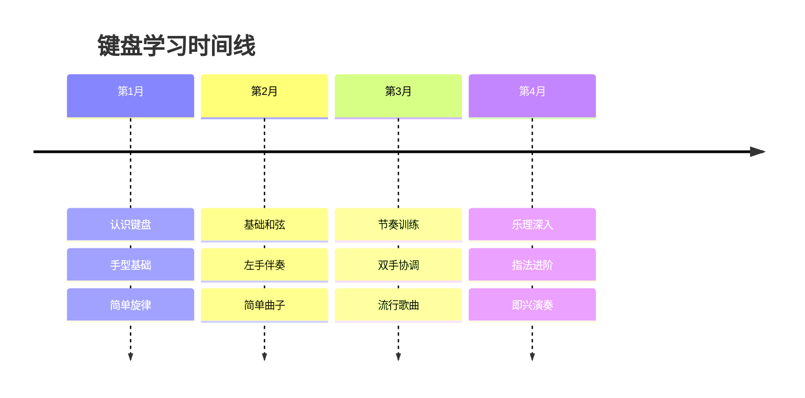
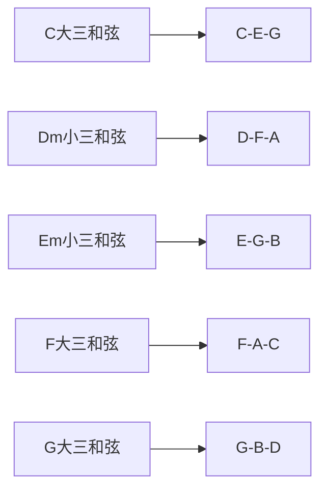
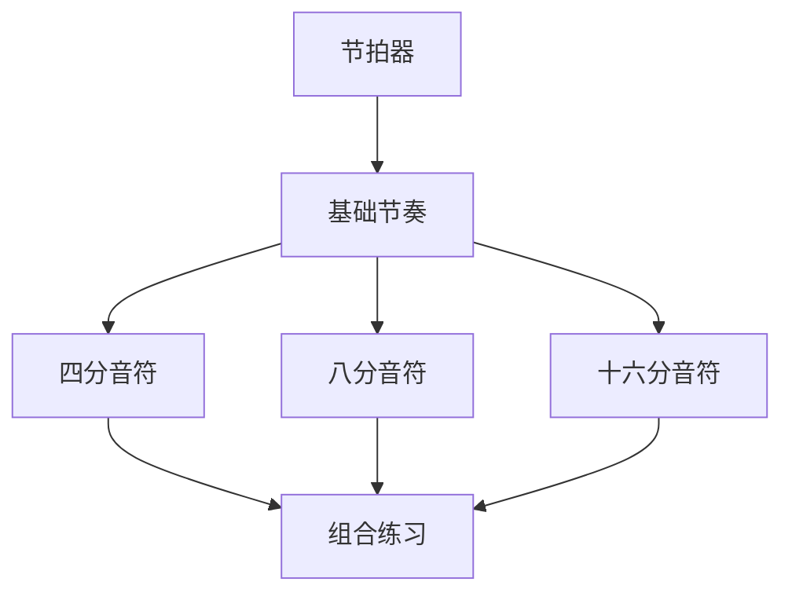

# 键盘乐器入门指南

键盘乐器是最适合初学者的入门乐器。

## 学习路线



## 键盘布局

标准88键钢琴布局：

$$
Range = A_0 (27.5Hz) \to C_8 (4186Hz)
$$

```typescript
interface KeyboardLayout {
  totalKeys: number;
  whiteKeys: number;
  blackKeys: number;
  octaves: number;
}

const piano: KeyboardLayout = {
  totalKeys: 88,
  whiteKeys: 52,
  blackKeys: 36,
  octaves: 7.25,
};

// 一个八度的键数
const octaveKeys = 7 + 5; // 7白键 + 5黑键
```

## 指法编号

| 编号 | 手指 | 左手 | 右手 |
|------|------|------|------|
| 1 | 大拇指 | 最左 | 最左 |
| 2 | 食指 | | |
| 3 | 中指 | | |
| 4 | 无名指 | | |
| 5 | 小拇指 | 最右 | 最右 |

## 基础和弦

### C大调主要和弦



和弦构成公式：

$$
Major = Root + M3 + P5
$$

$$
Minor = Root + m3 + P5
$$

其中 $M3 = 4个半音$, $m3 = 3个半音$, $P5 = 7个半音$

## 练习曲目进度

### 第一月曲目

| 曲目 | 技术点 | 难度 |
|------|--------|------|
| 《小星星》 | 单手旋律 | 入门 |
| 《两只老虎》 | 简单节奏 | 入门 |
| 《欢乐颂》 | 双手配合 | 简单 |

### 第二月曲目

```typescript
interface Song {
  title: string;
  chords: string[];
  difficulty: 'easy' | 'medium' | 'hard';
  techniques: string[];
}

const month2Songs: Song[] = [
  {
    title: '童话',
    chords: ['C', 'G', 'Am', 'F'],
    difficulty: 'easy',
    techniques: ['左手和弦', '右手旋律'],
  },
  {
    title: '月亮代表我的心',
    chords: ['C', 'Em', 'F', 'G', 'Am'],
    difficulty: 'medium',
    techniques: ['分解和弦', '延音'],
  },
];
```

## 技术要点

### 手型要求

正确的手型是基础：

$$
Proper\_Hand = Curved\_Fingers + Relaxed\_Wrist + Stable\_Arm
$$

- [x] 手指自然弯曲
- [x] 手腕放松不僵硬
- [x] 指尖触键
- [ ] 大拇指侧面触键
- [ ] 保持整体稳定

### 节奏训练



## 乐理基础

### 音程关系

| 音程 | 半音数 | 示例 |
|------|--------|------|
| 小二度 | 1 | E-F |
| 大二度 | 2 | C-D |
| 小三度 | 3 | E-G |
| 大三度 | 4 | C-E |
| 纯四度 | 5 | C-F |
| 纯五度 | 7 | C-G |
| 小六度 | 8 | E-C |
| 大六度 | 9 | C-A |
| 小七度 | 10 | D-C |
| 大七度 | 11 | C-B |
| 纯八度 | 12 | C-C |

### 大调音阶构成

$$
Major\_Scale = W-W-H-W-W-W-H
$$

其中 $W = 全音(2半音)$, $H = 半音(1半音)$

## 练习计划

```markdown
## 每日练习 (30分钟)

### 热身 (5分钟)
- 手指伸展
- 简单音阶练习

### 技术练习 (10分钟)
- 指法练习
- 和弦转换

### 曲目练习 (15分钟)
- 复习旧曲目
- 学习新曲目
```

## 学习资源

| 类型 | 名称 | 评价 |
|------|------|------|
| App | Simply Piano | 互动反馈好 |
| App | Flowkey | 曲目丰富 |
| 书籍 | 《钢琴自学三月通》 | 系统全面 |
| 视频 | B站教程 | 适合入门 |

## 常见问题

- [x] 指法不标准 → 多看示范视频
- [x] 左右手配合难 → 先分后合
- [x] 节奏不稳定 → 使用节拍器
- [ ] 手型变形 → 对镜练习
- [ ] 进步缓慢 → 降低难度

> 学习键盘乐器是一段美妙的旅程，重要的是保持耐心和持续练习。