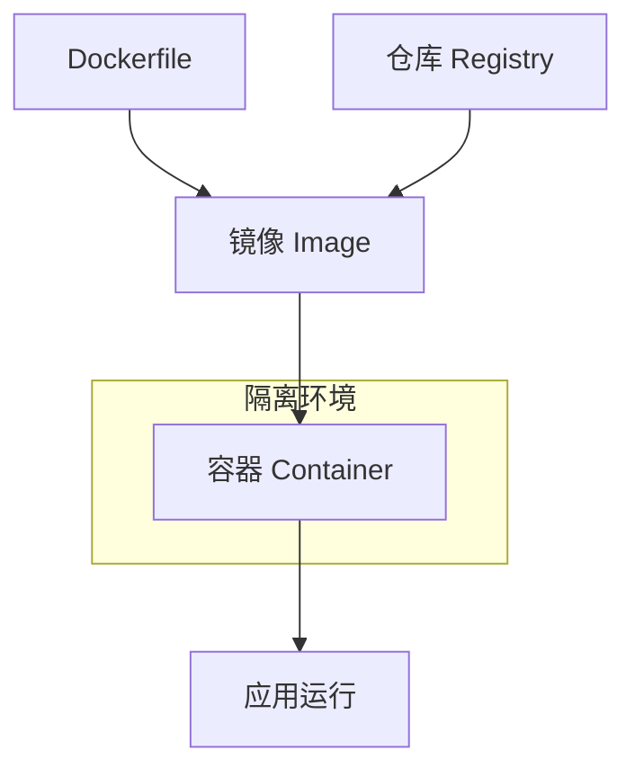
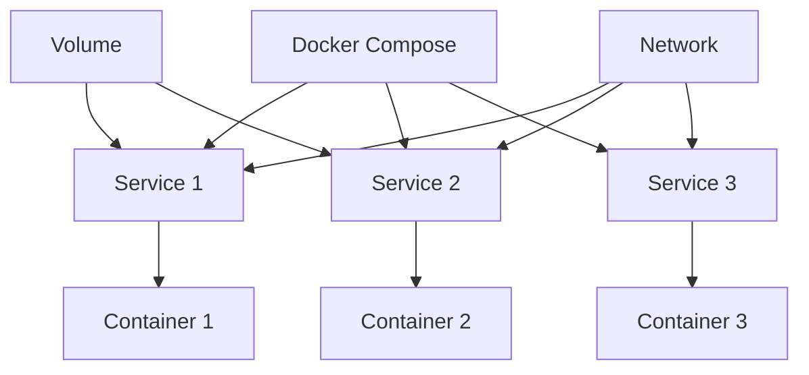
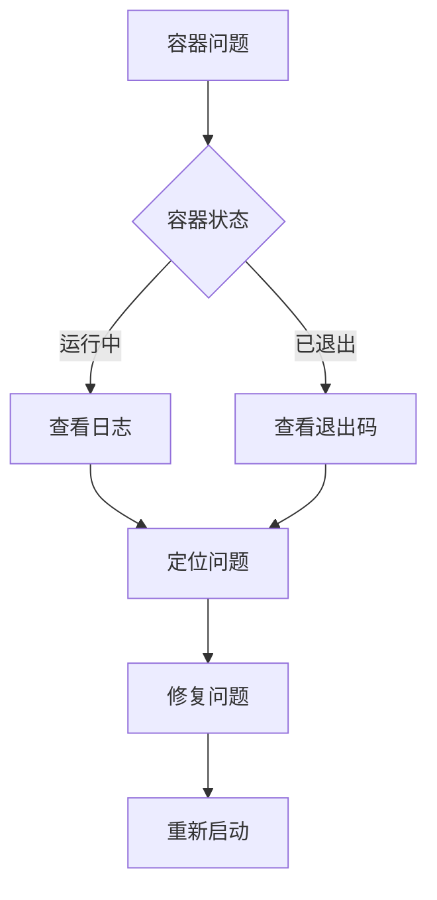

# Docker容器化实战指南

Docker改变了我们开发和部署应用的方式。

## 核心概念



## Dockerfile编写

```dockerfile
# 基础镜像
FROM node:20-alpine

# 设置工作目录
WORKDIR /app

# 复制依赖文件
COPY package*.json ./

# 安装依赖
RUN npm ci --only=production

# 复制源代码
COPY . .

# 构建应用
RUN npm run build

# 暴露端口
EXPOSE 3000

# 启动命令
CMD ["node", "dist/server.js"]
```

## 多阶段构建

```dockerfile
# 构建阶段
FROM node:20-alpine AS builder
WORKDIR /app
COPY package*.json ./
RUN npm ci
COPY . .
RUN npm run build

# 运行阶段
FROM node:20-alpine AS runner
WORKDIR /app
COPY --from=builder /app/dist ./dist
COPY --from=builder /app/node_modules ./node_modules
EXPOSE 3000
CMD ["node", "dist/server.js"]
```

镜像大小对比：

$$
Size_{multi-stage} = Size_{runtime} < Size_{single-stage} = Size_{build} + Size_{runtime}
$$

## 常用命令

```bash
# 构建镜像
docker build -t myapp:v1.0 .

# 运行容器
docker run -d -p 3000:3000 --name myapp myapp:v1.0

# 查看容器
docker ps
docker ps -a

# 查看日志
docker logs myapp
docker logs -f myapp

# 进入容器
docker exec -it myapp sh

# 停止容器
docker stop myapp

# 删除容器
docker rm myapp

# 删除镜像
docker rmi myapp:v1.0
```

## Docker Compose

```yaml
version: '3.8'

services:
  app:
    build: .
    ports:
      - "3000:3000"
    environment:
      - NODE_ENV=production
      - DATABASE_URL=postgres://user:pass@db:5432/mydb
    depends_on:
      - db
      - redis
    networks:
      - app-network

  db:
    image: postgres:15-alpine
    volumes:
      - postgres-data:/var/lib/postgresql/data
    environment:
      - POSTGRES_USER=user
      - POSTGRES_PASSWORD=pass
      - POSTGRES_DB=mydb
    networks:
      - app-network

  redis:
    image: redis:7-alpine
    networks:
      - app-network

volumes:
  postgres-data:

networks:
  app-network:
    driver: bridge
```

## 容器编排



## 网络模式

| 模式 | 描述 | 适用场景 |
|------|------|----------|
| bridge | 默认模式，独立网络 | 一般应用 |
| host | 使用宿主机网络 | 高性能网络 |
| none | 无网络 | 安全隔离 |
| container | 共享容器网络 | 服务依赖 |

## 数据持久化

```typescript
interface VolumeConfig {
  type: 'bind' | 'volume' | 'tmpfs';
  source: string;
  target: string;
  readonly?: boolean;
}

const volumeExamples: VolumeConfig[] = [
  {
    type: 'bind',
    source: './data',
    target: '/app/data',
  },
  {
    type: 'volume',
    source: 'postgres-data',
    target: '/var/lib/postgresql/data',
  },
];
```

## 资源限制

```bash
# 内存限制
docker run -d --memory="512m" --memory-swap="1g" myapp

# CPU限制
docker run -d --cpus="1.5" myapp

# 完整限制
docker run -d \
  --memory="512m" \
  --cpus="1.5" \
  --restart=unless-stopped \
  --health-cmd="curl -f http://localhost:3000/health" \
  --health-interval=30s \
  --health-retries=3 \
  myapp
```

资源计算：

$$
Container\_Resources = \min(Limits, Host\_Resources)
$$

## 最佳实践

### 镜像优化

- [x] 使用Alpine基础镜像
- [x] 多阶段构建
- [x] 合并RUN命令
- [ ] 利用构建缓存
- [ ] 安全扫描镜像

```dockerfile
# 合并RUN命令减少层数
RUN apt-get update \
    && apt-get install -y curl \
    && rm -rf /var/lib/apt/lists/*
```

### 安全建议

```markdown
1. 不要以root用户运行
2. 使用COPY而非ADD
3. 设置健康检查
4. 定期更新基础镜像
5. 扫描镜像漏洞
```

## 常见问题排查



| 退出码 | 含义 |
|--------|------|
| 0 | 正常退出 |
| 1 | 应用错误 |
| 137 | 被SIGKILL杀死（OOM） |
| 139 | 段错误 |
| 143 | 被SIGTERM停止 |

> Docker让"一次构建，到处运行"成为现实，极大简化了应用的部署流程。