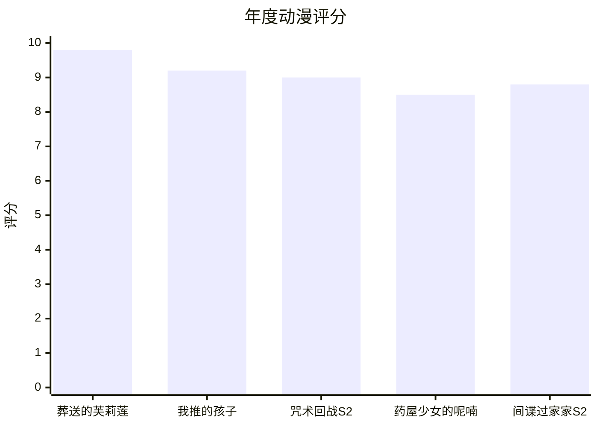
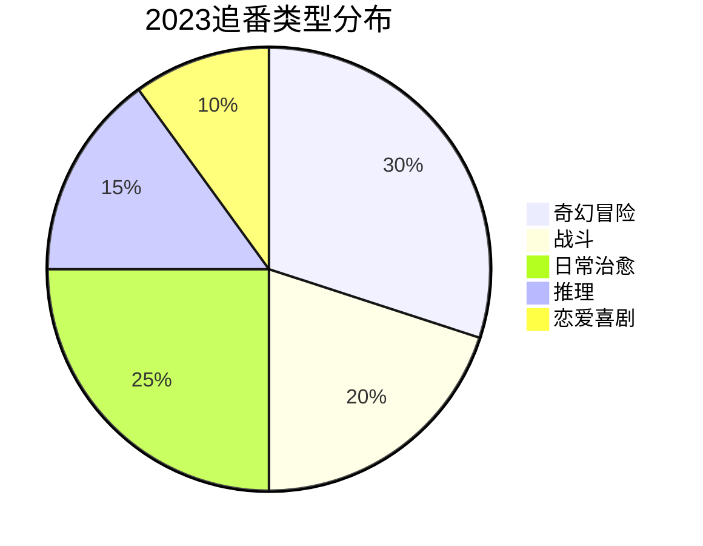

# 2023年度动漫盘点

2023年是动漫大年，诞生了许多优秀作品。

## 年度TOP5



## 详细评价

### 1. 葬送的芙莉莲

评分：$\frac{9.8}{10}$

| 方面 | 评价 |
|------|------|
| 剧情 | 非常出色 |
| 画面 | 精美绝伦 |
| 音乐 | 动人 |
| 角色 | 立体 |

> 时间对精灵来说只是过客，但对人类却是生命。

### 2. 我推的孩子

评分：$\frac{9.2}{10}$

```typescript
interface AnimeReview {
  title: string;
  studio: string;
  highlights: string[];
  flaws: string[];
}

const oshiNoKo: AnimeReview = {
  title: '我推的孩子',
  studio: 'A-1 Pictures',
  highlights: [
    '第一集电影级制作',
    '剧情反转精彩',
    '对偶像行业深刻描绘',
  ],
  flaws: [
    '后期节奏稍快',
  ],
};
```

### 3. 咒术回战 第二季

评分：$\frac{9.0}{10}$

涉谷事变篇的战斗作画堪称年度最佳。

### 4. 药屋少女的呢喃

评分：$\frac{8.5}{10}$

古风推理，女主猫猫的聪明才智令人印象深刻。

### 5. 间谍过家家 第二季

评分：$\frac{8.8}{10}$

温馨治愈的家庭喜剧，阿尼亚依旧可爱。

## 类型分布



## 制作公司表现

| 公司 | 作品数 | 平均评分 | 最佳作品 |
|------|--------|----------|----------|
| MAPPA | 3 | 9.0 | 咒术回战S2 |
| A-1 Pictures | 2 | 9.0 | 我推的孩子 |
| Madhouse | 1 | 9.8 | 葬送的芙莉莲 |

## 年度名场面

### 最佳战斗场景

咒术回战S2 - 五条悟 vs 宿傩

$$
Battle\_Quality = Animation + Direction + Music + Impact
$$

### 最佳催泪场景

葬送的芙莉莲 - 辛美尔的回忆

### 最佳反转

我推的孩子 - 第一集真相揭露

## 观番统计

```typescript
interface ViewingStats {
  totalEpisodes: number;
  completedSeries: number;
  averageRating: number;
  totalTimeHours: number;
}

const stats2023: ViewingStats = {
  totalEpisodes: 286,
  completedSeries: 12,
  averageRating: 8.5,
  totalTimeHours: 114.4,
};
```

## 年度语录

```markdown
1. "即使没有永恒，我们也努力活着。" - 葬送的芙莉莲

2. "谎言也是一种爱。" - 我推的孩子

3. "天上天下，唯我独尊。" - 咒术回战

4. "人不是神，所以会犯错。" - 药屋少女的呢喃

5. "这个世界需要一个英雄。" - 间谍过家家
```

## 下季期待

- [ ] 葬送的芙莉莲 后半
- [ ] 鬼灭之刃 柱训练篇
- [ ] 无职转生 第三季

## 追番心得

追番不只是娱乐，更是一种生活方式。

- [x] 每周固定时间追番
- [x] 与朋友讨论剧情
- [x] 收藏喜欢的周边
- [ ] 写详细观后感
- [ ] 参与社区讨论

> 好的动漫不只是消遣，它让我们在故事中找到共鸣，在角色身上看到自己。