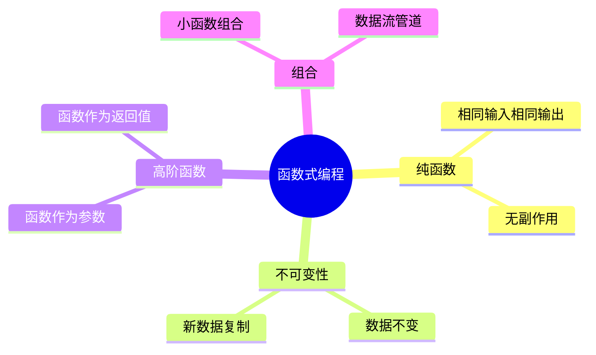
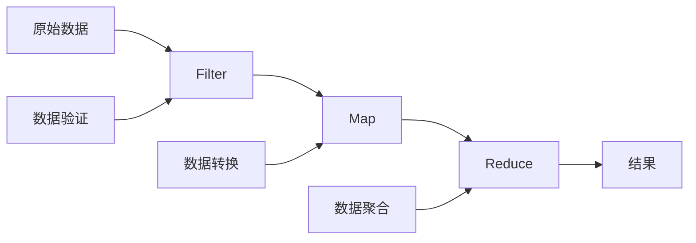

# 函数式编程思想

函数式编程是一种声明式的编程范式。

## 核心概念



## 纯函数

纯函数的定义：

$$
Pure(f) \iff \forall x, y: f(x) = f(y) \land NoSideEffects(f)
$$

```typescript
// 纯函数 - 相同输入永远返回相同输出
function add(a: number, b: number): number {
  return a + b;
}

// 非纯函数 - 有副作用
let counter = 0;
function increment(): number {
  counter++; // 修改外部状态
  return counter;
}

// 纯函数版本
function pureIncrement(count: number): number {
  return count + 1;
}
```

## 不可变性

```typescript
// 可变方式（不推荐）
const arr = [1, 2, 3];
arr.push(4); // 直接修改

// 不可变方式（推荐）
const newArr = [...arr, 4]; // 创建新数组

// 对象不可变更新
interface User {
  name: string;
  age: number;
}

const user: User = { name: 'Alice', age: 25 };

// 修改方式
const updatedUser = { ...user, age: 26 };
```

## 高阶函数

### Map

$$
Map(f, [a_1, a_2, ..., a_n]) = [f(a_1), f(a_2), ..., f(a_n)]
$$

```typescript
const numbers = [1, 2, 3, 4, 5];
const doubled = numbers.map(x => x * 2);
// [2, 4, 6, 8, 10]
```

### Filter

$$
Filter(p, [a_1, ..., a_n]) = [a_i \mid p(a_i) = true]
$$

```typescript
const numbers = [1, 2, 3, 4, 5];
const evens = numbers.filter(x => x % 2 === 0);
// [2, 4]
```

### Reduce

$$
Reduce(f, init, [a_1, ..., a_n]) = f(...f(f(init, a_1), a_2)..., a_n)
$$

```typescript
const numbers = [1, 2, 3, 4, 5];
const sum = numbers.reduce((acc, x) => acc + x, 0);
// 15

// 复杂reduce示例
interface Product {
  category: string;
  price: number;
}

const products: Product[] = [
  { category: 'A', price: 100 },
  { category: 'B', price: 200 },
  { category: 'A', price: 150 },
];

const byCategory = products.reduce((acc, p) => {
  acc[p.category] = (acc[p.category] || 0) + p.price;
  return acc;
}, {} as Record<string, number>);
// { A: 250, B: 200 }
```

## 函数组合

```typescript
// 函数组合
const compose = <T>(...fns: Array<(arg: T) => T>) => 
  (x: T) => fns.reduceRight((acc, fn) => fn(acc), x);

// 管道（从左到右）
const pipe = <T>(...fns: Array<(arg: T) => T>) =>
  (x: T) => fns.reduce((acc, fn) => fn(acc), x);

// 使用示例
const double = (x: number) => x * 2;
const addOne = (x: number) => x + 1;
const square = (x: number) => x * x;

const compute = pipe(double, addOne, square);
compute(3); // ((3 * 2) + 1)^2 = 49
```

## 数据流处理



## 柯里化

```typescript
// 柯里化函数
const curry = <A, B, C>(fn: (a: A, b: B) => C) => 
  (a: A) => (b: B) => fn(a, b);

// 普通函数
const add = (a: number, b: number) => a + b;

// 柯里化后
const curriedAdd = curry(add);
const addFive = curriedAdd(5);
addFive(3); // 8

// 实际应用
const formatName = curry((first: string, last: string) => 
  `${first} ${last}`
);
const withLastName = formatName('张');
withLastName('三'); // '张 三'
withLastName('四'); // '张 四'
```

## 函子(Functor)

```typescript
// Maybe函子 - 处理空值
class Maybe<T> {
  private constructor(private value: T | null) {}
  
  static of<T>(value: T | null): Maybe<T> {
    return new Maybe(value);
  }
  
  map<U>(fn: (value: T) => U): Maybe<U> {
    return this.value === null 
      ? Maybe.of<U>(null) 
      : Maybe.of(fn(this.value));
  }
  
  getOrElse(defaultValue: T): T {
    return this.value ?? defaultValue;
  }
}

// 使用示例
const result = Maybe.of(5)
  .map(x => x * 2)
  .map(x => x + 1)
  .getOrElse(0);
// 11

const nullResult = Maybe.of<number>(null)
  .map(x => x * 2)
  .getOrElse(0);
// 0
```

## 函数式vs命令式

| 特性 | 命令式 | 函数式 |
|------|--------|--------|
| 关注点 | 如何做 | 做什么 |
| 状态 | 可变 | 不可变 |
| 控制流 | 循环/条件 | 递归/组合 |
| 数据 | 可修改 | 新建 |
| 副作用 | 允许 | 避免 |

## 最佳实践

- [x] 编写纯函数
- [x] 使用不可变数据结构
- [x] 善用高阶函数
- [x] 组合而非继承
- [ ] 处理副作用边界
- [ ] 惰性求值优化

> 函数式编程不是银弹，但它提供了一种优雅的思考方式。