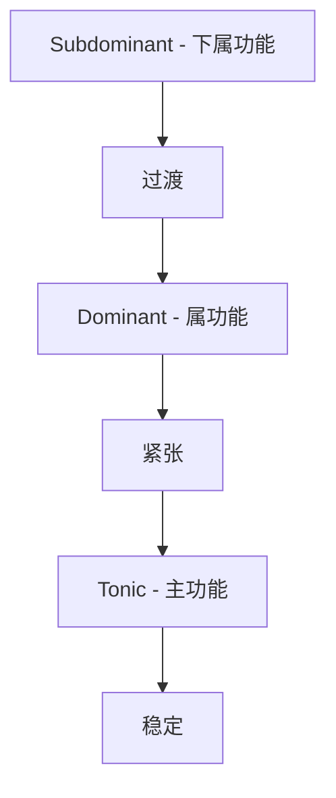
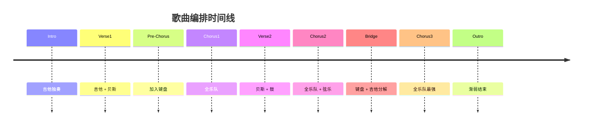

# 乐队歌曲创作心得

玩乐队两年，终于创作出了属于自己的歌曲。

## 创作流程


## 歌曲结构分析

标准流行歌曲结构：

$$
Structure = Verse + Chorus + Verse + Chorus + Bridge + Chorus
$$

| 部分 | 小节数 | 功能 |
|------|--------|------|
| Intro | 4-8 | 引入 |
| Verse | 8-16 | 叙事 |
| Pre-Chorus | 4 | 铺垫 |
| Chorus | 8 | 高潮 |
| Bridge | 8 | 转折 |
| Outro | 4-8 | 结尾 |

## 和弦进行

### 常用进行

```typescript
interface ChordProgression {
  name: string;
  chords: string[];
  mood: string;
}

const progressions: ChordProgression[] = [
  {
    name: 'I-V-vi-IV',
    chords: ['C', 'G', 'Am', 'F'],
    mood: '流行、阳光',
  },
  {
    name: 'vi-IV-I-V',
    chords: ['Am', 'F', 'C', 'G'],
    mood: '伤感、抒情',
  },
  {
    name: 'I-vi-IV-V',
    chords: ['C', 'Am', 'F', 'G'],
    mood: '怀旧、温暖',
  },
  {
    name: 'ii-V-I',
    chords: ['Dm', 'G', 'C'],
    mood: '爵士、流动',
  },
];
```

### 和弦功能



## 旋律创作

### 旋律走向

旋律的美感公式：

$$
Melody\_Beauty = Range \times Contour \times Rhythm \times Repetition
$$

### 音程关系

| 音程 | 感觉 | 使用场景 |
|------|------|----------|
| 小二度 | 紧张 | 爵士 |
| 大二度 | 平稳 | 流行 |
| 小三度 | 忧伤 | 抒情 |
| 大三度 | 明亮 | 流行 |
| 纯五度 | 开放 | 摇滚 |
| 小七度 | 慵懒 | R&B |

## 歌词创作

### 押韵模式

```typescript
type RhymeScheme = 'AAAA' | 'AABB' | 'ABAB' | 'ABBA';

interface LyricsSection {
  lines: string[];
  scheme: RhymeScheme;
  syllables: number[];
}

const verseExample: LyricsSection = {
  lines: [
    '窗外的雨还在下',  // A
    '思绪随风飘向远方',  // A
    '心中的那个愿望',    // A
    '何时才能实现啊',    // A
  ],
  scheme: 'AAAA',
  syllables: [7, 7, 7, 7],
};
```

### 歌词检查清单

- [x] 意象清晰具体
- [x] 韵律自然流畅
- [x] 情感真实动人
- [ ] 避免陈词滥调
- [ ] 留白空间适当

## 编曲思路

### 乐器编排



### 频率分配

$$
Mix = Bass(20-250Hz) + Mids(250-4kHz) + Highs(4kHz+)
$$

| 乐器 | 主要频率 | 作用 |
|------|----------|------|
| 底鼓 | 60-100Hz | 节奏基础 |
| 贝斯 | 80-250Hz | 低频支撑 |
| 吉他 | 200-2kHz | 和声填充 |
| 键盘 | 200-8kHz | 旋律和声 |
| 人声 | 100-8kHz | 核心 |

## 排练与录音

### 排练效率

- [x] 提前发送谱子
- [x] 明确排练目标
- [x] 录音回放分析
- [ ] 控制排练时长
- [ ] 保持专注状态

### 录音清单

```markdown
- [ ] 检查设备状态
- [ ] 调整麦克风位置
- [ ] 设置合适的录音电平
- [ ] 每个乐器单独录音
- [ ] 保留多条录音
```

## 我们的第一首歌

经过两个月的努力，完成了第一首原创《追光》。

> 音乐不在于完美，而在于真实表达。每一次创作都是一次成长。