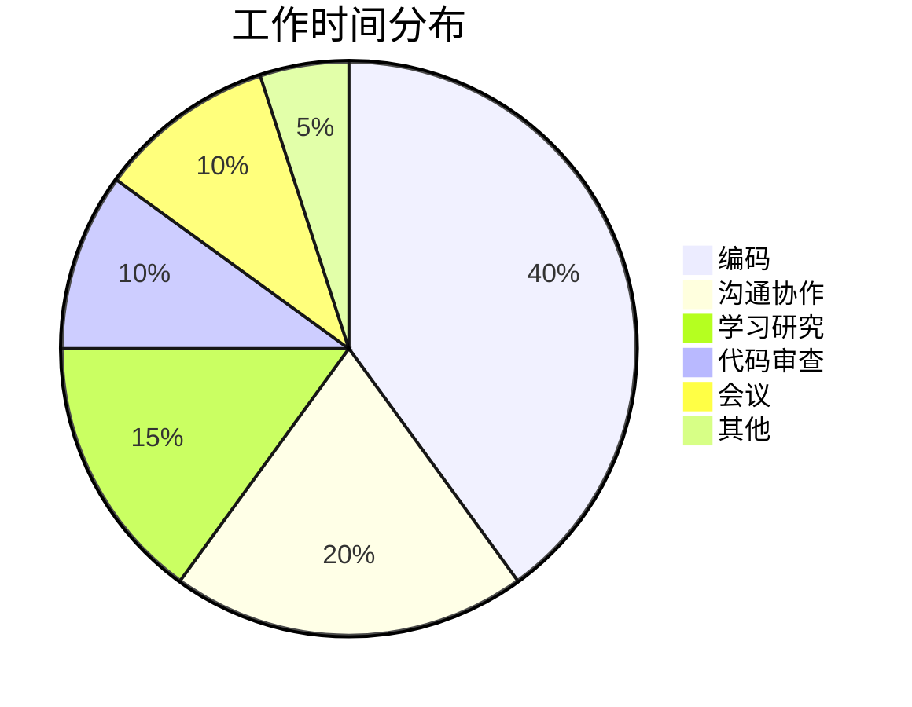
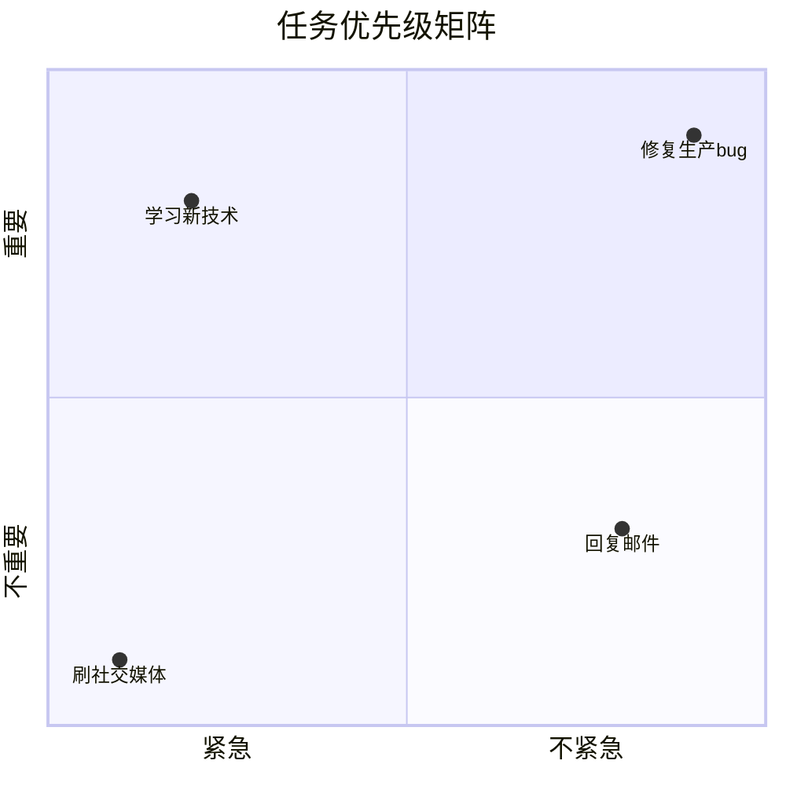
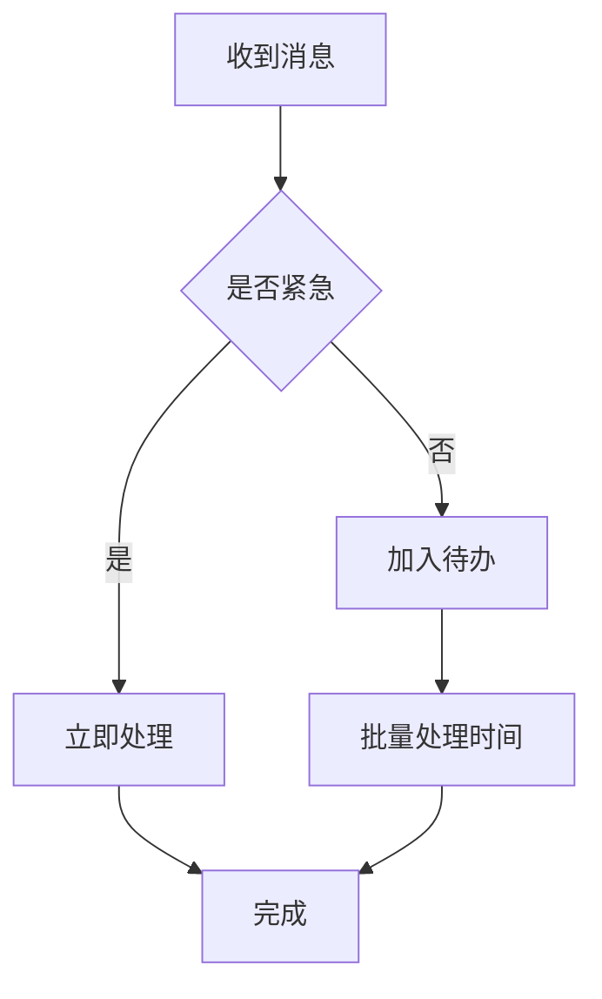

# 程序员的时间管理法则

作为程序员，时间是最宝贵的资源。

## 时间分配模型



## 番茄工作法

一个番茄钟 = 25分钟专注 + 5分钟休息

$$
Productivity = \sum_{i=1}^{n} Pomodoro_i \times Focus\_Rate
$$

### 实施步骤

```typescript
interface PomodoroSession {
  duration: 25; // 分钟
  task: string;
  interruptions: number;
  completed: boolean;
}

const pomodoroCycle = {
  focus: 25,
  shortBreak: 5,
  longBreak: 15,
  cyclesBeforeLongBreak: 4,
};

// 一个完整周期
// 25min x 4 + 5min x 3 + 15min = 130分钟
```

## 四象限法则

| 紧急 | 不紧急 | |
|------|--------|---|
| **重要** | 第一象限：立即做 | 第二象限：计划做 |
| **不重要** | 第三象限：委托做 | 第四象限：删除 |

### 任务分类



## 时间记录法

```typescript
interface TimeLog {
  task: string;
  category: 'coding' | 'meeting' | 'learning' | 'other';
  startTime: Date;
  endTime: Date;
  duration: number; // 分钟
}

// 计算时间分配
function analyzeTimeLogs(logs: TimeLog[]): Record<string, number> {
  return logs.reduce((acc, log) => {
    acc[log.category] = (acc[log.category] || 0) + log.duration;
    return acc;
  }, {} as Record<string, number>);
}
```

## 深度工作

深度工作时间与产出的关系：

$$
Output = Depth \times Time \times Focus^2
$$

### 深度工作策略

1. **消除干扰**
   - 关闭通知
   - 设置专注模式
   - 物理隔离

2. **仪式感**
   - 固定时间
   - 固定地点
   - 固定流程

3. **精力管理**
   - 识别高效时段
   - 合理安排休息
   - 保持身体健康

## 邮件与沟通



### 邮件处理原则

- [x] 2分钟内能完成的立即回复
- [x] 批量处理邮件（每天2-3次）
- [x] 标题清晰简洁
- [ ] 避免反复来回沟通
- [ ] 重要邮件设置提醒

## 会议优化

### 会议效率公式

$$
Meeting\_Value = Decisions \times Participants - Time\_Cost
$$

### 会议最佳实践

| 类型 | 时长 | 参与者 | 目标 |
|------|------|--------|------|
| 站立会 | 15分钟 | 团队 | 同步进度 |
| 技术评审 | 1小时 | 相关人员 | 技术决策 |
| 头脑风暴 | 2小时 | 核心成员 | 创意发散 |
| 1:1沟通 | 30分钟 | 两人 | 反馈指导 |

## 学习与成长

### 学习曲线管理

$$
Skill\_Level = \int_{0}^{T} Practice(t) \times Feedback(t) \, dt
$$

### 知识管理

```
知识管理流程：
输入 → 处理 → 存储 → 输出 → 反馈
```

- [x] 每周阅读技术文章
- [x] 定期总结项目经验
- [x] 参与技术分享
- [ ] 写技术博客
- [ ] 参与开源项目

## 每日计划模板

```markdown
## 今日待办

### 必须完成 (MIT)
- [ ] 完成用户模块重构
- [ ] 修复登录bug
- [ ] 代码审查

### 争取完成
- [ ] 学习React新特性
- [ ] 整理文档

### 延后处理
- [ ] 重构测试用例
```

## 周回顾模板

| 维度 | 本周完成 | 下周计划 |
|------|----------|----------|
| 工作 | 3个需求 | 2个需求 |
| 学习 | 读完2篇文章 | 学习新框架 |
| 健康 | 运动3次 | 保持习惯 |

> 时间管理的本质不是挤时间，而是明确什么最重要。