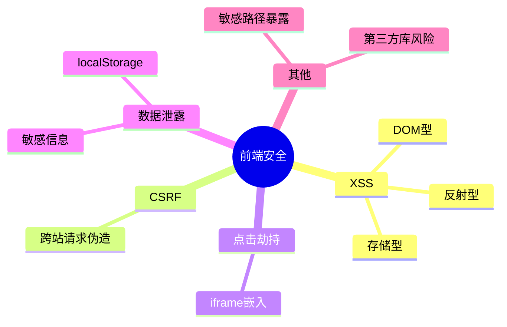
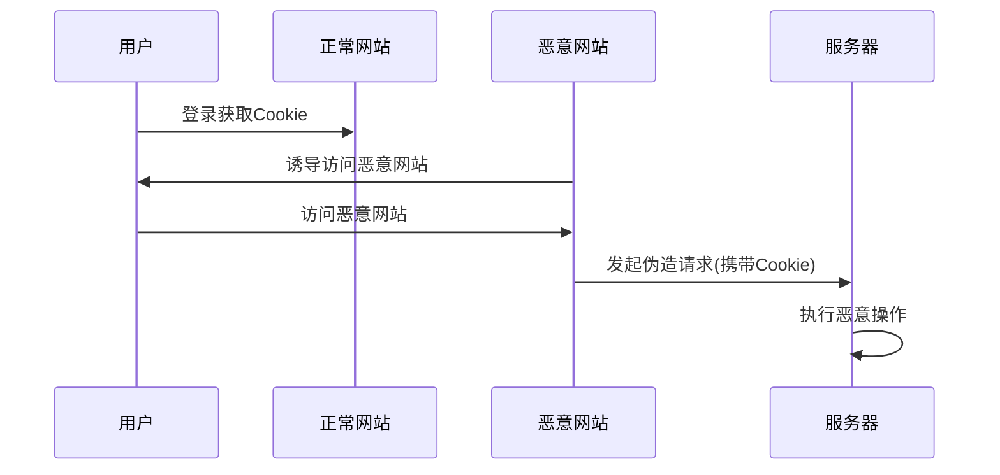
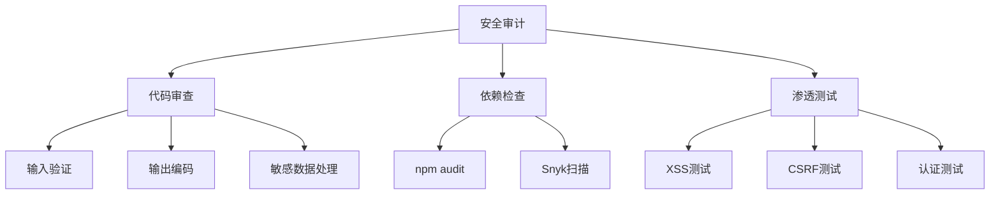

# 前端安全防护指南

前端安全是Web应用安全的重要组成部分。

## 常见安全威胁



## XSS攻击防护

### XSS类型

$$
XSS = Injection_{script} + Execution_{browser}
$$

| 类型 | 来源 | 严重程度 |
|------|------|----------|
| 存储型XSS | 服务器存储 | 高 |
| 反射型XSS | URL参数 | 中 |
| DOM型XSS | DOM操作 | 中 |

### 防护措施

```typescript
// 输入过滤
function sanitizeInput(input: string): string {
  return input
    .replace(/</g, '&lt;')
    .replace(/>/g, '&gt;')
    .replace(/"/g, '&quot;')
    .replace(/'/g, '&#x27;')
    .replace(/\//g, '&#x2F;');
}

// 使用DOMPurify库
import DOMPurify from 'dompurify';

const cleanHTML = DOMPurify.sanitize(userInput);

// CSP配置
const cspPolicy = {
  'default-src': "'self'",
  'script-src': "'self' 'unsafe-inline'",
  'style-src': "'self' 'unsafe-inline'",
  'img-src': "'self' data: https:",
  'connect-src': "'self' https://api.example.com",
};
```

## CSRF防护



### CSRF防护实现

```typescript
// CSRF Token方案
interface CSRFProtection {
  token: string;
  headerName: string;
}

function generateCSRFToken(): string {
  return crypto.randomUUID();
}

// 请求拦截器
function addCSRFToken(config: RequestConfig): RequestConfig {
  const token = getCookie('csrf_token');
  return {
    ...config,
    headers: {
      ...config.headers,
      'X-CSRF-Token': token,
    },
  };
}

// SameSite Cookie配置
const cookieOptions = {
  sameSite: 'strict', // 或 'lax'
  secure: true,
  httpOnly: true,
};
```

## 点击劫持防护

```typescript
// 防止iframe嵌入
if (window.top !== window.self) {
  window.top.location = window.self.location;
}

// X-Frame-Options响应头
// deny: 禁止所有嵌入
// sameorigin: 只允许同源嵌入

// CSP frame-ancestors
const framePolicy = "frame-ancestors 'self' https://trusted.com";
```

## 敏感数据保护

### 数据存储安全

```typescript
interface StorageSecurity {
  method: string;
  recommendation: string;
  riskLevel: 'high' | 'medium' | 'low';
}

const storageRecommendations: StorageSecurity[] = [
  {
    method: 'localStorage',
    recommendation: '不要存储敏感信息',
    riskLevel: 'high',
  },
  {
    method: 'sessionStorage',
    recommendation: '会话级临时数据',
    riskLevel: 'medium',
  },
  {
    method: 'Cookie (httpOnly)',
    recommendation: 'Token存储推荐',
    riskLevel: 'low',
  },
];
```

### 数据传输加密

$$
Transmission\_Security = HTTPS + Encryption + Validation
$$

```typescript
// 使用HTTPS
const apiConfig = {
  baseURL: 'https://api.example.com', // 强制HTTPS
};

// 敏感数据加密传输
import { encrypt, decrypt } from './crypto';

async function sendSensitiveData(data: object) {
  const encrypted = await encrypt(JSON.stringify(data));
  return fetch('/api/sensitive', {
    method: 'POST',
    body: encrypted,
    headers: { 'Content-Type': 'application/json' },
  });
}
```

## 安全检查清单

```markdown
## 前端安全检查清单

### XSS防护
- [ ] 输入过滤和转义
- [ ] 使用安全的渲染方法
- [ ] 配置CSP策略
- [ ] 定期扫描漏洞

### CSRF防护
- [ ] 实现CSRF Token
- [ ] 配置SameSite Cookie
- [ ] 验证请求来源

### 数据安全
- [ ] 不在本地存储敏感数据
- [ ] 使用HTTPS传输
- [ ] Token过期处理
- [ ] 清理敏感日志

### 其他
- [ ] 依赖库安全审计
- [ ] 防止点击劫持
- [ ] 错误信息脱敏
- [ ] 安全的第三方集成
```

## 安全响应头配置

```typescript
interface SecurityHeaders {
  header: string;
  value: string;
  purpose: string;
}

const recommendedHeaders: SecurityHeaders[] = [
  {
    header: 'X-Content-Type-Options',
    value: 'nosniff',
    purpose: '防止MIME类型嗅探',
  },
  {
    header: 'X-Frame-Options',
    value: 'DENY',
    purpose: '防止点击劫持',
  },
  {
    header: 'Strict-Transport-Security',
    value: 'max-age=31536000; includeSubDomains',
    purpose: '强制HTTPS',
  },
  {
    header: 'Content-Security-Policy',
    value: "default-src 'self'",
    purpose: '限制资源来源',
  },
  {
    header: 'X-XSS-Protection',
    value: '1; mode=block',
    purpose: '浏览器XSS过滤器',
  },
];
```

## 安全审计流程



## 第三方库安全

```typescript
// 检查依赖安全
// npm audit
// yarn audit

// 使用Snyk
// npx snyk test

// 定期更新依赖
interface DependencySecurity {
  name: string;
  version: string;
  vulnerabilities: number;
  recommendation: string;
}
```

## 安全开发最佳实践

- [x] 最小权限原则
- [x] 默认安全配置
- [x] 输入验证和输出编码
- [x] 使用安全依赖
- [ ] 定期安全审计
- [ ] 安全培训和教育

> 安全不是一次性工作，而是持续的过程。前端安全需要从开发、测试到部署的全流程关注。