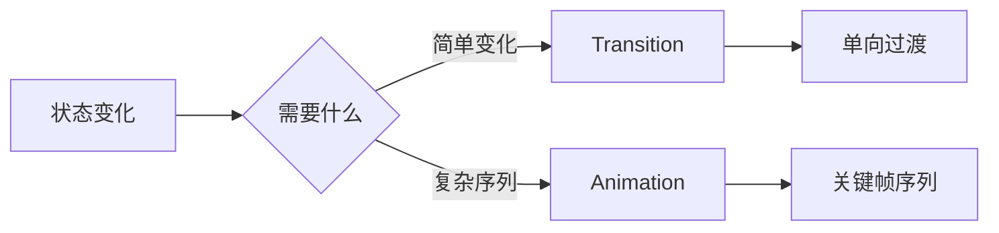
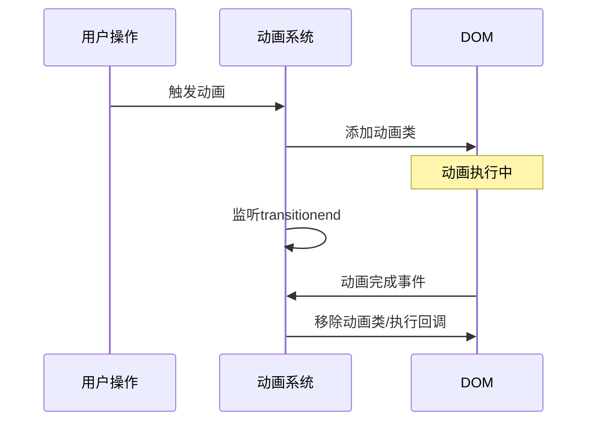

# CSS动画与过渡完全指南

动画是提升用户体验的重要手段。

## 过渡 vs 动画



## 过渡(Transition)

### 基础语法

```css
/* 完整语法 */
.element {
  transition: property duration timing-function delay;
}

/* 分写形式 */
.element {
  transition-property: transform;
  transition-duration: 300ms;
  transition-timing-function: ease-out;
  transition-delay: 100ms;
}

/* 多属性过渡 */
.card {
  transition: transform 0.3s ease, 
              opacity 0.3s ease, 
              box-shadow 0.3s ease;
}
```

### 时间函数

$$
Progress = f(t) \quad where \quad t \in [0, 1]
$$

| 函数 | 曲线 | 适用场景 |
|------|------|----------|
| ease | 快-慢 | 通用 |
| ease-in | 慢开始 | 淡出 |
| ease-out | 慢结束 | 淡入 |
| ease-in-out | 慢-快-慢 | 缩放 |
| linear | 匀速 | 进度条 |
| cubic-bezier() | 自定义 | 个性化 |

### 自定义贝塞尔曲线

```css
.custom-timing {
  transition-timing-function: cubic-bezier(0.68, -0.55, 0.265, 1.55);
}

/* 常用预设 */
.ease-bounce {
  transition-timing-function: cubic-bezier(0.34, 1.56, 0.64, 1);
}

.ease-elastic {
  transition-timing-function: cubic-bezier(0.68, -0.6, 0.32, 1.6);
}
```

## 动画(Animation)

### 关键帧定义

```css
@keyframes fadeIn {
  from {
    opacity: 0;
    transform: translateY(20px);
  }
  to {
    opacity: 1;
    transform: translateY(0);
  }
}

@keyframes bounce {
  0%, 100% {
    transform: translateY(0);
  }
  50% {
    transform: translateY(-20px);
  }
}

@keyframes pulse {
  0% {
    transform: scale(1);
    opacity: 1;
  }
  50% {
    transform: scale(1.1);
    opacity: 0.8;
  }
  100% {
    transform: scale(1);
    opacity: 1;
  }
}
```

### 动画属性

```css
.animated {
  animation-name: fadeIn;
  animation-duration: 500ms;
  animation-timing-function: ease-out;
  animation-delay: 0s;
  animation-iteration-count: 1;
  animation-direction: normal;
  animation-fill-mode: forwards;
  animation-play-state: running;
}

/* 简写形式 */
.animated {
  animation: fadeIn 500ms ease-out 0s 1 normal forwards;
}
```

## 性能优化

### 可动画属性优先级

```typescript
// 性能从高到低
const animationProperties = [
  { property: 'transform', gpu: true, repaint: false },
  { property: 'opacity', gpu: true, repaint: false },
  { property: 'filter', gpu: true, repaint: false },
  { property: 'width/height', gpu: false, repaint: true },
  { property: 'margin/padding', gpu: false, repaint: true },
  { property: 'color/background', gpu: false, repaint: true },
];
```

### 硬件加速

```css
.accelerated {
  transform: translateZ(0);
  /* 或 */
  will-change: transform, opacity;
}

/* 注意：will-change要谨慎使用 */
.will-change-optimized {
  /* hover时才启用will-change */
  &:hover {
    will-change: transform;
  }
}
```

## 常用动画模式

```css
/* 淡入 */
.fade-in {
  animation: fadeIn 0.3s ease-out forwards;
}

/* 滑入 */
.slide-in {
  animation: slideIn 0.4s cubic-bezier(0.16, 1, 0.3, 1) forwards;
}

@keyframes slideIn {
  from {
    opacity: 0;
    transform: translateX(-100%);
  }
  to {
    opacity: 1;
    transform: translateX(0);
  }
}

/* 缩放 */
.scale-in {
  animation: scaleIn 0.2s ease-out forwards;
}

@keyframes scaleIn {
  from {
    opacity: 0;
    transform: scale(0.9);
  }
  to {
    opacity: 1;
    transform: scale(1);
  }
}
```

## 交互动画

```css
/* 按钮悬停 */
.btn {
  transition: all 0.2s ease;
}
.btn:hover {
  transform: translateY(-2px);
  box-shadow: 0 4px 12px rgba(0, 0, 0, 0.15);
}
.btn:active {
  transform: translateY(0);
  box-shadow: 0 2px 4px rgba(0, 0, 0, 0.1);
}

/* 卡片悬停 */
.card {
  transition: transform 0.3s ease, box-shadow 0.3s ease;
}
.card:hover {
  transform: translateY(-8px);
  box-shadow: 0 12px 24px rgba(0, 0, 0, 0.1);
}
```

## 动画编排



## 动画性能指标

$$
FPS = \frac{1000ms}{Frame\_Time} \geq 60
$$

$$
Frame\_Budget = \frac{1000ms}{60} \approx 16.67ms
$$

## 最佳实践

- [x] 优先使用transform和opacity
- [x] 使用will-change优化关键动画
- [x] 减少布局抖动
- [ ] 避免动画过多元素
- [ ] 尊重用户偏好设置

```css
/* 尊重用户偏好 */
@media (prefers-reduced-motion: reduce) {
  * {
    animation-duration: 0.01ms !important;
    transition-duration: 0.01ms !important;
  }
}
```

> 动画是细节，但细节决定体验。好的动画让用户感到流畅自然。