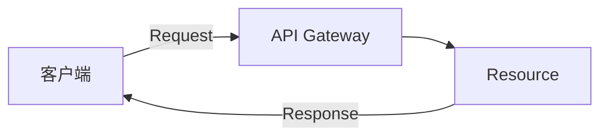
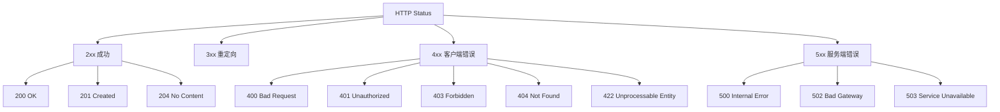
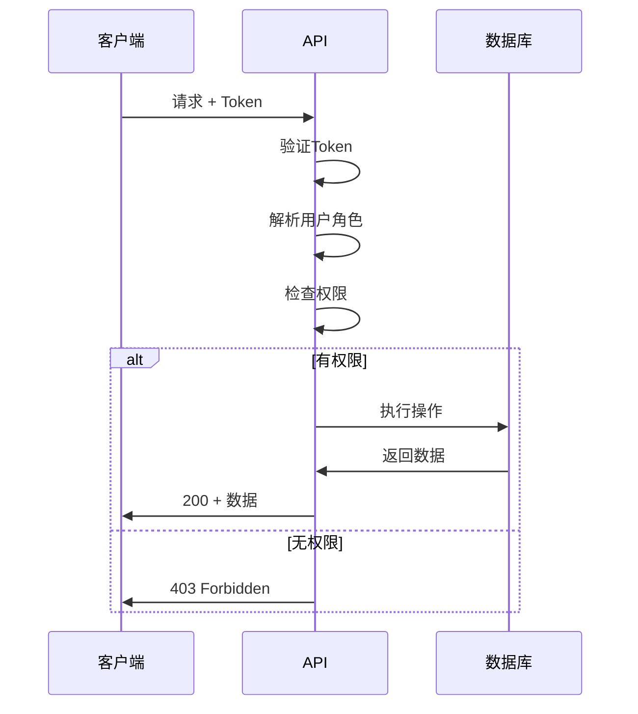

# RESTful API设计规范

好的API设计让前后端协作更加顺畅。

## REST原则



### 核心约束

$$
REST = Client\_Server + Stateless + Cache + Uniform\_Interface + Layered\_System
$$

## HTTP方法语义

| 方法 | 语义 | 幂等性 | 安全性 |
|------|------|--------|--------|
| GET | 获取资源 | 是 | 是 |
| POST | 创建资源 | 否 | 否 |
| PUT | 全量更新 | 是 | 否 |
| PATCH | 部分更新 | 是 | 否 |
| DELETE | 删除资源 | 是 | 否 |

## URL设计规范

```typescript
// 好的设计
GET    /api/v1/users          // 获取用户列表
GET    /api/v1/users/123      // 获取单个用户
POST   /api/v1/users          // 创建用户
PUT    /api/v1/users/123      // 更新用户
DELETE /api/v1/users/123      // 删除用户

// 关联资源
GET    /api/v1/users/123/orders        // 用户的订单
GET    /api/v1/users/123/orders/456    // 用户的具体订单

// 筛选和分页
GET    /api/v1/users?status=active&page=1&limit=20
```

## 响应格式

```typescript
interface ApiResponse<T> {
  code: number;
  message: string;
  data: T;
  meta?: {
    page: number;
    limit: number;
    total: number;
  };
}

// 成功响应
const successResponse: ApiResponse<User> = {
  code: 200,
  message: 'success',
  data: {
    id: '1',
    name: 'Alice',
    email: 'alice@example.com',
  },
};

// 错误响应
const errorResponse: ApiResponse<null> = {
  code: 404,
  message: 'User not found',
  data: null,
};
```

## 状态码使用



## 分页设计

```typescript
interface PaginationParams {
  page: number;   // 页码，从1开始
  limit: number;  // 每页数量
  sort?: string;  // 排序字段
  order?: 'asc' | 'desc'; // 排序方向
}

interface PaginatedResponse<T> {
  data: T[];
  pagination: {
    page: number;
    limit: number;
    total: number;
    totalPages: number;
  };
}

// 分页计算
const offset = (page - 1) * limit;
const totalPages = Math.ceil(total / limit);
```

分页链接生成：

$$
Links = \{first, prev, self, next, last\}
$$

## 认证与授权

```typescript
// JWT Token结构
interface JwtPayload {
  sub: string;      // 用户ID
  iat: number;      // 签发时间
  exp: number;      // 过期时间
  roles: string[];  // 角色
}

// Authorization Header
// Authorization: Bearer <token>
```

### 权限检查流程



## 版本控制

| 方式 | 示例 | 优点 | 缺点 |
|------|------|------|------|
| URL | /api/v1/users | 简单直观 | URL变化 |
| Header | Accept: application/vnd.api.v1+json | URL整洁 | 复杂 |
| Query | /api/users?version=1 | 灵活 | 不推荐 |

## 错误处理

```typescript
interface ApiError {
  code: number;
  message: string;
  details?: Array<{
    field: string;
    message: string;
  }>;
}

// 验证错误示例
const validationError: ApiError = {
  code: 422,
  message: 'Validation failed',
  details: [
    { field: 'email', message: 'Invalid email format' },
    { field: 'password', message: 'Password too short' },
  ],
};
```

## 最佳实践检查清单

- [x] 使用名词复数形式
- [x] 版本号放在URL中
- [x] 返回适当的状态码
- [x] 支持分页和过滤
- [x] 统一错误响应格式
- [ ] 提供API文档
- [ ] 实现速率限制

> 好的API设计是无声的沟通，让使用者能够直观地理解和使用。