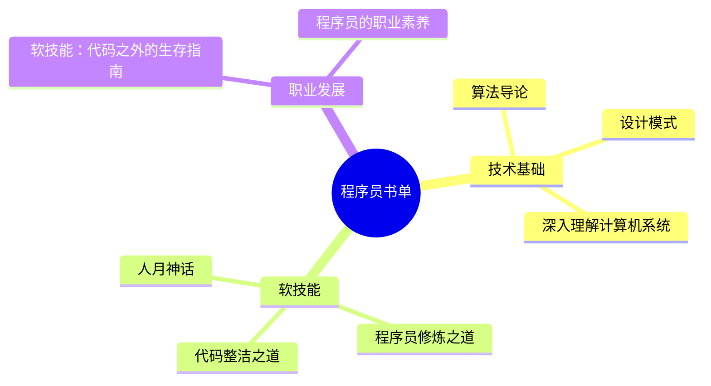
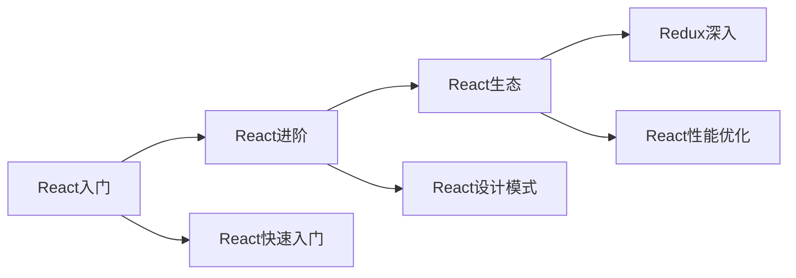
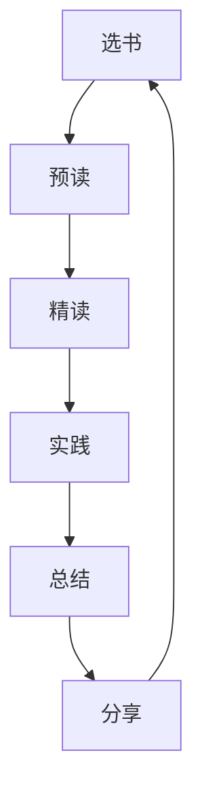

# 程序员的阅读书单推荐

阅读是程序员持续成长的重要途径。

## 阅读价值模型

$$
Knowledge\_Growth = Books \times Understanding \times Practice
$$



## 必读技术书籍

### 基础理论

| 书名 | 作者 | 评分 | 阅读顺序 |
|------|------|------|----------|
| 《算法导论》 | CLRS | 9.5/10 | 第1本 |
| 《深入理解计算机系统》 | Bryant | 9.8/10 | 第2本 |
| 《设计模式》 | GoF | 8.5/10 | 第3本 |

### 编程实践

```typescript
interface Book {
  title: string;
  author: string;
  category: 'fundamental' | 'practice' | 'soft-skill';
  rating: number;
  recommendation: string;
}

const programmingBooks: Book[] = [
  {
    title: '代码整洁之道',
    author: 'Robert C. Martin',
    category: 'practice',
    rating: 9.0,
    recommendation: '必读，提升代码质量',
  },
  {
    title: '重构',
    author: 'Martin Fowler',
    category: 'practice',
    rating: 9.2,
    recommendation: '改善既有代码设计',
  },
  {
    title: '程序员修炼之道',
    author: 'Dave Thomas',
    category: 'soft-skill',
    rating: 9.5,
    recommendation: '职业素养指南',
  },
];
```

## JavaScript/TypeScript书籍

```markdown
推荐书单：

1. 《JavaScript高级程序设计》 - 红宝书，全面深入
2. 《你不知道的JavaScript》 - 深入JS原理
3. 《TypeScript编程》 - TS官方团队成员编写
4. 《JavaScript语言精粹》 - 精简精华版
```

## React生态书籍



## 软技能书籍

### 职业发展

- [x] 《软技能：代码之外的生存指南》
- [x] 《人月神话》 - 项目管理经典
- [x] 《程序员修炼之道》 - 职业素养
- [ ] 《高效程序员的45个习惯》
- [ ] 《编写可读代码的艺术》

### 思维方法

```typescript
const thinkingBooks: Book[] = [
  {
    title: '思考，快与慢',
    author: 'Daniel Kahneman',
    category: 'soft-skill',
    rating: 9.0,
    recommendation: '理解人类决策机制',
  },
  {
    title: '刻意练习',
    author: 'Anders Ericsson',
    category: 'soft-skill',
    rating: 8.8,
    recommendation: '掌握学习方法',
  },
];
```

## 阅读时间规划

$$
Reading\_Plan = \frac{Pages}{Daily\_Pages} \times Days
$$

### 月度阅读计划

| 类型 | 数量 | 预计时间 |
|------|------|----------|
| 技术精读 | 1本 | 30天 |
| 技术速读 | 2本 | 15天/本 |
| 软技能 | 1本 | 20天 |

## 阅读方法



### SQ3R阅读法

1. **Survey (浏览)** - 快速浏览全书结构
2. **Question (提问)** - 带着问题阅读
3. **Read (阅读)** - 精读重要章节
4. **Recite (复述)** - 记忆和总结
5. **Review (复习)** - 定期回顾

## 阅读笔记模板

```markdown
## 书籍信息
- 书名：
- 作者：
- 阅读日期：

## 核心观点
1. 
2. 
3. 

## 实践应用
- 如何应用到工作中：

## 精选摘录
> 

## 推荐指数
⭐⭐⭐⭐⭐
```

## 数字阅读资源

| 平台 | 特点 | 适用 |
|------|------|------|
| GitHub Books | 开源免费 | 技术文档 |
| O'Reilly | 专业权威 | 技术书籍 |
| Kindle | 便携方便 | 通识阅读 |
| 微信读书 | 中文丰富 | 国内书籍 |

## 阅读习惯养成

- [x] 每天固定时间阅读
- [x] 带着问题阅读
- [x] 做阅读笔记
- [ ] 分享阅读心得
- [ ] 定期回顾总结

> 阅读不是终点，实践才是目的。书籍给予我们知识，实践赋予我们能力。保持阅读的习惯，是程序员持续进步的关键。