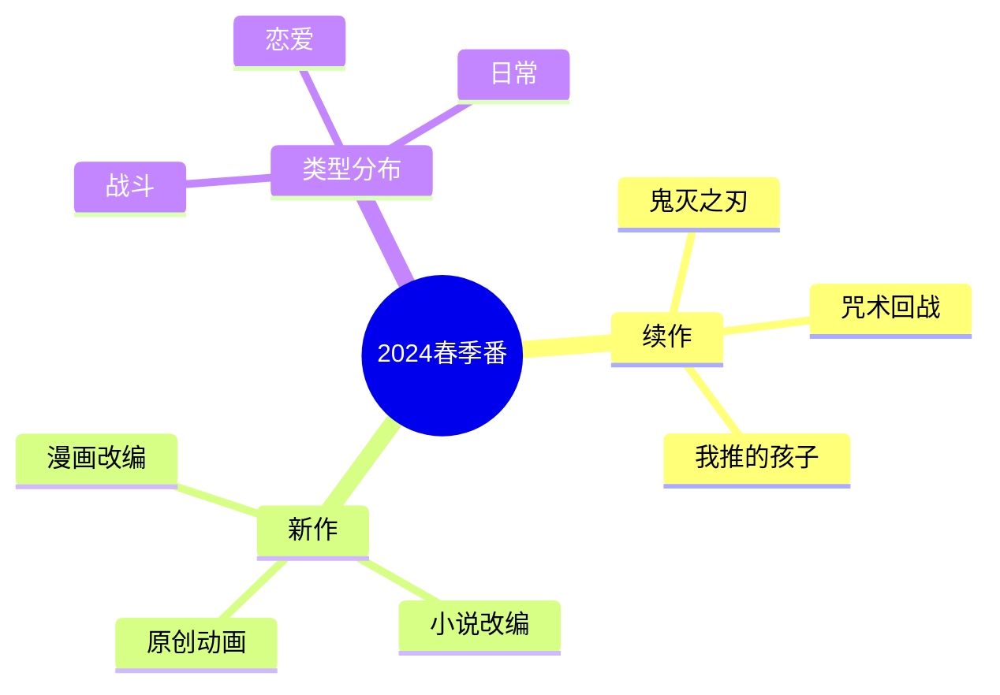
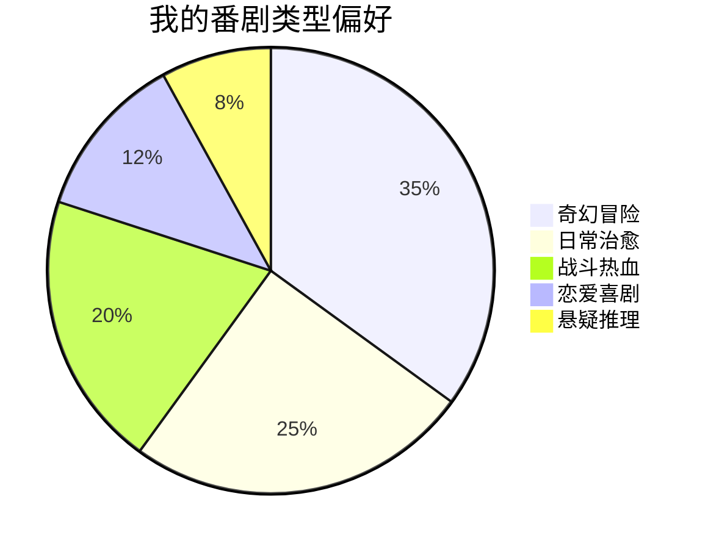

# 春日番剧追番日记

春天是新番的季节，一起来盘点这个季度的精彩作品。

## 本季追番清单



## 番剧评分表

| 番剧 | 类型 | 评分 | 状态 |
|------|------|------|------|
| 鬼灭之刃 柱训练篇 | 战斗 | 9.5/10 | 追番中 |
| 咒术回战 第二季 | 战斗 | 9.0/10 | 追番中 |
| 我推的孩子 | 偶像 | 9.2/10 | 已完结 |
| 葬送的芙莉莲 | 奇幻 | 9.8/10 | 追番中 |
| 药屋少女的呢喃 | 古风 | 8.5/10 | 追番中 |

## 观番时间规划

理想的追番时间分配：

$$
Weekly\_Time = \sum_{i=1}^{n} (Episodes_i \times 24min)
$$

```typescript
interface AnimeSchedule {
  name: string;
  day: number; // 0-6, 0=周日
  time: string;
  episodes: number;
}

const weeklySchedule: AnimeSchedule[] = [
  { name: '葬送的芙莉莲', day: 5, time: '23:00', episodes: 1 },
  { name: '药屋少女的呢喃', day: 6, time: '01:00', episodes: 1 },
  { name: '鬼灭之刃', day: 6, time: '23:15', episodes: 1 },
];
```

## 番剧类型偏好



## 追番进度

- [x] 鬼灭之刃 柱训练篇 - 更新至第8话
- [x] 葬送的芙莉莲 - 更新至第28话
- [ ] 药屋少女的呢喃 - 落后2话
- [ ] 无职转生 第三季 - 尚未开始

## 动画制作分析

### 制作公司实力对比

$$
Production\_Quality = Animation + Story + Music + Voice\_Acting
$$

| 制作公司 | 代表作 | 特点 |
|----------|--------|------|
| Ufotable | 鬼灭之刃 | 画面华丽 |
| MAPPA | 咒术回战 | 作画精良 |
| A-1 Pictures | 我推的孩子 | 制作稳定 |
| Madhouse | 无职转生 | 改编出色 |

## 观番环境优化

最佳观番体验要素：

1. **显示设备**
   - 分辨率：4K/1080p
   - 刷新率：60Hz+
   - 色彩：高色域

2. **音频设备**
   - 耳机/音箱
   - 支持杜比音效

3. **观看环境**
   - 光线适宜
   - 温度舒适

## 番剧安利语录

> 好的番剧让人沉浸其中，忘记时间的流逝。

```typescript
const animeQuotes = [
  {
    anime: '葬送的芙莉莲',
    quote: '即使没有永恒，我们也努力活着。',
    character: '芙莉莲',
  },
  {
    anime: '鬼灭之刃',
    quote: '纵使吾身俱灭，定将恶鬼斩杀！',
    character: '炼狱杏寿郎',
  },
  {
    anime: '我推的孩子',
    quote: '谎言也是一种爱。',
    character: '星野爱',
  },
];
```

## 下季期待

- [ ] 无职转生 第三季
- [ ] Re:从零开始的异世界生活 第三季
- [ ] Overlord 第五季

> 春天有春天的番，夏天有夏天的番，每个季节都有独特的回忆。