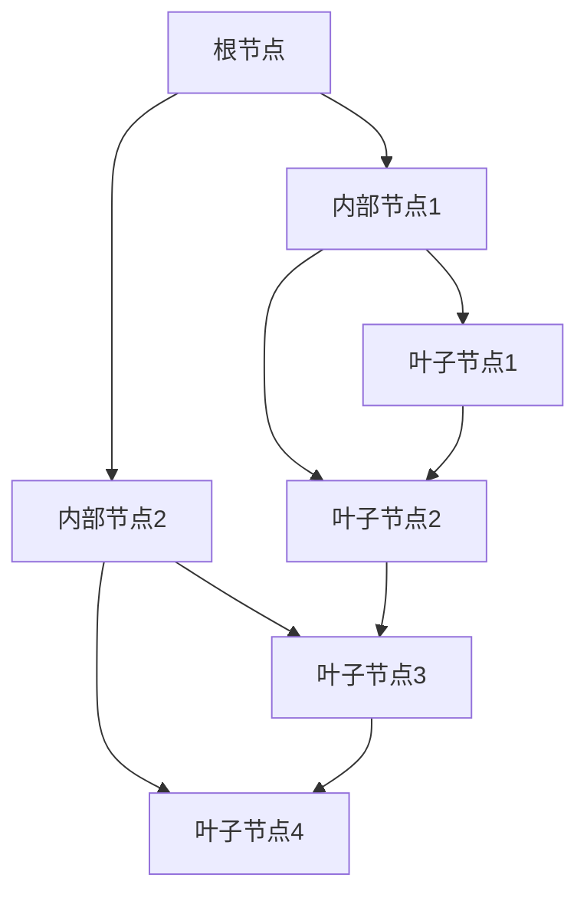
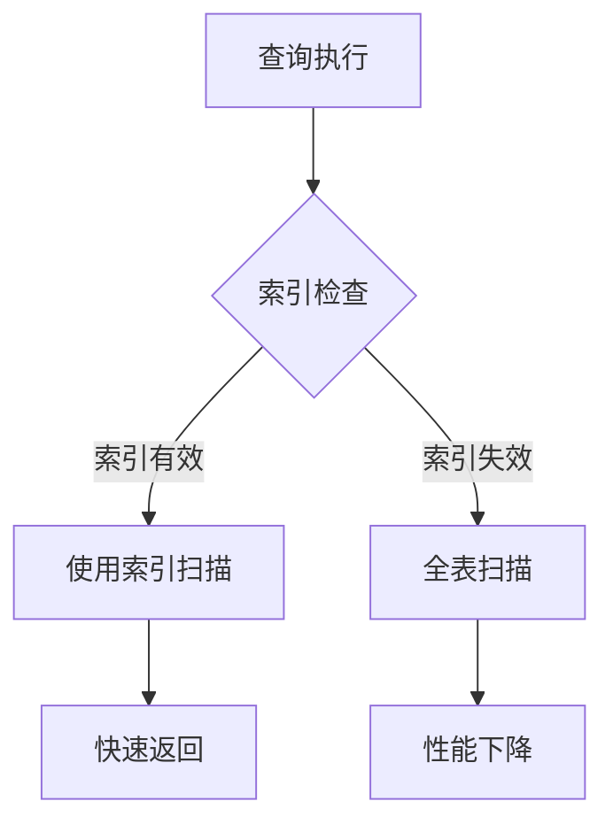

# 数据库索引优化实践

索引是数据库性能优化的核心。

## 索引原理

### B+树结构



### 查询复杂度

$$
Time\_Complexity = O(\log_m n)
$$

其中 $m$ 是B+树的阶数，$n$ 是数据量。

## 索引类型

| 类型 | 描述 | 适用场景 |
|------|------|----------|
| 主键索引 | 唯一标识 | 主键字段 |
| 唯一索引 | 值唯一 | 用户名、邮箱 |
| 普通索引 | 加速查询 | 经常查询的字段 |
| 组合索引 | 多字段组合 | 多条件查询 |
| 全文索引 | 文本搜索 | 文章、评论 |

## 创建索引

```sql
-- 主键索引
CREATE TABLE users (
  id INT PRIMARY KEY AUTO_INCREMENT,
  username VARCHAR(50),
  email VARCHAR(100)
);

-- 唯一索引
CREATE UNIQUE INDEX idx_username ON users(username);

-- 组合索引
CREATE INDEX idx_name_email ON users(username, email);

-- 全文索引
CREATE FULLTEXT INDEX idx_content ON articles(content);
```

## 索引选择策略

```typescript
interface IndexStrategy {
  selectivity: number;  // 选择性
  cardinality: number;   // 基数
  size: number;          // 大小
}

// 选择性公式
// Selectivity = Cardinality / Total_Rows
const selectivity = cardinality / totalRows;
```

### 最左前缀原则

对于组合索引 `(a, b, c)`:

- [x] `WHERE a = 1` - 使用索引
- [x] `WHERE a = 1 AND b = 2` - 使用索引
- [x] `WHERE a = 1 AND b = 2 AND c = 3` - 使用索引
- [ ] `WHERE b = 2` - 不使用索引
- [ ] `WHERE c = 3` - 不使用索引

## 查询优化

### EXPLAIN分析

```sql
EXPLAIN SELECT * FROM users WHERE username = 'alice';
```

| 字段 | 说明 |
|------|------|
| type | 访问类型，从好到差：system > const > eq_ref > ref > range > index > ALL |
| key | 使用的索引 |
| rows | 预估扫描行数 |
| Extra | 额外信息 |

### 索引失效场景



索引失效原因：

1. 使用 `LIKE '%abc'` 前缀模糊
2. 对索引列使用函数
3. 隐式类型转换
4. 使用 `OR` 连接非索引列
5. `IS NULL` 或 `IS NOT NULL`

## 性能监控

```sql
-- 查看索引使用情况
SELECT 
  index_name,
  table_name,
  cardinality,
  seq_in_index
FROM information_schema.statistics
WHERE table_schema = 'mydb';

-- 查看慢查询
SELECT * FROM mysql.slow_log 
WHERE query_time > 1 
ORDER BY start_time DESC;
```

## 索引维护成本

$$
Maintenance\_Cost = Insert + Update + Delete + Storage
$$

| 操作 | 索引影响 |
|------|----------|
| INSERT | 需更新索引 |
| UPDATE | 可能重建索引 |
| DELETE | 需删除索引项 |
| SELECT | 加速查询 |

## 最佳实践

- [x] 为WHERE条件创建索引
- [x] 为JOIN字段创建索引
- [x] 选择性高的列优先
- [ ] 避免过多索引
- [ ] 定期分析和优化

> 索引是一把双刃剑，用好了加速查询，用多了影响写入性能。