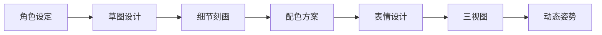
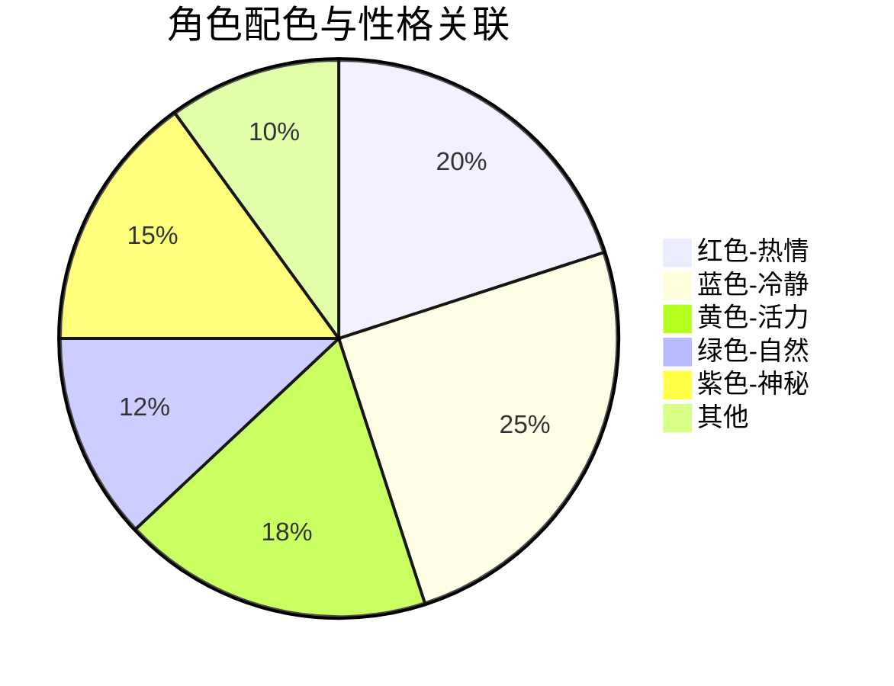

# 动漫角色设计分析

角色设计是动漫作品的灵魂所在。

## 设计流程



## 角色属性矩阵

$$
Character\_Appeal = \sum_{i=1}^{n} (Visual_i + Personality_i + Story_i)
$$

| 属性 | 权重 | 描述 |
|------|------|------|
| 外观设计 | 30% | 发型、服装、配色 |
| 性格特征 | 35% | 性格、习惯、口癖 |
| 背景故事 | 20% | 经历、成长、关系 |
| 声音表现 | 15% | 声线、语调、台词 |

## 经典角色原型

```typescript
interface CharacterArchetype {
  name: string;
  traits: string[];
  examples: string[];
}

const archetypes: CharacterArchetype[] = [
  {
    name: '傲娇',
    traits: ['表面冷淡', '内心温柔', '不善表达'],
    examples: ['远坂凛', '御坂美琴', '逢坂大河'],
  },
  {
    name: '天然呆',
    traits: ['迟钝', '迷糊', '治愈系'],
    examples: ['平泽唯', '阿库娅', '日向翔阳'],
  },
  {
    name: '病娇',
    traits: ['偏执', '占有欲', '危险'],
    examples: ['我妻由乃', '龙宫礼奈'],
  },
];
```

## 配色心理学



配色对角色印象的影响：

$$
Impression = Color \times Saturation \times Contrast
$$

## 发型设计语言

| 发型 | 角色类型 | 典型代表 |
|------|----------|----------|
| 长直发 | 优等生/冰山 | 晓美焰 |
| 双马尾 | 傲娇 | 逢坂大河 |
| 短发 | 活泼/中性 | 黑雪姬 |
| 卷发 | 大小姐 | 远坂凛 |
| 异色发 | 特殊身份 | 初音未来 |

## 表情设计要点

```typescript
interface Expression {
  emotion: string;
  eyes: string;
  mouth: string;
  eyebrows: string;
}

const expressions: Record<string, Expression> = {
  happy: {
    emotion: '开心',
    eyes: '弯弯的月牙形',
    mouth: '上扬的微笑',
    eyebrows: '微微上扬',
  },
  sad: {
    emotion: '悲伤',
    eyes: '水汪汪的',
    mouth: '微微下垂',
    eyebrows: '八字眉',
  },
  angry: {
    emotion: '愤怒',
    eyes: '锐利的眼神',
    mouth: '紧闭或咬牙',
    eyebrows: '倒八字',
  },
};
```

## 动态姿势设计

平衡感的计算：

$$
Balance = \frac{Center\_of\_Gravity}{Support\_Base}
$$

### 姿势类型

1. **站立** - 自然放松
2. **战斗** - 动感张力
3. **坐姿** - 休闲舒适
4. **奔跑** - 速度感

## 服装设计原则

- [x] 符合角色身份
- [x] 便于动画制作
- [x] 具有辨识度
- [ ] 考虑周边制作
- [ ] 保持风格统一

## 优秀案例分析

> 好的角色设计让人一眼就能记住，好的故事让角色变得立体。

### 案例一：初音未来

- 发型：葱绿双马尾，标志性
- 服装：未来感设计
- 数字编号：01，体现虚拟偶像身份

### 案例二：钉崎野蔷薇

- 独特的发型设计
- 异色瞳孔
- 和风元素融合现代感