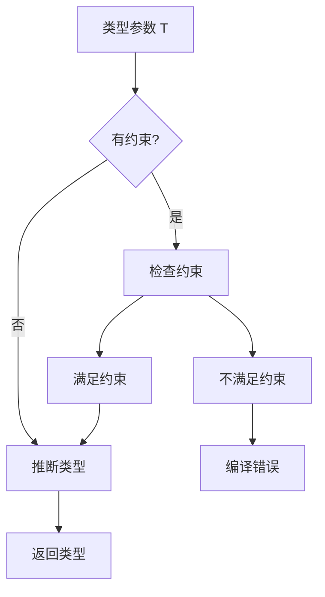

# TypeScript泛型编程指南

泛型是TypeScript中最强大的特性之一。

## 泛型基础

```typescript
// 泛型函数
function identity<T>(arg: T): T {
  return arg;
}

// 泛型接口
interface Box<T> {
  value: T;
}

// 泛型类
class Container<T> {
  constructor(private item: T) {}
  
  get(): T {
    return this.item;
  }
}
```

## 泛型约束

类型约束的关系：

$$
T \subseteq U \Rightarrow T \text{ extends } U
$$

```typescript
interface Lengthwise {
  length: number;
}

function logLength<T extends Lengthwise>(arg: T): T {
  console.log(arg.length);
  return arg;
}

// 使用keyof约束
function getProperty<T, K extends keyof T>(obj: T, key: K): T[K] {
  return obj[key];
}
```

## 高级泛型模式

### 条件类型

```typescript
type IsString<T> = T extends string ? true : false;

type A = IsString<string>; // true
type B = IsString<number>; // false

// 分布式条件类型
type Exclude<T, U> = T extends U ? never : T;
type NonNullable<T> = T extends null | undefined ? never : T;
```

### 映射类型

```typescript
// 只读属性
type Readonly<T> = {
  readonly [P in keyof T]: T[P];
};

// 可选属性
type Partial<T> = {
  [P in keyof T]?: T[P];
};

// 必选属性
type Required<T> = {
  [P in keyof T]-?: T[P];
};

// 选择属性
type Pick<T, K extends keyof T> = {
  [P in K]: T[P];
};

// 忽略属性
type Omit<T, K extends keyof any> = Pick<T, Exclude<keyof T, K>>;
```

## 类型推断流程



## 实用泛型工具

```typescript
// 深层只读
type DeepReadonly<T> = {
  readonly [P in keyof T]: T[P] extends object 
    ? DeepReadonly<T[P]> 
    : T[P];
};

// 深层可选
type DeepPartial<T> = {
  [P in keyof T]?: T[P] extends object 
    ? DeepPartial<T[P]> 
    : T[P];
};

// 提取函数参数类型
type Parameters<T> = T extends (...args: infer P) => any ? P : never;

// 提取函数返回类型
type ReturnType<T> = T extends (...args: any) => infer R ? R : any;

// 提取Promise返回类型
type Awaited<T> = T extends Promise<infer U> ? Awaited<U> : T;
```

## 泛型与类型体操

类型计算示例：

$$
Result = \text{Unwrap} \langle \text{Promise} \langle T \rangle \rangle = T
$$

```typescript
// 数组元素类型提取
type ElementOf<T> = T extends readonly (infer E)[] ? E : never;

type StringArray = ElementOf<string[]>; // string

// 元组操作
type First<T extends any[]> = T extends [infer F, ...any[]] ? F : never;
type Last<T extends any[]> = T extends [...any[], infer L] ? L : never;

type Head = First<[1, 2, 3]>; // 1
type Tail = Last<[1, 2, 3]>;  // 3
```

## 类型体操练习

| 类型挑战 | 难度 | 描述 |
|----------|------|------|
| Pick | 简单 | 实现Pick |
| Readonly | 简单 | 实现Readonly |
| Tuple to Object | 中等 | 元组转对象 |
| Deep Readonly | 困难 | 深层只读 |
| Currying | 困难 | 柯里化类型 |

## 泛型最佳实践

- [x] 使用描述性的类型参数名
- [x] 尽量使用 extends 约束泛型
- [x] 避免过多泛型参数
- [ ] 优先使用内置工具类型
- [ ] 保持类型简单易懂

```typescript
// 好的命名
function getPropertyValue<T extends object, K extends keyof T>(
  obj: T,
  key: K
): T[K] {
  return obj[key];
}

// 避免这样的命名
function getValue<T, U>(obj: T, key: U): unknown {
  return (obj as any)[key as any];
}
```

> 泛型的本质是参数化类型，让类型也能像值一样传递和计算。