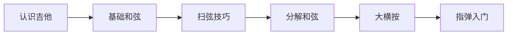
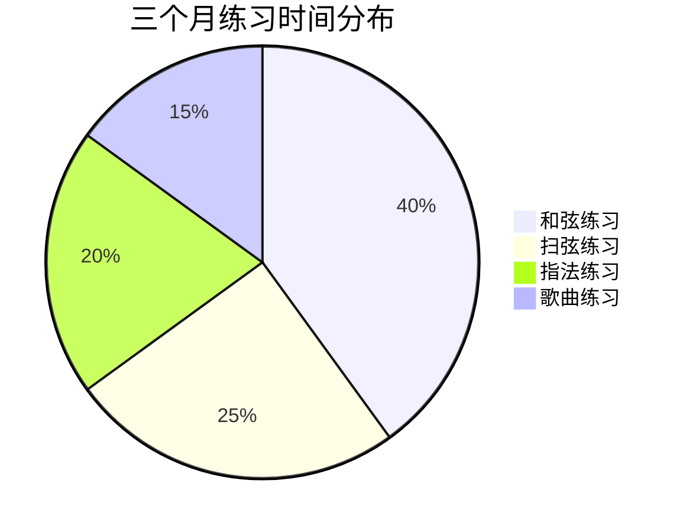

# 学习吉他三个月心得

三个月前，我终于下定决心学习吉他。

## 学习路线图



## 基础和弦练习

最重要的八个开放和弦：

| 和弦 | 指法 | 难度 |
|------|------|------|
| C | 1-2-3 | 简单 |
| D | 1-2-3 | 简单 |
| E | 1-2-3 | 简单 |
| G | 1-2-3-4 | 中等 |
| Am | 1-2-3 | 简单 |
| Em | 1-2 | 简单 |
| Dm | 1-2-3 | 中等 |
| F | 大横按 | 困难 |

## 和弦转换速度公式

转换速度提升需要：

$$
Speed = \frac{Practice\_Time}{Repetitions} \times Muscle\_Memory
$$

## 我的练习计划

### 第一月：基础

- [x] 认识吉他的各个部分
- [x] 学习正确的持琴姿势
- [x] 掌握C、Am、G、Em四个和弦
- [x] 练习简单的扫弦节奏

### 第二月：进阶

- [x] 学习D、Dm、E和弦
- [x] 练习和弦转换
- [x] 学习分解和弦
- [ ] F和弦还在挣扎中

### 第三月：实战

- [ ] 完整弹唱一首歌
- [ ] 学习大横按技巧
- [ ] 尝试指弹练习

## 常见问题解决

### 手指疼痛

$$
Pain\_Level \propto \frac{1}{Callus\_Thickness}
$$

解决方法：
1. 每天坚持练习
2. 逐渐增加练习时间
3. 必要时休息

### 和弦杂音

```typescript
interface ChordProblem {
  symptom: string;
  cause: string;
  solution: string;
}

const problems: ChordProblem[] = [
  {
    symptom: '闷音',
    cause: '手指碰到其他弦',
    solution: '调整手指角度',
  },
  {
    symptom: '杂音',
    cause: '按弦不实',
    solution: '增加按弦力度',
  },
  {
    symptom: '声音中断',
    cause: '换和弦太慢',
    solution: '慢速练习转换',
  },
];
```

## 学会的歌曲

1. 《小星星》- 单音旋律
2. 《两只老虎》- 简单和弦
3. 《生日快乐》- 扫弦版

## 练习时间统计



## 吉他学习资源

| 类型 | 名称 | 评价 |
|------|------|------|
| App | GuitarTuna | 调音必备 |
| App | Ultimate Guitar | 和弦谱丰富 |
| B站 | 果木音乐 | 教程详细 |
| 书籍 | 《吉他自学三月通》 | 系统全面 |

> 学吉他没有捷径，只有日复一日的练习。指尖的茧，是坚持的勋章。