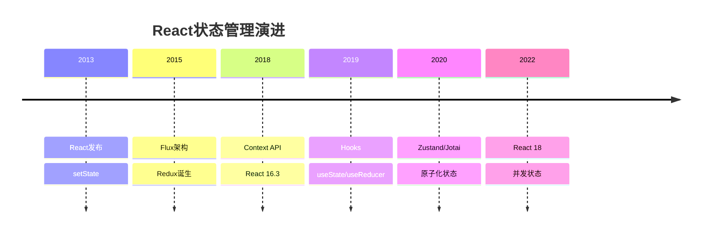
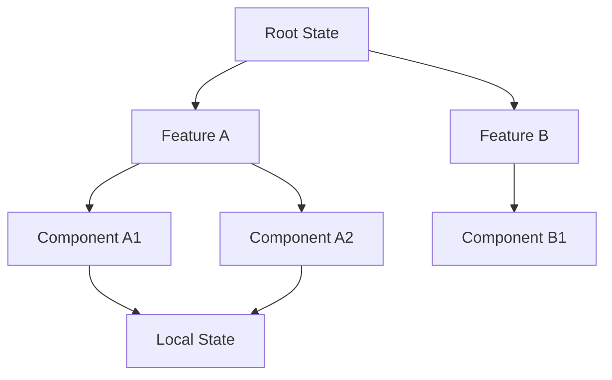

# React状态管理深入解析

状态管理是React应用的核心问题之一。

## 状态管理演进



## 状态类型分析

```typescript
// 组件本地状态
const [count, setCount] = useState(0);

// 派生状态
const doubled = useMemo(() => count * 2, [count]);

// 全局状态
const globalState = useStore((state) => state.value);
```

## 方案对比

| 特性 | Redux | Zustand | Jotai | Recoil |
|------|-------|---------|-------|--------|
| 学习曲线 | 高 | 低 | 低 | 中 |
| 代码量 | 多 | 少 | 少 | 中 |
| 性能 | 优 | 优 | 优 | 优 |
| DevTools | 完善 | 支持 | 支持 | 支持 |
| 类型支持 | 需配置 | 原生 | 原生 | 原生 |

## Zustand实现原理

```typescript
// 简化版Zustand实现
type State = Record<string, unknown>;
type Listener = (state: State) => void;

function createStore<T extends State>(
  initialState: T
) {
  let state = initialState;
  const listeners = new Set<Listener>();

  return {
    getState: () => state,
    setState: (partial: Partial<T>) => {
      state = { ...state, ...partial };
      listeners.forEach((listener) => listener(state));
    },
    subscribe: (listener: Listener) => {
      listeners.add(listener);
      return () => listeners.delete(listener);
    },
  };
}
```

## 状态更新性能分析

React的批处理更新机制：

$$
Updates_{batched} = \min(Updates_{triggered}, Sync\_Threshold)
$$

```typescript
// React 18自动批处理
function handleClick() {
  // 这些更新会被自动批处理
  setCount(c => c + 1);
  setFlag(f => !f);
  // 只会触发一次re-render
}
```

## Jotai原子化状态

```typescript
import { atom, useAtom } from 'jotai';

// 原子状态定义
const countAtom = atom(0);
const doubledAtom = atom((get) => get(countAtom) * 2);

// 组件使用
function Counter() {
  const [count, setCount] = useAtom(countAtom);
  const [doubled] = useAtom(doubledAtom);

  return (
    <div>
      <p>Count: {count}</p>
      <p>Doubled: {doubled}</p>
      <button onClick={() => setCount((c) => c + 1)}>Increment</button>
    </div>
  );
}
```

## 状态传播图



## 选择指南

- [x] 简单应用：useState/useReducer
- [x] 中等复杂度：Zustand
- [x] 细粒度更新：Jotai
- [ ] 大型团队：Redux Toolkit
- [ ] 服务端状态：React Query/SWR

## 性能优化

```typescript
// 选择器优化
const user = useStore(
  (state) => state.users[id], // 只订阅特定用户
  shallow // 浅比较
);

// 避免不必要的重渲染
const MemoizedComponent = memo(function Component({ data }) {
  return <div>{data.name}</div>;
});
```

> 选择状态管理方案时，要根据项目规模和团队熟悉度权衡。