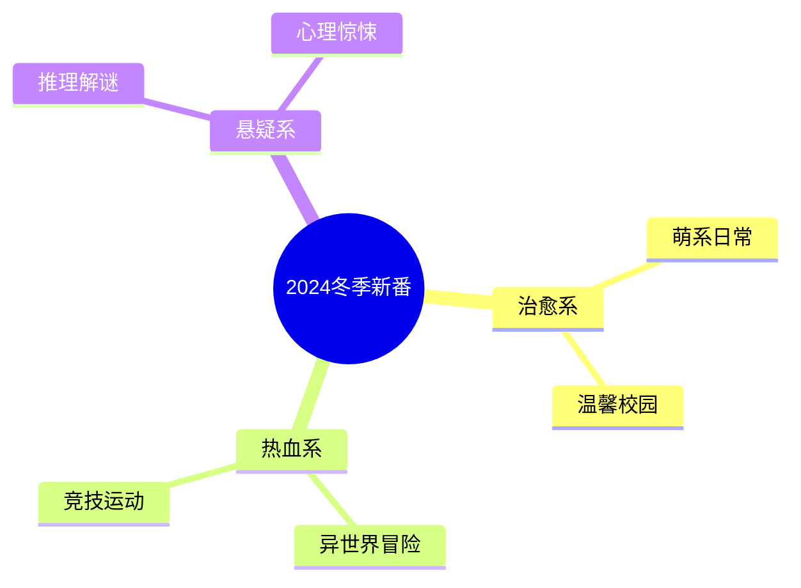

# 冬日动漫推荐清单

冬天是最适合窝在被子里看动漫的季节。

## 本季新番推荐



## 推荐列表

### 1. 冰菓

经典的校园推理动漫，画风清新，剧情温和。

- 评分：$\frac{9.2}{10}$
- 集数：22话
- 类型：推理、校园

### 2. 四月是你的谎言

音乐与青春的完美结合。

$$
Emotion = Music \times Performance
$$

### 3. 紫罗兰永恒花园

京阿尼的画质巅峰，每一帧都是壁纸。

| 特点 | 评价 |
|------|------|
| 画面 | 精美绝伦 |
| 剧情 | 感人至深 |
| 音乐 | 动人心弦 |
| 声优 | 阵容豪华 |

## 番剧追番进度

- [x] 冰菓
- [x] 四月是你的谎言
- [x] 紫罗兰永恒花园
- [ ] 虫师
- [ ] 夏目友人帐

## 观影建议

冬天看动漫的最佳搭配：

1. 热可可 + 毛毯
2. 零食 + 暖炉
3. 耳机 + 静音环境

## 音乐推荐

动漫OST是灵魂：

> 音乐是动漫的灵魂，一首好的BGM能让场景瞬间升华。

### 经典OST曲目

```typescript
interface AnimeOST {
  title: string;
  anime: string;
  composer: string;
  mood: 'sad' | 'happy' | 'epic' | 'calm';
}

const recommendations: AnimeOST[] = [
  { title: 'Refrain', anime: '四月是你的谎言', composer: '横山克', mood: 'sad' },
  { title: 'Violet\'s Letter', anime: '紫罗兰永恒花园', composer: 'Evan Call', mood: 'calm' },
  { title: '月が綺麗', anime: '月色真美', composer: '伊贺拓郎', mood: 'happy' },
];
```

## 动漫评分公式

个人评分标准：

$$
Score = 0.3 \times Story + 0.25 \times Art + 0.25 \times Music + 0.2 \times Character
$$

其中每个维度的取值范围为 $[0, 10]$。

## 冬日观番计划表

| 日期 | 时间 | 动漫 | 话数 |
|------|------|------|------|
| 周六 | 20:00 | 冰菓 | 1-3 |
| 周日 | 14:00 | 紫罗兰永恒花园 | 1-2 |

> 冬天很短，番剧很长，且看且珍惜。