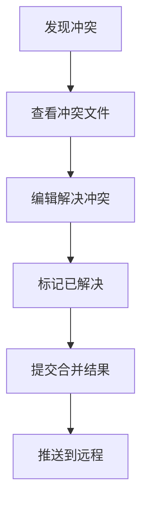

# Git分支管理策略

良好的分支策略是团队协作的基础。

## Git Flow模型


## 主流分支策略对比

| 策略 | 适用场景 | 分支数量 | 复杂度 |
|------|----------|----------|--------|
| Git Flow | 版本发布 | 多 | 高 |
| GitHub Flow | 持续部署 | 少 | 低 |
| GitLab Flow | 混合模式 | 中 | 中 |
| Trunk Based | 大型团队 | 极少 | 低 |

## 分支命名规范

```bash
# 功能分支
feature/user-authentication
feature/payment-integration

# 修复分支
bugfix/login-error
hotfix/security-patch

# 发布分支
release/v1.2.0
release/2024-q4
```

## 常用命令

```bash
# 创建并切换分支
git checkout -b feature/new-feature

# 合并分支（保持历史整洁）
git merge --no-ff feature/new-feature

# 变基操作
git rebase main

# 交互式变基
git rebase -i HEAD~3

# Cherry-pick特定提交
git cherry-pick abc123
```

## 版本号规范

语义化版本号遵循：

$$
SemVer = MAJOR.MINOR.PATCH
$$

- $MAJOR$: 不兼容的API变更
- $MINOR$: 向后兼容的功能新增
- $PATCH$: 向后兼容的问题修复

## Git Hook配置

```yaml
# .husky/pre-commit
#!/usr/bin/env sh
. "$(dirname -- "$0")/_/husky.sh"

npm run lint
npm run test
```

```yaml
# .husky/commit-msg
#!/usr/bin/env sh
. "$(dirname -- "$0")/_/husky.sh"

npx --no -- commitlint --edit "$1"
```

## 提交信息规范

```
<type>(<scope>): <subject>

<body>

<footer>
```

| Type | 描述 |
|------|------|
| feat | 新功能 |
| fix | 修复bug |
| docs | 文档更新 |
| style | 代码格式 |
| refactor | 重构 |
| test | 测试 |
| chore | 构建/工具 |

## 冲突解决流程



> 分支策略的核心是在团队协作效率和代码质量之间找到平衡。