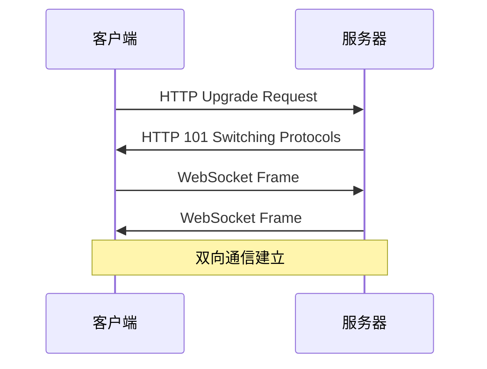

# WebSocket实时通信详解

WebSocket是一种在单个TCP连接上进行全双工通信的协议。

## 协议握手

WebSocket握手基于HTTP协议升级：

$$
Upgrade: websocket
$$

$$
Connection: Upgrade
$$

## 连接建立过程



## 服务端实现

```typescript
import { WebSocketServer, WebSocket } from 'ws';

interface Message {
  type: string;
  payload: unknown;
  timestamp: number;
}

const wss = new WebSocketServer({ port: 8080 });

const clients = new Set<WebSocket>();

wss.on('connection', (ws) => {
  clients.add(ws);
  
  ws.on('message', (data) => {
    const message: Message = JSON.parse(data.toString());
    message.timestamp = Date.now();
    
    // 广播给所有客户端
    clients.forEach((client) => {
      if (client.readyState === WebSocket.OPEN) {
        client.send(JSON.stringify(message));
      }
    });
  });
  
  ws.on('close', () => {
    clients.delete(ws);
  });
});

console.log('WebSocket server running on ws://localhost:8080');
```

## 客户端实现

```typescript
class WebSocketClient {
  private ws: WebSocket | null = null;
  private reconnectAttempts = 0;
  private maxReconnectAttempts = 5;
  
  constructor(private url: string) {}
  
  connect(): void {
    this.ws = new WebSocket(this.url);
    
    this.ws.onopen = () => {
      console.log('Connected to server');
      this.reconnectAttempts = 0;
    };
    
    this.ws.onmessage = (event) => {
      const message = JSON.parse(event.data);
      this.handleMessage(message);
    };
    
    this.ws.onclose = () => {
      this.reconnect();
    };
  }
  
  private reconnect(): void {
    if (this.reconnectAttempts < this.maxReconnectAttempts) {
      this.reconnectAttempts++;
      const delay = Math.min(1000 * Math.pow(2, this.reconnectAttempts), 30000);
      setTimeout(() => this.connect(), delay);
    }
  }
  
  send(type: string, payload: unknown): void {
    if (this.ws?.readyState === WebSocket.OPEN) {
      this.ws.send(JSON.stringify({ type, payload }));
    }
  }
  
  private handleMessage(message: Message): void {
    console.log('Received:', message);
  }
}
```

## 数据帧格式

WebSocket帧结构：

$$
FIN + RSV1 + RSV2 + RSV3 + OPCODE + MASK + PAYLOAD\_LEN + MASKING\_KEY + PAYLOAD
$$

| 字段 | 位数 | 描述 |
|------|------|------|
| FIN | 1 | 是否最后一帧 |
| RSV1-3 | 3 | 保留位 |
| OPCODE | 4 | 操作码 |
| MASK | 1 | 是否掩码 |
| PAYLOAD_LEN | 7/7+16/7+64 | 负载长度 |

## 心跳机制

```typescript
// 心跳间隔计算
const HEARTBEAT_INTERVAL = 30000;
const HEARTBEAT_TIMEOUT = 10000;

function setupHeartbeat(ws: WebSocket): void {
  let heartbeatTimer: NodeJS.Timeout;
  let timeoutTimer: NodeJS.Timeout;
  
  const sendHeartbeat = () => {
    if (ws.readyState === WebSocket.OPEN) {
      ws.ping();
      timeoutTimer = setTimeout(() => {
        ws.terminate();
      }, HEARTBEAT_TIMEOUT);
    }
  };
  
  ws.on('pong', () => {
    clearTimeout(timeoutTimer);
    heartbeatTimer = setTimeout(sendHeartbeat, HEARTBEAT_INTERVAL);
  });
  
  heartbeatTimer = setTimeout(sendHeartbeat, HEARTBEAT_INTERVAL);
}
```

## 应用场景

- [x] 即时通讯
- [x] 实时数据推送
- [x] 在线协作
- [x] 游戏
- [ ] 视频会议

> WebSocket让Web应用具备了实时通信能力，是现代实时应用的基础设施。