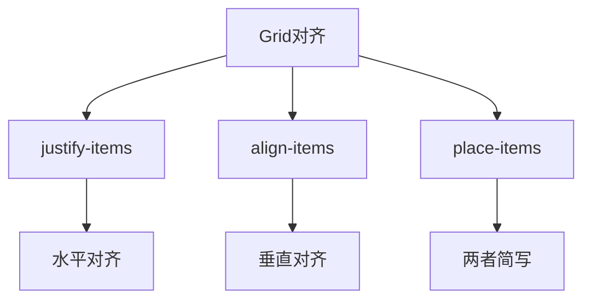

# CSS Grid布局完全指南

CSS Grid是最强大的CSS布局系统之一。

## 基础概念

Grid布局由网格容器和网格项目组成：

$$
Grid = Container + Items
$$

```mermaid
graph TB
    A[Grid Container] --> B[Grid Item 1]
    A --> C[Grid Item 2]
    A --> D[Grid Item 3]
    A --> E[Grid Item 4]

    subgrid 网格轨道
        F[Grid Line]
        G[Grid Cell]
        H[Grid Area]
    end
```

## 基本用法

### 定义网格

```css
.container {
  display: grid;
  grid-template-columns: 200px 1fr 1fr;
  grid-template-rows: auto 1fr auto;
  gap: 20px;
}
```

网格轨道大小计算：

$$
ColumnWidth = \frac{AvailableWidth - Gaps}{frSum} \times fr
$$

### 常用属性

| 属性 | 描述 | 示例 |
|------|------|------|
| `grid-template-columns` | 定义列 | `1fr 2fr 1fr` |
| `grid-template-rows` | 定义行 | `auto 1fr auto` |
| `gap` | 间距 | `20px` |
| `grid-area` | 命名区域 | `"header"` |
| `justify-items` | 水平对齐 | `center` |
| `align-items` | 垂直对齐 | `center` |

## 响应式网格

```css
/* 使用minmax创建自适应网格 */
.container {
  display: grid;
  grid-template-columns: repeat(auto-fit, minmax(300px, 1fr));
  gap: 20px;
}
```

自动计算列数：

$$
ColumnCount = \lfloor \frac{ContainerWidth + Gap}{MinWidth + Gap} \rfloor
$$

## 网格区域命名

```css
.container {
  display: grid;
  grid-template-areas:
    "header header header"
    "sidebar main main"
    "footer footer footer";
  grid-template-columns: 200px 1fr 1fr;
  grid-template-rows: auto 1fr auto;
}

.header { grid-area: header; }
.sidebar { grid-area: sidebar; }
.main { grid-area: main; }
.footer { grid-area: footer; }
```

## 实际布局示例

```html
<!DOCTYPE html>
<html>
<head>
  <style>
    .layout {
      display: grid;
      grid-template-areas:
        "header"
        "nav"
        "main"
        "footer";
      min-height: 100vh;
    }

    @media (min-width: 768px) {
      .layout {
        grid-template-areas:
          "header header"
          "nav    main"
          "footer footer";
        grid-template-columns: 200px 1fr;
        grid-template-rows: auto 1fr auto;
      }
    }

    .header { grid-area: header; background: #333; color: white; }
    .nav { grid-area: nav; background: #f0f0f0; }
    .main { grid-area: main; padding: 20px; }
    .footer { grid-area: footer; background: #333; color: white; }
  </style>
</head>
<body>
  <div class="layout">
    <header class="header">Header</header>
    <nav class="nav">Navigation</nav>
    <main class="main">Main Content</main>
    <footer class="footer">Footer</footer>
  </div>
</body>
</html>
```

## 对齐方式



### 对齐示例

```css
/* 居中单个项目 */
.item {
  justify-self: center;
  align-self: center;
}

/* 或者简写 */
.item {
  place-self: center;
}

/* 容器级对齐 */
.container {
  justify-items: center;
  align-items: center;
}
```

## 复杂布局实例

```css
/* 圣杯布局 */
.layout {
  display: grid;
  grid-template:
    "header header header" auto
    "left   main   right" 1fr
    "footer footer footer" auto
    / 200px 1fr 200px;
  min-height: 100vh;
}
```

## Grid vs Flexbox

| 特性 | Grid | Flexbox |
|------|------|---------|
| 维度 | 二维 | 一维 |
| 适用 | 页面布局 | 组件布局 |
| 对齐 | 更强大 | 简单易用 |
| 间距 | gap属性 | margin |

选择建议：

$$
Layout = \begin{cases}
Grid & \text{if 二维布局} \\
Flexbox & \text{if 一维布局}
\end{cases}
$$

## 调试技巧

浏览器开发者工具中可视化Grid：

```css
.container {
  display: grid;
  /* Chrome/Edge会显示网格线 */
}
```

- 打开DevTools → Elements → Grid徽章
- 查看网格线、轨道、区域

## 兼容性

现代浏览器全面支持：

- Chrome 57+
- Firefox 52+
- Safari 10.1+
- Edge 16+

> CSS Grid彻底改变了Web布局的方式。掌握它，你就能创建任何复杂的布局。