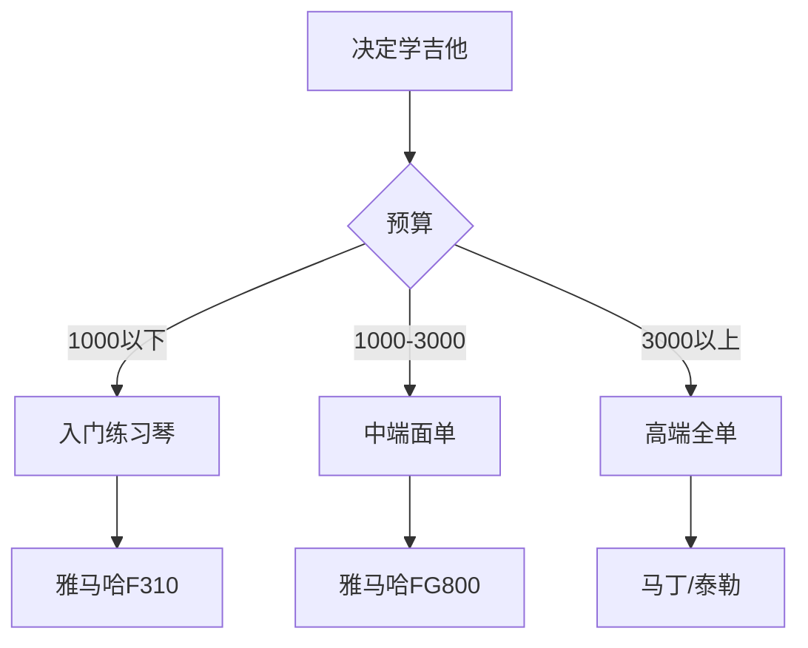

# 我的第一把吉他

终于下定决心，拥有了自己的吉他！

## 选琴经历



## 我的配置

| 项目 | 品牌型号 | 价格 |
|------|----------|------|
| 吉他 | Yamaha FG800 | ¥1099 |
| 琴弦 | D'Addario EJ16 | ¥68 |
| 变调夹 | Shubb C1 | ¥198 |
| 调音器 | Snark SN-5X | ¥59 |
| 拨片 | Dunlop Tortex ×10 | ¥30 |
| 琴包 | 加厚棉质 | ¥89 |

总花费：¥1643

## 基础知识

### 吉他结构

```
    ┌───────头部───────┐
    │  ○ ○ ○ 弦钮      │
    │                  │
    │    ══════琴颈══════│
    │   │ 品丝 │        │
    │   │ 品格 │        │
    │   └──────┘        │
    │  ┌──────────┐     │
    │  │  音孔    │     │
    │  │    ○     │     │
    │  └──────────┘     │
    └──────────────────┘
         琴身
```

### 音高计算

标准调弦的频率：

$$
f_n = 440 \times 2^{\frac{n-69}{12}} \text{ Hz}
$$

| 弦 | 音名 | 频率 |
|----|------|------|
| 1弦 | E4 | 329.63 Hz |
| 2弦 | B3 | 246.94 Hz |
| 3弦 | G3 | 196.00 Hz |
| 4弦 | D3 | 146.83 Hz |
| 5弦 | A2 | 110.00 Hz |
| 6弦 | E2 | 82.41 Hz |

## 学习计划

第一周学习内容：

- [x] 正确的持琴姿势
- [x] 右手拨弦方法
- [x] 左手按弦要领
- [x] 基础和弦 C、G、Am、Em
- [x] 简单的分解和弦

## 练习记录

```
Day 1: 手指疼，按不住弦
Day 2: 稍微好一点了，C和弦能按响
Day 3: 练习转换 C -> Am
Day 4: 加入 G 和弦，手指头起茧了
Day 5: 能弹《小星星》的分解和弦版
Day 6: 尝试扫弦，节奏乱七八糟
Day 7: 练习了2小时，指尖都麻了
```

## 和弦图

### C和弦

```
  ╔═══╗
  ║ ║ ║
┌─┼─┼─┼─┐
│ │ ○ │ │  1指按1弦1品
├─┼─┼─┼─┤
│ ○ │ │ │  2指按4弦2品
├─┼─┼─┼─┤
│ │ │ ○ │  3指按5弦3品
└─┴─┴─┴─┘
  ○       6弦不弹
```

### G和弦

```
  ╔═══╗
  ║ ║ ║
┌─┼─┼─┼─┐
│ ○ │ │ │  2指按5弦2品
├─┼─┼─┼─┤
│ │ ○ │ │  1指按6弦3品
├─┼─┼─┼─┤
│ ○ │ │ ○  3指按1弦3品
└─┴─┴─┴─┘
```

## 心得体会

学吉他和写代码有相似之处：

$$
Mastery = Practice^{Time} \times Passion
$$

- **重复练习**：和弦转换需要肌肉记忆
- **分解问题**：把难点拆开练习
- **及时反馈**：听自己弹的声音
- **保持耐心**：进步是渐进的

> 万事开头难，但只要坚持下去，总会有收获。音乐让我找到了另一种表达自己的方式。

加油！希望有一天能弹自己喜欢的歌！