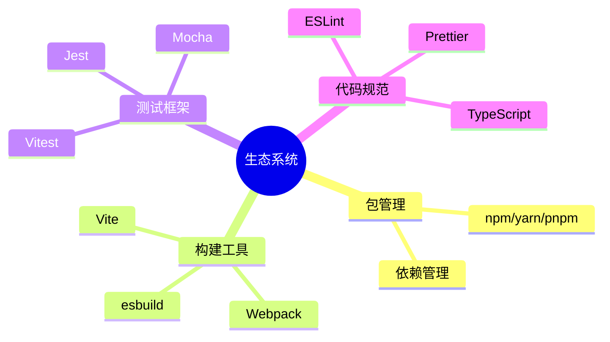

# 学习新编程语言的方法

掌握一门新语言需要策略和练习。

## 学习曲线

语言学习的时间投入与能力提升的关系：

$$
Skill(t) = S_{max} \times (1 - e^{-kt})
$$

其中：
- $S_{max}$ 是最大潜能
- $k$ 是学习效率常数
- $t$ 是时间


## 学习路径

### 1. 基础语法

| 概念 | 学习重点 |
|------|----------|
| 变量与类型 | 声明、作用域、类型系统 |
| 控制流 | 条件、循环、分支 |
| 函数 | 定义、参数、返回值 |
| 数据结构 | 数组、对象、集合 |

### 2. 核心特性

```typescript
// 以TypeScript为例

// 类型系统
type User = {
  id: string;
  name: string;
  email: string;
};

// 泛型
function identity(x: T): T {
  return x;
}

// 异步
async function fetchData(): Promise<User> {
  const res = await fetch('/api/user');
  return res.json();
}
```

### 3. 生态系统



## 实践项目

学习新语言时，我总是做这几个项目：

1. **命令行工具** - 学习基础语法和标准库
2. **Web API** - 学习网络编程和框架
3. **TODO应用** - 学习状态管理和持久化
4. **爬虫** - 学习并发和数据处理

## 学习资源对比

| 资源类型 | 优点 | 缺点 |
|----------|------|------|
| 官方文档 | 权威、最新 | 可能枯燥 |
| 视频教程 | 直观、生动 | 被动学习 |
| 书籍 | 系统、深入 | 可能过时 |
| 实践项目 | 主动、实用 | 可能走弯路 |
| 社区问答 | 具体、及时 | 碎片化 |

## 学习计划模板

```
第1周：语法基础
- Day 1-2: 变量、类型、运算符
- Day 3-4: 控制流、函数
- Day 5-7: 数据结构、模块

第2周：实践入门
- 完成3个小练习
- 阅读优秀项目源码
- 学习标准库

第3-4周：项目开发
- 选择一个小项目
- 边学边做
- 解决实际问题

第5-8周：深入学习
- 学习框架和工具
- 阅读源码
- 参与开源
```

## 高效学习技巧

### 费曼学习法

$$
Understanding = \frac{Teach}{Complexity}
$$

能够简单地向他人解释，才是真正理解。

### 刻意练习

- [ ] 明确目标
- [ ] 即时反馈
- [ ] 走出舒适区
- [ ] 重复练习
- [ ] 专注投入

### 项目驱动学习

```typescript
// 学习新概念时立即实践
// 学习Map后立即用

function wordCount(text: string): Map<string, number> {
  const words = text.toLowerCase().split(/\s+/);
  const count = new Map<string, number>();

  for (const word of words) {
    count.set(word, (count.get(word) || 0) + 1);
  }

  return count;
}

// 立即测试
const result = wordCount('hello world hello');
console.log(result); // Map { 'hello' => 2, 'world' => 1 }
```

## 避免的坑

| 坑 | 表现 | 解决 |
|----|------|------|
| 教程地狱 | 只看不练 | 边学边做 |
| 完美主义 | 不敢开始 | 先完成再完美 |
| 技术焦虑 | 学太多 | 专注一门 |
| 孤立学习 | 不交流 | 加入社区 |

> 学习编程语言没有捷径，但有更高效的方法。关键是要动手实践，持续学习。