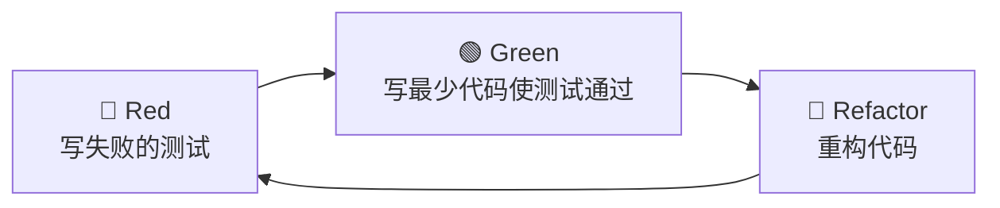
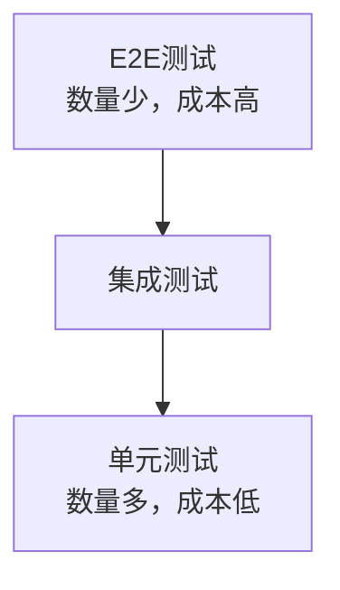

# 测试驱动开发实践

测试驱动开发（TDD）是一种先写测试再写代码的开发方法。

## TDD循环



TDD的核心循环：

$$
Development = Red \to Green \to Refactor
$$

## 实战示例

### 第一步：Red - 写失败的测试

```typescript
// calculator.test.ts
import { describe, it, expect } from 'vitest';
import { Calculator } from './calculator';

describe('Calculator', () => {
  it('should add two numbers', () => {
    const calc = new Calculator();
    expect(calc.add(2, 3)).toBe(5);
  });

  it('should subtract two numbers', () => {
    const calc = new Calculator();
    expect(calc.subtract(5, 3)).toBe(2);
  });

  it('should multiply two numbers', () => {
    const calc = new Calculator();
    expect(calc.multiply(2, 3)).toBe(6);
  });

  it('should divide two numbers', () => {
    const calc = new Calculator();
    expect(calc.divide(6, 3)).toBe(2);
  });

  it('should throw error when dividing by zero', () => {
    const calc = new Calculator();
    expect(() => calc.divide(1, 0)).toThrow('Division by zero');
  });
});
```

### 第二步：Green - 写最少代码

```typescript
// calculator.ts
export class Calculator {
  add(a: number, b: number): number {
    return a + b;
  }

  subtract(a: number, b: number): number {
    return a - b;
  }

  multiply(a: number, b: number): number {
    return a * b;
  }

  divide(a: number, b: number): number {
    if (b === 0) {
      throw new Error('Division by zero');
    }
    return a / b;
  }
}
```

### 第三步：Refactor - 重构

```typescript
// calculator.ts (refactored)
type Operation = (a: number, b: number) => number;

export class Calculator {
  private operations: Record<string, Operation> = {
    add: (a, b) => a + b,
    subtract: (a, b) => a - b,
    multiply: (a, b) => a * b,
    divide: (a, b) => {
      if (b === 0) throw new Error('Division by zero');
      return a / b;
    },
  };

  private execute(op: string, a: number, b: number): number {
    const operation = this.operations[op];
    if (!operation) throw new Error(`Unknown operation: ${op}`);
    return operation(a, b);
  }

  add(a: number, b: number): number {
    return this.execute('add', a, b);
  }

  subtract(a: number, b: number): number {
    return this.execute('subtract', a, b);
  }

  multiply(a: number, b: number): number {
    return this.execute('multiply', a, b);
  }

  divide(a: number, b: number): number {
    return this.execute('divide', a, b);
  }
}
```

## 测试类型金字塔



测试覆盖率和成本的关系：

$$
Cost_{total} = N_{e2e} \times C_{e2e} + N_{int} \times C_{int} + N_{unit} \times C_{unit}
$$

## React组件测试

```typescript
// Button.test.tsx
import { describe, it, expect, vi } from 'vitest';
import { render, screen, fireEvent } from '@testing-library/react';
import { Button } from './Button';

describe('Button', () => {
  it('should render with correct text', () => {
    render(<Button>Click me</Button>);
    expect(screen.getByText('Click me')).toBeInTheDocument();
  });

  it('should call onClick when clicked', () => {
    const handleClick = vi.fn();
    render(<Button onClick={handleClick}>Click me</Button>);

    fireEvent.click(screen.getByText('Click me'));

    expect(handleClick).toHaveBeenCalledTimes(1);
  });

  it('should be disabled when disabled prop is true', () => {
    render(<Button disabled>Click me</Button>);
    expect(screen.getByText('Click me')).toBeDisabled();
  });
});
```

## Mock和Stub

```typescript
// 使用vi.fn()创建mock函数
const mockCallback = vi.fn();

// 使用vi.mock()模拟模块
vi.mock('./api', () => ({
  fetchUser: vi.fn().mockResolvedValue({ id: '1', name: 'Alice' }),
}));

// 使用vi.spyOn()监视方法
const consoleSpy = vi.spyOn(console, 'log').mockImplementation(() => {});
```

## 测试覆盖率

| 类型 | 描述 | 目标 |
|------|------|------|
| 语句覆盖 | 每条语句执行 | >80% |
| 分支覆盖 | 每个分支执行 | >75% |
| 函数覆盖 | 每个函数调用 | >80% |
| 行覆盖 | 每行代码执行 | >80% |

## TDD的优势

- [x] 更好的代码设计
- [x] 文档化的代码
- [x] 快速反馈循环
- [x] 重构的信心
- [x] 减少bug数量

## 常见问题

| 问题 | 解决方案 |
|------|----------|
| 测试太慢 | 使用测试缓存，并行执行 |
| 测试脆弱 | 减少依赖，使用mock |
| 测试不清晰 | 使用描述性的test name |
| 重构困难 | 保持测试简单，关注行为 |

> TDD不只是关于测试，更是一种设计方法。它迫使你思考接口设计，编写可测试的代码。