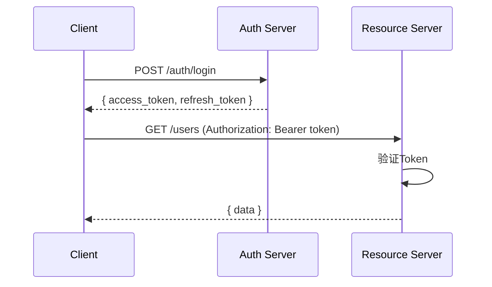

# REST API设计规范

良好的API设计是前后端协作的基础。

## RESTful原则

REST架构风格的约束条件：

$$
REST = ClientServer + Stateless + Cache + UniformInterface + LayeredSystem + CodeOnDemand
$$

## URL设计

### 资源命名

```mermaid
graph TB
    A[API Root] --> B[/users]
    A --> C[/posts]
    A --> D[/comments]

    B --> E[/users/:id]
    E --> F[/users/:id/posts]
    E --> G[/users/:id/comments]

    C --> H[/posts/:id]
    H --> I[/posts/:id/comments]
    H --> J[/posts/:id/likes]
```

### 规范对比

| 正确 | 错误 | 说明 |
|------|------|------|
| GET /users | GET /getUsers | 使用名词 |
| POST /users | POST /createUser | 动作由HTTP方法表示 |
| /users/123 | /users?id=123 | 路径参数表示资源 |
| /users?page=1 | /users/1 | 查询参数用于过滤 |

## HTTP方法

| 方法 | 用途 | 幂等性 | 安全性 |
|------|------|--------|--------|
| GET | 获取资源 | ✅ | ✅ |
| POST | 创建资源 | ❌ | ❌ |
| PUT | 替换资源 | ✅ | ❌ |
| PATCH | 更新资源 | ❌ | ❌ |
| DELETE | 删除资源 | ✅ | ❌ |

## 状态码设计

```typescript
// 响应状态码使用
enum HttpStatus {
  // 成功响应
  OK = 200,                  // 成功
  CREATED = 201,             // 创建成功
  NO_CONTENT = 204,         // 无内容（删除成功）

  // 客户端错误
  BAD_REQUEST = 400,        // 请求格式错误
  UNAUTHORIZED = 401,       // 未认证
  FORBIDDEN = 403,          // 无权限
  NOT_FOUND = 404,          // 资源不存在
  CONFLICT = 409,           // 资源冲突
  UNPROCESSABLE_ENTITY = 422, // 验证错误

  // 服务端错误
  INTERNAL_SERVER_ERROR = 500, // 服务器错误
}
```

## 响应格式

### 成功响应

```json
{
  "success": true,
  "data": {
    "id": "123",
    "title": "文章标题",
    "content": "文章内容"
  }
}
```

### 分页响应

```json
{
  "success": true,
  "data": [...],
  "meta": {
    "page": 1,
    "per_page": 20,
    "total": 100,
    "total_pages": 5
  }
}
```

### 错误响应

```json
{
  "success": false,
  "error": {
    "code": "VALIDATION_ERROR",
    "message": "验证失败",
    "details": [
      {
        "field": "email",
        "message": "邮箱格式不正确"
      }
    ]
  }
}
```

## API实现示例

```typescript
import express, { Request, Response } from 'express';

const app = express();
app.use(express.json());

// GET /users - 获取用户列表
app.get('/users', async (req: Request, res: Response) => {
  const { page = 1, per_page = 20 } = req.query;

  const { users, total } = await getUsers({
    page: Number(page),
    perPage: Number(per_page),
  });

  res.json({
    success: true,
    data: users,
    meta: {
      page: Number(page),
      per_page: Number(per_page),
      total,
      total_pages: Math.ceil(total / Number(per_page)),
    },
  });
});

// POST /users - 创建用户
app.post('/users', async (req: Request, res: Response) => {
  const { name, email } = req.body;

  // 验证
  if (!name || !email) {
    return res.status(422).json({
      success: false,
      error: {
        code: 'VALIDATION_ERROR',
        message: '缺少必填字段',
      },
    });
  }

  const user = await createUser({ name, email });
  res.status(201).json({ success: true, data: user });
});
```

## 认证授权



## 版本控制

```
# URL版本（推荐）
GET /api/v1/users
GET /api/v2/users

# Header版本
GET /users
Accept: application/vnd.api+json;version=1
```

## API设计清单

- [ ] URL使用名词复数
- [ ] 正确使用HTTP方法
- [ ] 合适的状态码
- [ ] 一致的响应格式
- [ ] 分页支持
- [ ] 过滤和排序
- [ ] 错误处理
- [ ] 认证授权
- [ ] 版本控制
- [ ] 文档完善

> 好的API设计应该是直观的、一致的、可预测的。开发者不需要频繁查阅文档就能正确使用。