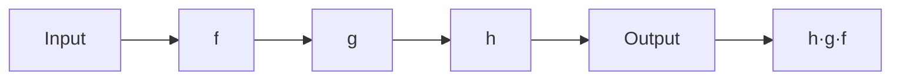

# 函数式编程思想

函数式编程是一种编程范式，它将计算视为数学函数的求值。

## 核心概念

### 纯函数

纯函数的输出只依赖于输入：

$$
Output = f(Input)
$$

相同的输入永远产生相同的输出，且没有副作用。

```typescript
// ❌ 非纯函数：依赖外部状态
let counter = 0;
function increment() {
  return ++counter;
}

// ✅ 纯函数：只依赖参数
function pureIncrement(value: number): number {
  return value + 1;
}
```

### 不可变性

```typescript
// ❌ 可变操作
const arr = [1, 2, 3];
arr.push(4); // 改变了原数组

// ✅ 不可变操作
const arr = [1, 2, 3];
const newArr = [...arr, 4]; // 创建新数组
```

## 函数组合



组合函数：

$$
h \circ g \circ f = h(g(f(x)))
$$

```typescript
// 函数组合
const compose = <T>(...fns: ((x: T) => T)[]) =>
  (x: T) => fns.reduceRight((acc, fn) => fn(acc), x);

const pipe = <T>(...fns: ((x: T) => T)[]) =>
  (x: T) => fns.reduce((acc, fn) => fn(acc), x);

// 使用示例
const double = (x: number) => x * 2;
const addOne = (x: number) => x + 1;
const square = (x: number) => x * x;

const calculate = pipe(double, addOne, square);
console.log(calculate(3)); // ((3 * 2) + 1) ^ 2 = 49
```

## 高阶函数

```typescript
// map: 转换
const numbers = [1, 2, 3, 4, 5];
const doubled = numbers.map(x => x * 2);
// [2, 4, 6, 8, 10]

// filter: 过滤
const evens = numbers.filter(x => x % 2 === 0);
// [2, 4]

// reduce: 归约
const sum = numbers.reduce((acc, x) => acc + x, 0);
// 15
```

## 柯里化

柯里化是将多参数函数转换为单参数函数链的过程：

$$
f(a, b, c) \Rightarrow f(a)(b)(c)
$$

```typescript
// 普通函数
function add(a: number, b: number, c: number): number {
  return a + b + c;
}

// 柯里化版本
function curriedAdd(a: number) {
  return (b: number) => {
    return (c: number) => a + b + c;
  };
}

// 使用
const result = curriedAdd(1)(2)(3); // 6

// 部分应用
const addFive = curriedAdd(5);
const addFiveAndTen = addFive(10);
console.log(addFiveAndTen(3)); // 18
```

## Functor和Monad

### Functor

Functor是可映射的容器：

```typescript
interface Functor<T> {
  map<U>(f: (value: T) => U): Functor<U>;
}

// Array是Functor
const arr: Functor<number> = [1, 2, 3];
const mapped = arr.map(x => x * 2); // [2, 4, 6]
```

### Monad

Monad是支持链式操作的容器：

```typescript
interface Monad<T> {
  bind<U>(f: (value: T) => Monad<U>): Monad<U>;
}

// Maybe Monad
class Maybe<T> {
  constructor(private value: T | null) {}

  static of<T>(value: T): Maybe<T> {
    return new Maybe(value);
  }

  bind<U>(f: (value: T) => Maybe<U>): Maybe<U> {
    return this.value === null
      ? new Maybe<U>(null)
      : f(this.value);
  }

  getOrElse(defaultValue: T): T {
    return this.value ?? defaultValue;
  }
}

// 使用示例
const result = Maybe.of(5)
  .bind(x => Maybe.of(x * 2))
  .bind(x => Maybe.of(x + 1))
  .getOrElse(0);
// result = 11
```

## 实际应用

```typescript
// 数据处理管道
interface User {
  id: string;
  name: string;
  age: number;
  email: string;
}

const users: User[] = [
  { id: '1', name: 'Alice', age: 25, email: 'alice@example.com' },
  { id: '2', name: 'Bob', age: 17, email: 'bob@example.com' },
  { id: '3', name: 'Charlie', age: 30, email: 'charlie@example.com' },
];

// 函数式处理
const adultNames = users
  .filter(user => user.age >= 18)
  .map(user => user.name)
  .sort((a, b) => a.localeCompare(b));

console.log(adultNames); // ['Alice', 'Charlie']
```

## 函数式编程清单

- [x] 使用纯函数
- [x] 避免可变状态
- [x] 使用高阶函数
- [x] 函数组合
- [x] 柯里化
- [ ] 惰性求值
- [ ] 尾递归优化

> 函数式编程让代码更可预测、更易测试、更容易并发。它不是银弹，但是一种强大的思维方式。