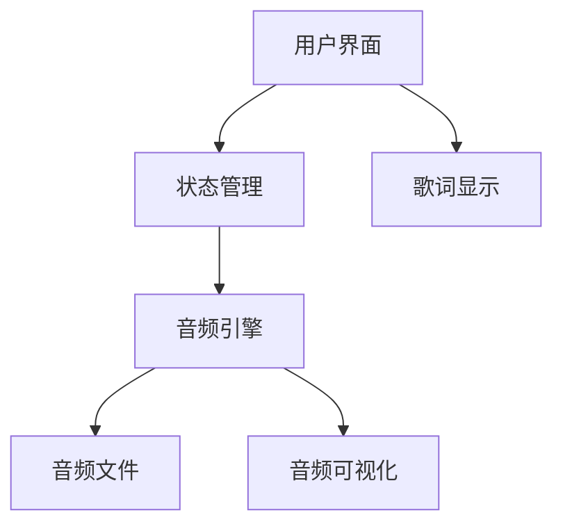
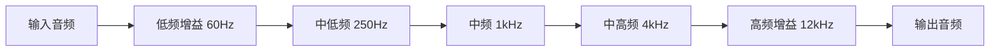

# 我的音乐播放器项目

作为一个音乐爱好者，开发自己的音乐播放器是很有意思的事。

## 项目概述



## 技术选型

| 层级 | 技术 | 理由 |
|------|------|------|
| 框架 | Next.js 15 | SSR + API Routes |
| UI | React 19 | 组件化开发 |
| 样式 | Tailwind CSS | 快速开发 |
| 状态 | Zustand | 轻量级状态管理 |
| 音频 | Web Audio API | 底层控制 |

## 核心功能

### 音频播放

音频播放的核心是计算播放进度：

$$
Progress = \frac{CurrentTime}{Duration} \times 100\%
$$

```typescript
import { useRef, useState, useEffect } from 'react';

interface UseAudioPlayerReturn {
  isPlaying: boolean;
  currentTime: number;
  duration: number;
  play: () => void;
  pause: () => void;
  seek: (time: number) => void;
}

export function useAudioPlayer(src: string): UseAudioPlayerReturn {
  const audioRef = useRef<HTMLAudioElement | null>(null);
  const [isPlaying, setIsPlaying] = useState(false);
  const [currentTime, setCurrentTime] = useState(0);
  const [duration, setDuration] = useState(0);

  useEffect(() => {
    const audio = new Audio(src);
    audioRef.current = audio;

    const handleTimeUpdate = () => setCurrentTime(audio.currentTime);
    const handleLoadedMetadata = () => setDuration(audio.duration);
    const handleEnded = () => setIsPlaying(false);

    audio.addEventListener('timeupdate', handleTimeUpdate);
    audio.addEventListener('loadedmetadata', handleLoadedMetadata);
    audio.addEventListener('ended', handleEnded);

    return () => {
      audio.removeEventListener('timeupdate', handleTimeUpdate);
      audio.removeEventListener('loadedmetadata', handleLoadedMetadata);
      audio.removeEventListener('ended', handleEnded);
      audio.pause();
    };
  }, [src]);

  const play = () => {
    audioRef.current?.play();
    setIsPlaying(true);
  };

  const pause = () => {
    audioRef.current?.pause();
    setIsPlaying(false);
  };

  const seek = (time: number) => {
    if (audioRef.current) {
      audioRef.current.currentTime = time;
    }
  };

  return { isPlaying, currentTime, duration, play, pause, seek };
}
```

### 音频可视化

```typescript
import { useRef, useEffect } from 'react';

export function AudioVisualizer({ audioElement }: { audioElement: HTMLAudioElement }) {
  const canvasRef = useRef<HTMLCanvasElement>(null);

  useEffect(() => {
    const canvas = canvasRef.current;
    if (!canvas) return;

    const ctx = canvas.getContext('2d')!;
    const audioCtx = new AudioContext();
    const analyser = audioCtx.createAnalyser();
    const source = audioCtx.createMediaElementSource(audioElement);

    source.connect(analyser);
    analyser.connect(audioCtx.destination);

    const bufferLength = analyser.frequencyBinCount;
    const dataArray = new Uint8Array(bufferLength);

    const draw = () => {
      requestAnimationFrame(draw);
      analyser.getByteFrequencyData(dataArray);

      ctx.fillStyle = 'rgb(0, 0, 0)';
      ctx.fillRect(0, 0, canvas.width, canvas.height);

      const barWidth = (canvas.width / bufferLength) * 2.5;
      let x = 0;

      for (let i = 0; i < bufferLength; i++) {
        const barHeight = dataArray[i] / 2;
        ctx.fillStyle = `rgb(${dataArray[i]}, 50, 50)`;
        ctx.fillRect(x, canvas.height - barHeight, barWidth, barHeight);
        x += barWidth + 1;
      }
    };

    draw();
  }, [audioElement]);

  return <canvas ref={canvasRef} width={800} height={200} />;
}
```

## 播放列表数据结构

```typescript
interface Track {
  id: string;
  title: string;
  artist: string;
  album: string;
  duration: number;
  src: string;
  cover: string;
}

interface Playlist {
  id: string;
  name: string;
  tracks: Track[];
  createdAt: Date;
  updatedAt: Date;
}
```

## 音频均衡器

频率响应曲线：

$$
H(f) = \frac{Output}{Input}
$$



## 开发进度

- [x] 基础播放功能
- [x] 播放列表管理
- [x] 歌词同步显示
- [x] 音频可视化
- [ ] 均衡器
- [ ] 音效处理
- [ ] 移动端适配

## 项目结构

```
src/
├── app/
│   ├── page.tsx
│   └── layout.tsx
├── components/
│   ├── Player.tsx
│   ├── Playlist.tsx
│   ├── Visualizer.tsx
│   └── Controls.tsx
├── hooks/
│   ├── useAudioPlayer.ts
│   └── usePlaylist.ts
├── stores/
│   └── playerStore.ts
└── types/
    └── index.ts
```

> 这个项目让我深入理解了Web Audio API，也让我更加热爱音乐。代码与旋律的结合，真是太美妙了！