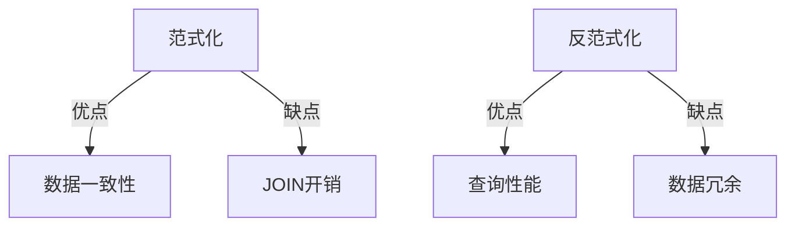
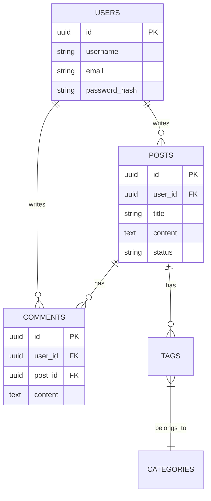

# 数据库设计最佳实践

良好的数据库设计是应用性能和可维护性的基础。

## 设计原则

### 范式化

第三范式（3NF）要求：

$$
3NF = 2NF + NoTransitiveDependency
$$

传递依赖：$A \to B \to C$，则 $A \to C$ 是传递依赖。

### 反范式化

为了查询性能，有时需要打破范式：



## 表设计

```sql
-- 用户表
CREATE TABLE users (
    id UUID PRIMARY KEY DEFAULT gen_random_uuid(),
    username VARCHAR(50) NOT NULL UNIQUE,
    email VARCHAR(255) NOT NULL UNIQUE,
    password_hash VARCHAR(255) NOT NULL,
    created_at TIMESTAMP WITH TIME ZONE DEFAULT NOW(),
    updated_at TIMESTAMP WITH TIME ZONE DEFAULT NOW()
);

-- 文章表
CREATE TABLE posts (
    id UUID PRIMARY KEY DEFAULT gen_random_uuid(),
    user_id UUID NOT NULL REFERENCES users(id) ON DELETE CASCADE,
    title VARCHAR(255) NOT NULL,
    content TEXT,
    status VARCHAR(20) DEFAULT 'draft',
    published_at TIMESTAMP WITH TIME ZONE,
    created_at TIMESTAMP WITH TIME ZONE DEFAULT NOW(),
    updated_at TIMESTAMP WITH TIME ZONE DEFAULT NOW()
);

-- 索引
CREATE INDEX idx_posts_user_id ON posts(user_id);
CREATE INDEX idx_posts_status ON posts(status);
CREATE INDEX idx_posts_published_at ON posts(published_at DESC) WHERE status = 'published';
```

## 索引策略

查询时间复杂度：

$$
T_{query} = O(\log n) \text{ with index} \\
T_{query} = O(n) \text{ without index}
$$

### 索引类型

| 类型 | 用途 | 示例 |
|------|------|------|
| B-Tree | 等值、范围查询 | WHERE id = 1 |
| Hash | 等值查询 | WHERE email = '...' |
| GIN | 全文搜索 | WHERE content @@ to_tsquery(...) |
| 部分索引 | 条件索引 | WHERE active = true |

## 查询优化

```sql
-- ❌ 避免 SELECT *
SELECT * FROM posts WHERE user_id = '...';

-- ✅ 只选择需要的字段
SELECT id, title, excerpt FROM posts WHERE user_id = '...';

-- ❌ 避免 N+1 问题
-- 在应用层循环查询
-- ✅ 使用 JOIN 或 IN
SELECT p.*, u.username
FROM posts p
JOIN users u ON p.user_id = u.id
WHERE p.status = 'published';
```

## ER图示例



## 事务处理

```typescript
import { Pool } from 'pg';

const pool = new Pool();

async function transferFunds(fromId: string, toId: string, amount: number) {
  const client = await pool.connect();

  try {
    await client.query('BEGIN');

    // 扣款
    await client.query(
      'UPDATE accounts SET balance = balance - $1 WHERE id = $2',
      [amount, fromId]
    );

    // 入账
    await client.query(
      'UPDATE accounts SET balance = balance + $1 WHERE id = $2',
      [amount, toId]
    );

    await client.query('COMMIT');
  } catch (error) {
    await client.query('ROLLBACK');
    throw error;
  } finally {
    client.release();
  }
}
```

## 设计检查清单

- [ ] 表是否有主键
- [ ] 外键关系是否正确
- [ ] 是否创建了必要索引
- [ ] 字段类型是否合理
- [ ] 是否考虑了软删除
- [ ] 时间戳字段是否完整
- [ ] 是否有审计日志

> 数据库设计是艺术与科学的结合。好的设计能让应用运行得更快、更稳定。