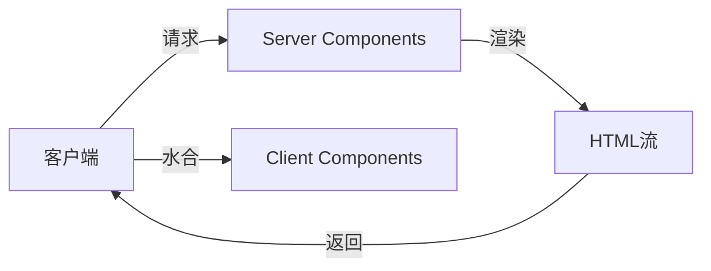
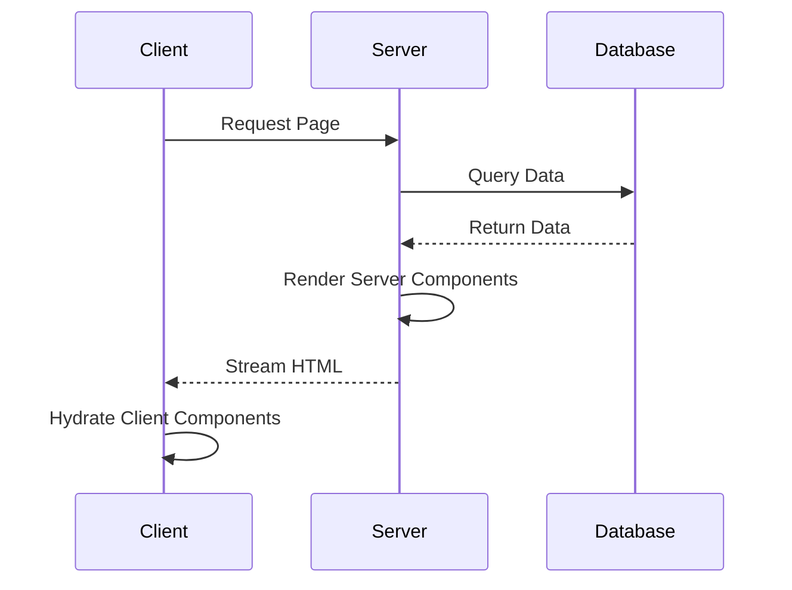

# React Server Components入门

Server Components是React的重要革新，它改变了我们构建应用的方式。

## 什么是Server Components



服务端组件在服务器上渲染，不增加客户端JavaScript体积。

## 核心概念

### 服务端组件 vs 客户端组件

$$
Bundle_{client} = ServerComponents \times 0 + ClientComponents \times Size
$$

服务端组件不会被打包到客户端！

### 示例代码

```typescript
// Server Component (默认)
// 文件：app/posts/page.tsx

async function getPosts() {
  const res = await fetch('https://api.example.com/posts', {
    cache: 'no-store',
  });
  return res.json();
}

export default async function PostsPage() {
  const posts = await getPosts();

  return (
    <main>
      <h1>文章列表</h1>
      <ul>
        {posts.map((post) => (
          <li key={post.id}>
            <article>
              <h2>{post.title}</h2>
              <p>{post.excerpt}</p>
            </article>
          </li>
        ))}
      </ul>
    </main>
  );
}
```

```typescript
// Client Component
// 文件：components/counter.tsx
'use client';

import { useState } from 'react';

export function Counter() {
  const [count, setCount] = useState(0);

  return (
    <button onClick={() => setCount((c) => c + 1)}>
      Count: {count}
    </button>
  );
}
```

## 数据获取模式



## 组合模式

| 场景 | 组件类型 | 原因 |
|------|----------|------|
| 数据展示 | Server | 直接访问后端 |
| 表单交互 | Client | 需要事件处理 |
| 状态管理 | Client | 需要useState |
| SEO页面 | Server | SEO友好 |
| 实时更新 | Client | 需要轮询/WS |

## 最佳实践

```typescript
// ✅ 好的模式：服务端组件包裹客户端组件
// app/page.tsx
import { LikeButton } from './like-button';

export default async function Page({ params }) {
  const post = await getPost(params.id);

  return (
    <article>
      <h1>{post.title}</h1>
      <p>{post.content}</p>
      <LikeButton postId={post.id} /> {/* 客户端组件 */}
    </article>
  );
}
```

## 性能对比

| 指标 | 传统CSR | Server Components |
|------|---------|-------------------|
| 首屏加载 | 慢 | 快 |
| SEO | 差 | 好 |
| 交互延迟 | 低 | 中（水合） |
| JS体积 | 大 | 小 |

## 注意事项

- [x] Server Components不能使用useState
- [x] Server Components不能使用useEffect
- [x] Server Components不能有事件处理器
- [x] Props必须是可序列化的
- [x] 'use client'指令必须放在文件顶部

> Server Components是React的未来，理解它对于构建现代Web应用至关重要。