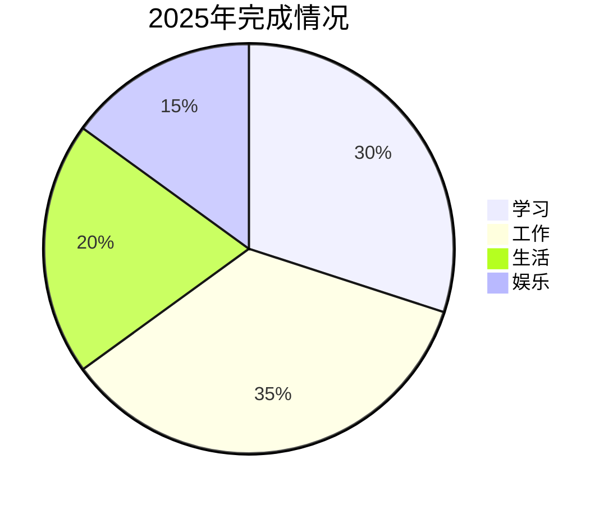

# 新年目标与回顾

新的一年，新的开始。

## 2025年回顾

### 完成的事项



### 成就解锁

| 项目 | 状态 | 感想 |
|------|------|------|
| 学习React 19 | ✅ | 框架更新真快 |
| 学会吉他基础 | ✅ | 音乐太美妙 |
| 完成10个项目 | ✅ | 实践出真知 |
| 坚持健身 | ❌ | 明年继续努力 |
| 阅读20本书 | ✅ | 收获满满 |

### 学习时长统计

每周学习时长分布：

$$
\bar{t} = \frac{1}{n} \sum_{i=1}^{n} t_i = 15 \text{ hours/week}
```

## 2026年目标

### 技术目标

- [ ] 掌握Next.js 16新特性
- [ ] 深入学习TypeScript类型体操
- [ ] 完成3个开源项目贡献
- [ ] 写20篇技术博客
- [ ] 学习Rust基础

### 生活目标

- [ ] 坚持每周健身3次
- [ ] 学会5首吉他曲目
- [ ] 阅读30本书
- [ ] 参加2次漫展
- [ ] 学会做10道菜

### 愿望清单

```
□ 看MyGO!!!!!演唱会
□ 去日本旅行
□ 换一台新电脑
□ 养一只猫
□ 拍一支Vlog
```

## 时间规划

每天的时间分配：

$$
24 = 8_{sleep} + 8_{work} + 2_{commute} + 2_{study} + 1_{exercise} + 3_{other}
$$

理想状态：

| 时段 | 活动 | 时长 |
|------|------|------|
| 6:00-7:00 | 晨练 | 1h |
| 8:00-9:00 | 通勤+播客 | 1h |
| 9:00-18:00 | 工作 | 8h |
| 19:00-20:00 | 晚餐+休息 | 1h |
| 20:00-22:00 | 学习 | 2h |
| 22:00-23:00 | 阅读 | 1h |
| 23:00-6:00 | 睡眠 | 7h |

## 心情日记

今天的心情：

```
(´▽`ʃ♡ƪ)
```

新年的第一天，阳光明媚。坐在窗边写下这些目标，内心充满期待。

> "新的一年，保持热爱，奔赴山海。"

2026，请多指教！