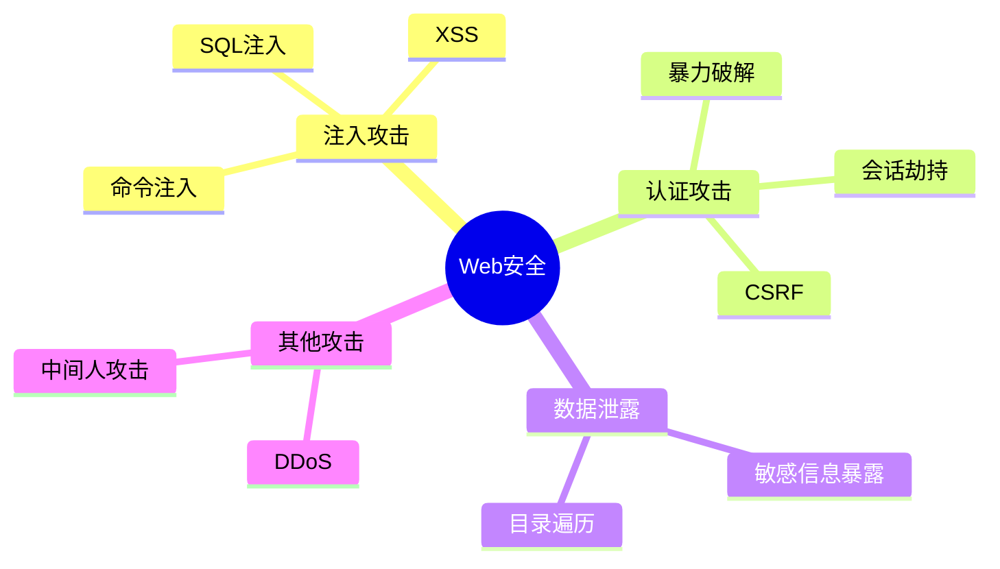

# Web安全入门指南

安全是Web开发中不可忽视的重要话题。

## 常见攻击类型



## XSS攻击

跨站脚本攻击（Cross-Site Scripting）：

$$
Attack = Inject(MaliciousScript) + Execute(Victim)
$$

### 防护示例

```typescript
import DOMPurify from 'dompurify';

// 危险！不要这样做
function dangerouslyRender(userInput: string) {
  return <div dangerouslySetInnerHTML={{ __html: userInput }} />;
}

// 安全的做法
function safelyRender(userInput: string) {
  const clean = DOMPurify.sanitize(userInput);
  return <div dangerouslySetInnerHTML={{ __html: clean }} />;
}
```

## SQL注入

攻击原理：

```sql
-- 恶意输入
username: admin'--
password: anything

-- 实际执行的SQL
SELECT * FROM users WHERE username = 'admin'--' AND password = 'anything'
```

### 防护措施

```typescript
// 危险！不要这样做
const query = `SELECT * FROM users WHERE id = ${userId}`;

// 安全：使用参数化查询
const query = 'SELECT * FROM users WHERE id = $1';
const result = await db.query(query, [userId]);
```

## CSRF攻击

跨站请求伪造防护：

```typescript
import { randomBytes } from 'crypto';

// 生成CSRF Token
function generateCsrfToken(): string {
  return randomBytes(32).toString('hex');
}

// 验证中间件
function csrfMiddleware(req, res, next) {
  const token = req.headers['x-csrf-token'];
  const sessionToken = req.session.csrfToken;

  if (!token || token !== sessionToken) {
    return res.status(403).json({ error: 'Invalid CSRF token' });
  }

  next();
}
```

## 安全检查清单

### 认证与授权

- [ ] 使用HTTPS
- [ ] 密码哈希存储（bcrypt/argon2）
- [ ] 会话管理
- [ ] 多因素认证
- [ ] 权限最小化原则

### 输入验证

- [ ] 白名单验证
- [ ] 参数化查询
- [ ] 输出编码
- [ ] 文件上传限制

### 安全头信息

```typescript
// 安全头配置
app.use((req, res, next) => {
  res.setHeader('X-Content-Type-Options', 'nosniff');
  res.setHeader('X-Frame-Options', 'DENY');
  res.setHeader('X-XSS-Protection', '1; mode=block');
  res.setHeader('Content-Security-Policy', "default-src 'self'");
  next();
});
```

## 风险评估

安全风险计算：

$$
Risk = Probability \times Impact
$$

| 漏洞等级 | 可能性 | 影响 | 优先级 |
|----------|--------|------|--------|
| 严重 | 高 | 高 | 立即修复 |
| 高危 | 中 | 高 | 尽快修复 |
| 中危 | 低 | 中 | 计划修复 |
| 低危 | 极低 | 低 | 可选修复 |

## 安全测试

```typescript
import { describe, it, expect } from 'vitest';

describe('Security Tests', () => {
  it('should sanitize XSS input', () => {
    const malicious = '<script>alert("xss")</script>';
    const clean = sanitize(malicious);
    expect(clean).not.toContain('<script>');
  });

  it('should reject SQL injection', async () => {
    const input = "admin'; DROP TABLE users;--";
    const result = await login(input, 'password');
    expect(result.success).toBe(false);
  });
});
```

> 安全是一个持续的过程，不是一次性的任务。保持学习，保持警惕。