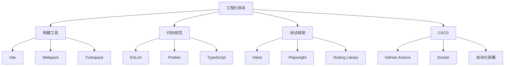

# 前端工程化实践

前端工程化是现代Web开发的基石，让我们探讨最佳实践。

## 工程化体系



## Vite配置

```typescript
import { defineConfig } from 'vite';
import react from '@vitejs/plugin-react';
import { visualizer } from 'rollup-plugin-visualizer';

export default defineConfig({
  plugins: [
    react(),
    visualizer({ open: true }),
  ],
  build: {
    rollupOptions: {
      output: {
        manualChunks: {
          vendor: ['react', 'react-dom'],
          utils: ['lodash', 'dayjs'],
        },
      },
    },
  },
  server: {
    port: 3000,
    proxy: {
      '/api': {
        target: 'http://localhost:8080',
        changeOrigin: true,
      },
    },
  },
});
```

## 构建优化

打包体积计算：

$$
Bundle_{total} = \sum_{i=1}^{n} Module_i - \sum_{j=1}^{m} Shared_j
$$

优化策略：

| 策略 | 描述 | 效果 |
|------|------|------|
| 代码分割 | 按路由拆分 | 减少首屏加载 |
| Tree Shaking | 移除死代码 | 减少体积 |
| 压缩 | 代码压缩 | 减少体积 |
| 缓存 | 长期缓存 | 加速加载 |

## ESLint配置

```javascript
// eslint.config.js
import js from '@eslint/js';
import ts from 'typescript-eslint';
import react from 'eslint-plugin-react';
import hooks from 'eslint-plugin-react-hooks';

export default ts.config(
  js.configs.recommended,
  ...ts.configs.recommended,
  {
    files: ['**/*.{ts,tsx}'],
    plugins: {
      react,
      'react-hooks': hooks,
    },
    rules: {
      'react/react-in-jsx-scope': 'off',
      'react-hooks/rules-of-hooks': 'error',
      'react-hooks/exhaustive-deps': 'warn',
    },
  }
);
```

## CI/CD流程


## GitHub Actions

```yaml
name: CI

on:
  push:
    branches: [main]
  pull_request:
    branches: [main]

jobs:
  build:
    runs-on: ubuntu-latest

    steps:
      - uses: actions/checkout@v4

      - name: Setup Node.js
        uses: actions/setup-node@v4
        with:
          node-version: '20'
          cache: 'npm'

      - name: Install dependencies
        run: npm ci

      - name: Lint
        run: npm run lint

      - name: Test
        run: npm run test

      - name: Build
        run: npm run build
```

## 代码质量指标

- [x] ESLint配置完成
- [x] Prettier格式化
- [x] TypeScript严格模式
- [x] 单元测试覆盖 >80%
- [ ] E2E测试覆盖
- [ ] 性能预算

> 工程化不是目的，而是提升效率和质量的手段。不要过度工程化，要根据项目需求选择合适的工具。