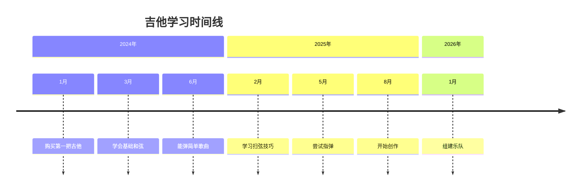

# 我的音乐学习之路

音乐是人类最美的语言，而我选择用吉他来表达自己。

## 初心

> "因为想要传达，所以歌唱。"

这句话来自MyGO!!!!!，也是我开始学习音乐的原因。

## 学习进度



## 乐理基础

### 音程计算

两个音之间的频率比：

$$
Ratio = 2^{\frac{n}{12}}
$$

其中 $n$ 是半音数量。

### 大调音阶

$$
Major = \{W, W, H, W, W, W, H\}
$$

$W$ = 全音，$H$ = 半音

## 练习计划

| 时间 | 内容 | 时长 |
|------|------|------|
| 周一 | 音阶练习 | 30min |
| 周二 | 和弦转换 | 30min |
| 周三 | 歌曲练习 | 45min |
| 周四 | 乐理学习 | 30min |
| 周五 | 自由练习 | 60min |
| 周六 | 乐队排练 | 120min |
| 周日 | 休息 | - |

## 最近学会的歌曲

- [x] 春日影 - MyGO!!!!!
- [x] 碧天伴走 - MyGO!!!!!
- [x] 青春コンプレックス - 孤独摇滚！
- [ ] 処救生 - MyGO!!!!!
- [ ] Endless Cry - Ave Mujica

## 设备清单

```
吉他：Yamaha FG800
效果器：BOSS ME-80
调音器：Snark SN-5X
琴弦：D'Addario EJ16
拨片：Dunlop Tortex .88mm
```

## 心得体会

练习时间与进步的关系：

$$
Progress = \int_{t_0}^{t_1} Practice(t) \times Focus(t) \, dt
$$

关键在于：

1. **坚持** - 每天进步一点点
2. **专注** - 质量比数量重要
3. **快乐** - 享受音乐本身

> 音乐不是竞赛，而是与自己对话的方式。

继续加油，希望能弹出更多美妙的旋律！