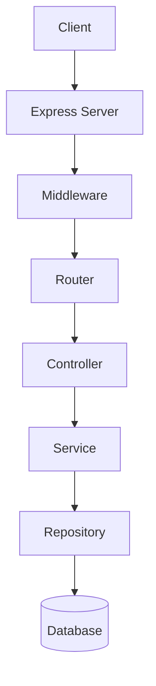
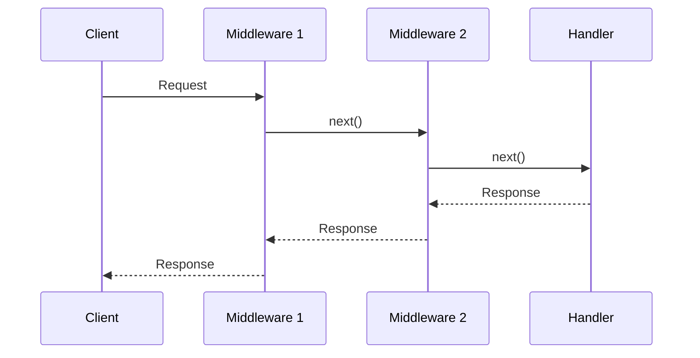

# Node.js后端开发入门

Node.js让JavaScript开发者也能写后端，全栈能力从此开始。

## 基础概念

Node.js采用事件驱动、非阻塞I/O模型：

$$
Throughput = \frac{Requests}{Time} \times Efficiency
$$

异步处理让单线程也能高效处理并发。

## Express快速入门

```typescript
import express, { Request, Response, NextFunction } from 'express';

const app = express();
const PORT = 3000;

// 中间件
app.use(express.json());

// 路由
app.get('/api/users', async (req: Request, res: Response) => {
  const users = await getUsers();
  res.json(users);
});

app.post('/api/users', async (req: Request, res: Response) => {
  const { name, email } = req.body;

  if (!name || !email) {
    return res.status(400).json({ error: 'Missing required fields' });
  }

  const user = await createUser({ name, email });
  res.status(201).json(user);
});

// 错误处理中间件
app.use((err: Error, req: Request, res: Response, next: NextFunction) => {
  console.error(err.stack);
  res.status(500).json({ error: 'Internal Server Error' });
});

app.listen(PORT, () => {
  console.log(`Server running on port ${PORT}`);
});
```

## 项目架构



## 中间件执行顺序

请求处理流程：



## 数据库连接

```typescript
import { Pool } from 'pg';

const pool = new Pool({
  host: process.env.DB_HOST,
  port: parseInt(process.env.DB_PORT || '5432'),
  database: process.env.DB_NAME,
  user: process.env.DB_USER,
  password: process.env.DB_PASSWORD,
});

export async function query<T>(sql: string, params?: unknown[]): Promise<T[]> {
  const { rows } = await pool.query(sql, params);
  return rows;
}
```

## RESTful API设计

| 方法 | 路径 | 操作 | 描述 |
|------|------|------|------|
| GET | /users | INDEX | 获取列表 |
| GET | /users/:id | SHOW | 获取详情 |
| POST | /users | CREATE | 创建资源 |
| PUT | /users/:id | UPDATE | 更新资源 |
| DELETE | /users/:id | DESTROY | 删除资源 |

## 项目结构

```
src/
├── controllers/
│   └── user.controller.ts
├── services/
│   └── user.service.ts
├── repositories/
│   └── user.repository.ts
├── routes/
│   └── user.routes.ts
├── middlewares/
│   └── auth.middleware.ts
├── models/
│   └── user.model.ts
└── app.ts
```

## 学习路线

- [x] JavaScript基础
- [x] Node.js运行时
- [x] Express框架
- [ ] 数据库操作
- [ ] 认证授权
- [ ] 测试
- [ ] 部署

> Node.js让前端开发者能够轻松进入后端领域，是全栈开发的重要一步。