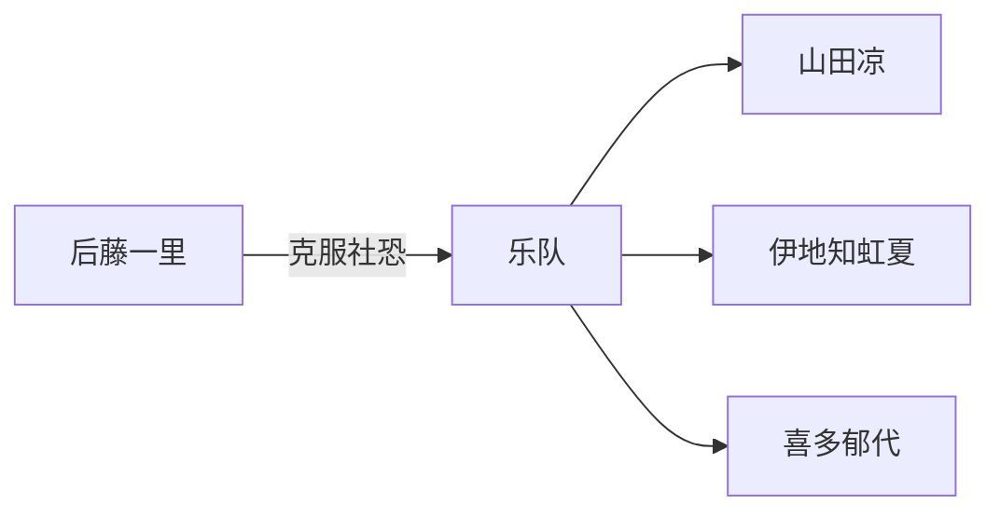

# 我的精神支柱动漫

动画不仅仅是娱乐，它们有时能成为生命中的光。

## 那些改变我的作品

### 1. 孤独摇滚！

孤独却渴望连接，社恐却热爱音乐。

小孤独的每一次成长都让我看到了自己。

> 「我不需要朋友...但我想要。」

角色关系：



### 2. BanG Dream! It's MyGO!!!!!

"为什么要组乐队？"

"因为我想要...无论多少次，我都想和你组乐队！"

情感温度公式：

$$
Emotion = \frac{Music \times Story}{Character \, Depth}
$$

### 3. 吹响吧！上低音号

青春、奋斗、不甘、成长。

## 推荐榜单

| 排名 | 作品 | 类型 | 推荐指数 |
|------|------|------|----------|
| 1 | 孤独摇滚！ | 音乐/日常 | ★★★★★ |
| 2 | MyGO!!!!! | 音乐/剧情 | ★★★★★ |
| 3 | 吹响吧！上低音号 | 音乐/青春 | ★★★★★ |
| 4 | 辉夜大小姐想让我告白 | 恋爱/喜剧 | ★★★★☆ |
| 5 | 紫罗兰永恒花园 | 剧情/治愈 | ★★★★★ |

## 收藏清单

- [x] 孤独摇滚！全卷BD
- [x] MyGO!!!!! 专辑
- [x] 吹响吧！上低音号 小说
- [ ] 京阿尼画集
- [ ] 演唱会门票

## 感动瞬间

```
┌──────────────────────────────┐
│   「私、歌いたい！！！」      │
│                              │
│   那一刻，世界都亮了起来。    │
└──────────────────────────────┘
```

## 音乐推荐

动画音乐有着特殊的力量：

$$
Healing = \int_{t_0}^{t_1} Melody(t) \times Emotion(t) \, dt
$$

推荐曲目：
- 孤独摇滚！OP：「青春コンプレックス」
- MyGO!!!!!：「春日影」
- 吹响吧！上低音号：「DREAM SOLISTER」

> 动画教会我：即使在最黑暗的时刻，也要相信前方有光。

愿我们都能找到属于自己的乐队，奏响人生的乐章！