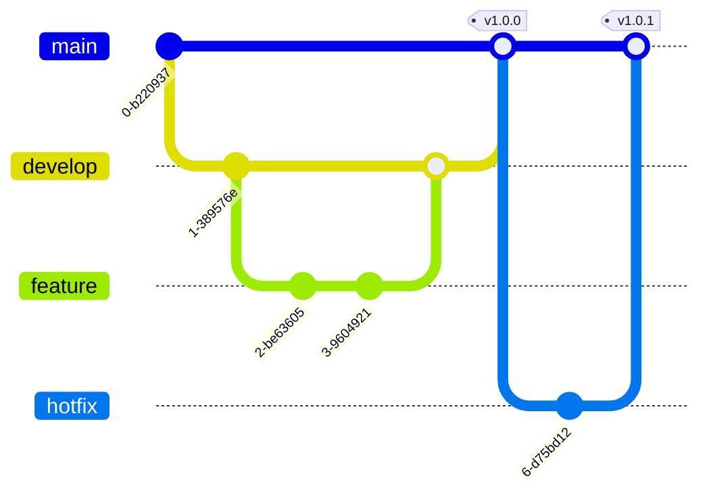
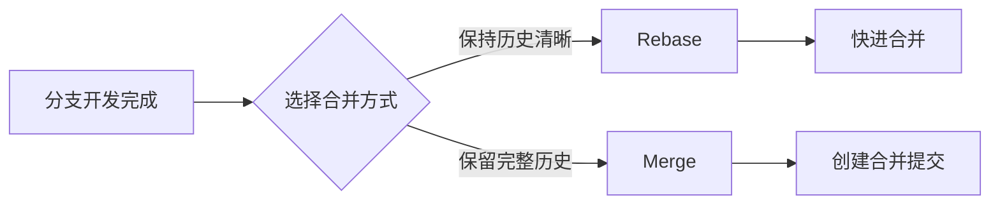

# Git工作流最佳实践

良好的Git工作流能大幅提升团队协作效率。

## 分支策略



## 提交规范

遵循Conventional Commits规范：

```
<type>(<scope>): <subject>

<body>

<footer>
```

### 类型说明

| 类型 | 描述 | 示例 |
|------|------|------|
| feat | 新功能 | feat: 添加用户登录功能 |
| fix | 修复bug | fix: 修复登录验证问题 |
| docs | 文档更新 | docs: 更新README |
| style | 代码格式 | style: 格式化代码 |
| refactor | 重构 | refactor: 重构用户模块 |
| test | 测试 | test: 添加单元测试 |
| chore | 构建/工具 | chore: 更新依赖 |

## Git Flow工作流

```bash
# 创建功能分支
git checkout develop
git checkout -b feature/user-auth

# 开发完成后合并
git checkout develop
git merge --no-ff feature/user-auth

# 准备发布
git checkout -b release/v1.0.0
# 修复问题...

# 发布到main
git checkout main
git merge --no-ff release/v1.0.0
git tag -a v1.0.0 -m "Release v1.0.0"
```

## 版本号计算

语义化版本号：

$$
Version = Major.Minor.Patch
$$

- $Major$：不兼容的API变更
- $Minor$：向后兼容的功能新增
- $Patch$：向后兼容的问题修复

## Rebase vs Merge



## 常用命令速查

```bash
# 交互式rebase
git rebase -i HEAD~3

# 撤销最后一次提交（保留更改）
git reset --soft HEAD~1

# 储藏当前更改
git stash
git stash pop

# 查看文件历史
git log --follow -p -- filename

# 挑选提交
git cherry-pick <commit-hash>
```

## 代码评审清单

- [ ] 代码风格是否一致
- [ ] 是否有足够的测试覆盖
- [ ] 提交信息是否清晰
- [ ] 是否有安全风险
- [ ] 性能是否有问题
- [ ] 文档是否更新

> 好的Git工作流是团队协作的润滑剂，能减少冲突、提高效率。