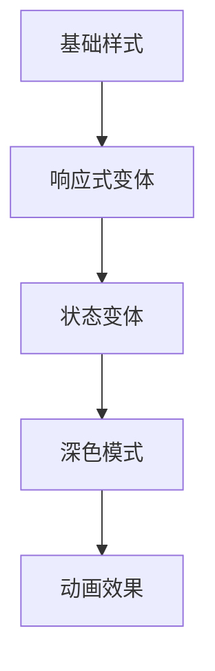

# Tailwind CSS实战技巧

Tailwind CSS让样式开发变得简单高效，本文分享一些实用技巧。

## 自定义配置

```javascript
// tailwind.config.js
/** @type {import('tailwindcss').Config} */
export default {
  content: ['./src/**/*.{js,ts,jsx,tsx}'],
  theme: {
    extend: {
      colors: {
        brand: {
          50: '#fef3f2',
          100: '#ffe4e1',
          500: '#f43f5e',
          900: '#881337',
        },
      },
      fontFamily: {
        sans: ['Inter', 'system-ui', 'sans-serif'],
        mono: ['JetBrains Mono', 'monospace'],
      },
    },
  },
  plugins: [],
};
```

## 响应式断点

断点计算公式：

$$
Breakpoint_{width} = Breakpoint_{base} + Offset
$$

| 断点 | 最小宽度 | 典型设备 |
|------|----------|----------|
| sm | 640px | 手机横屏 |
| md | 768px | 平板 |
| lg | 1024px | 笔记本 |
| xl | 1280px | 桌面 |
| 2xl | 1536px | 大屏 |

## 组件样式架构



## 实用组件示例

```tsx
import { cn } from '@/lib/utils';

interface ButtonProps {
  variant?: 'primary' | 'secondary' | 'outline';
  size?: 'sm' | 'md' | 'lg';
  children: React.ReactNode;
  className?: string;
}

export function Button({
  variant = 'primary',
  size = 'md',
  children,
  className,
}: ButtonProps) {
  const baseStyles = 'rounded-lg font-medium transition-colors';

  const variants = {
    primary: 'bg-brand-500 text-white hover:bg-brand-600',
    secondary: 'bg-gray-100 text-gray-900 hover:bg-gray-200',
    outline: 'border border-gray-300 hover:bg-gray-50',
  };

  const sizes = {
    sm: 'px-3 py-1.5 text-sm',
    md: 'px-4 py-2 text-base',
    lg: 'px-6 py-3 text-lg',
  };

  return (
    <button
      className={cn(
        baseStyles,
        variants[variant],
        sizes[size],
        className
      )}
    >
      {children}
    </button>
  );
}
```

## CSS Grid布局

Grid布局中列宽的计算：

$$
ColumnWidth = \frac{ContainerWidth - Gap \times (Columns - 1)}{Columns}
$$

示例代码：

```html
<div class="grid grid-cols-1 md:grid-cols-2 lg:grid-cols-3 gap-4">
  <!-- 卡片们 -->
</div>
```

## 深色模式

```tsx
// 使用class策略
export function ThemeToggle() {
  const [isDark, setIsDark] = useState(false);

  useEffect(() => {
    document.documentElement.classList.toggle('dark', isDark);
  }, [isDark]);

  return (
    <button onClick={() => setIsDark(!isDark)}>
      {isDark ? '☀️' : '🌙'}
    </button>
  );
}
```

## 性能优化

- [x] 启用JIT模式
- [x] 配置content路径
- [x] 清理未使用的样式
- [ ] 启用CSS压缩
- [ ] 配置缓存

> Tailwind CSS的核心理念是：约束带来的自由。通过有限的类名，反而能更快地构建界面。