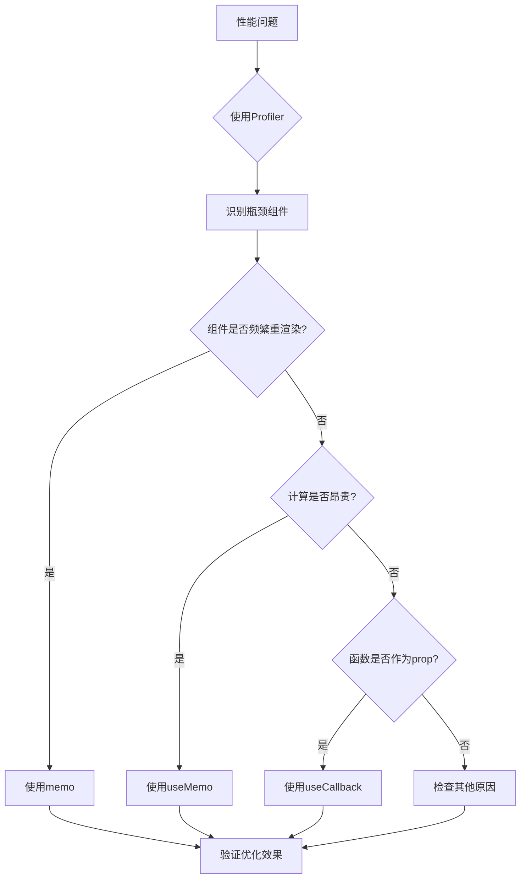

# 构建高性能React应用

React应用的性能优化是一个重要话题，让我们深入探讨。

## 性能优化策略

### 1. React.memo

```typescript
import { memo } from 'react';

interface UserCardProps {
  name: string;
  avatar: string;
}

const UserCard = memo<UserCardProps>(({ name, avatar }) => {
  console.log('UserCard render');
  return (
    <div className="user-card">
      
      <span>{name}</span>
    </div>
  );
});

UserCard.displayName = 'UserCard';

export default UserCard;
```

## 渲染复杂度分析

组件渲染的时间复杂度：

$$
T_{render} = O(n \times m)
$$

其中 $n$ 是子组件数量，$m$ 是每个子组件的props数量。

优化后的复杂度：

$$
T_{optimized} = O(1) + O(k)
$$

$k$ 是需要更新的组件数量。

## 性能分析流程



## useMemo和useCallback

```typescript
import { useMemo, useCallback } from 'react';

function ExpensiveComponent({ data, onItemClick }) {
  // 缓存计算结果
  const sortedData = useMemo(() => {
    console.log('Sorting...');
    return [...data].sort((a, b) => a.score - b.score);
  }, [data]);

  // 缓存回调函数
  const handleClick = useCallback((id: string) => {
    console.log('Clicked:', id);
    onItemClick?.(id);
  }, [onItemClick]);

  return (
    <ul>
      {sortedData.map(item => (
        <li key={item.id} onClick={() => handleClick(item.id)}>
          {item.name}: {item.score}
        </li>
      ))}
    </ul>
  );
}
```

## 性能指标对比

| 优化方法 | 适用场景 | 开销 | 收益 |
|----------|----------|------|------|
| memo | 避免不必要渲染 | 低 | 高 |
| useMemo | 昂贵计算 | 低 | 中 |
| useCallback | 函数prop传递 | 低 | 中 |
| 虚拟列表 | 大数据渲染 | 中 | 高 |

## 虚拟列表实现

```typescript
import { useRef } from 'react';

function VirtualList({ items, itemHeight = 50, visibleCount = 10 }) {
  const containerRef = useRef<HTMLDivElement>(null);

  const totalHeight = items.length * itemHeight;

  return (
    <div
      ref={containerRef}
      style={{ height: visibleCount * itemHeight, overflow: 'auto' }}
    >
      <div style={{ height: totalHeight, position: 'relative' }}>
        {/* 只渲染可见项 */}
      </div>
    </div>
  );
}
```

## 检查清单

- [ ] 使用React DevTools Profiler分析性能
- [ ] 为列表项添加正确的key
- [ ] 避免内联对象和函数
- [ ] 使用memo包裹纯组件
- [ ] 懒加载非关键组件

> 记住：过早优化是万恶之源。先测量，后优化。

参考链接：[React官方性能优化指南](https://react.dev/learn/render-and-commit)