# 程序员的日常生活

今天是一个普通的工作日，让我记录下这充实的一天。

## 早晨

早上7点起床，习惯性地先看一眼手机。

```
08:00 - 起床
08:30 - 出门
09:00 - 到达公司
```

## 工作日程

```mermaid
gantt
    title 今日工作安排
    dateFormat HH:mm
    section 开发
    代码评审     :09:00, 1h
    功能开发     :10:00, 3h
    section 会议
    站会         :14:00, 30m
    需求评审     :15:00, 1h
    section 其他
    文档编写     :16:00, 2h
```



## 编码效率公式

一天的有效编码时间：

$$
T_{effective} = T_{total} - T_{meetings} - T_{interruptions}
$$

根据帕累托原则：

$$
P = \frac{80}{20} = 4
$$

80%的产出来自20%的时间投入！

## 今日完成的任务

- [x] 修复登录页bug
- [x] 完成用户模块单元测试
- [x] 代码评审
- [ ] 优化数据库查询
- [ ] 编写技术文档

## 代码片段

今天写的一段小代码：

```python
def calculate_productivity(tasks: list, hours: float) -> float:
    """
    计算工作效率
    """
    if hours <= 0:
        return 0.0
    completed = sum(1 for t in tasks if t.done)
    return completed / hours

# 使用
tasks = [
    {'name': 'fix-bug', 'done': True},
    {'name': 'write-test', 'done': True},
    {'name': 'review-code', 'done': True},
]
efficiency = calculate_productivity(tasks, 8)
print(f"效率: {efficiency:.2f} tasks/hour")
```

## 午餐

中午和同事一起吃了日料，寿司很不错！

## 晚间

晚上回家后：

| 时间 | 活动 |
|------|------|
| 19:00 | 晚餐 |
| 20:00 | 看番 |
| 21:00 | 学习新技术 |
| 22:00 | 写博客 |
| 23:00 | 睡觉 |

> 生活不止眼前的代码，还有诗和远方。

晚安，明天继续加油！