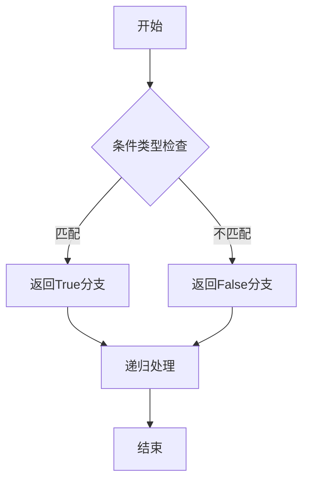

# TypeScript高级类型体操指南

TypeScript的类型系统是图灵完备的，我们可以用它实现复杂的类型推导。

## 条件类型

条件类型的基本语法：

```typescript
type IsString = T extends string ? true : false;

// 使用示例
type A = IsString<string>; // true
type B = IsString<number>; // false
```

## 类型数学

让我们用类型来实现斐波那契数列：

$$
F_n = F_{n-1} + F_{n-2}
$$

其中 $F_0 = 0$，$F_1 = 1$。

类型实现：

```typescript
type Fib<N extends number> = N extends 0
  ? 0
  : N extends 1
  ? 1
  : Add<Fib<Sub<N, 1>>, Fib<Sub<N, 2>>>;
```

## 流程图



## 映射类型

```typescript
// 将所有属性变为可选
type MyPartial = {
  [K in keyof T]?: T[K];
};

// 将所有属性变为只读
type MyReadonly = {
  readonly [K in keyof T]: T[K];
};

// 深层只读
type DeepReadonly = {
  readonly [K in keyof T]: T[K] extends object
    ? DeepReadonly<T[K]>
    : T[K];
};
```

## 实用工具类型

| 工具类型 | 作用 | 示例 |
|----------|------|------|
| `Pick` | 选取属性 | `Pick<User, 'name'>` |
| `Omit` | 排除属性 | `Omit<User, 'password'>` |
| `Record` | 构造对象 | `Record<string, number>` |
| `Infer` | 类型推断 | `ReturnType<Func>` |

## 模板字面量类型

```typescript
type EventName = `on${Capitalize<string>}`;
// "onClick" | "onChange" | "onHover" ...

type Getters = {
  [K in keyof T as `get${Capitalize<string & K>}`]: () => T[K];
};

interface Person {
  name: string;
  age: number;
}

type PersonGetters = Getters<Person>;
// { getName: () => string; getAge: () => number; }
```

## 递归类型练习

实现一个类型，将对象的键转换为蛇形命名：

```typescript
type CamelToSnake<S extends string> =
  S extends `${infer C}${infer R}`
    ? C extends Uppercase<C>
      ? `_${Lowercase<C>}${CamelToSnake<R>}`
      : `${C}${CamelToSnake<R>}`
    : S;

type SnakeCase = {
  [K in keyof T as CamelToSnake<string & K>]: T[K];
};
```

## 学习建议

- [x] 理解基础类型
- [x] 掌握泛型
- [ ] 学习条件类型
- [ ] 练习映射类型
- [ ] 研究内置工具类型

> 提示：类型体操需要大量练习，建议从简单例子开始逐步深入。