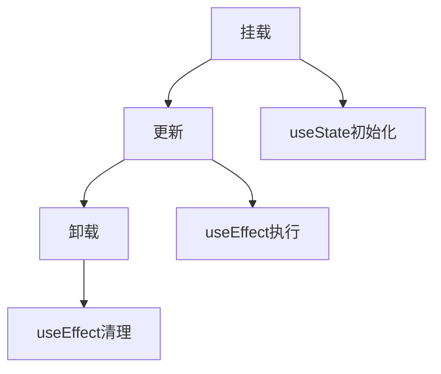

# 深入理解React Hooks原理

React Hooks是React 16.8引入的重要特性，它让我们在函数组件中使用state和其他React特性。

## useState的实现原理

useState内部使用闭包来保存状态。当我们调用useState时：

```javascript
let state = null;
function useState(initialValue) {
  state = state || initialValue;
  const setState = (newValue) => {
    state = newValue;
    render();
  };
  return [state, setState];
}
```

## 数学公式示例

React的协调算法时间复杂度为：

$$
O(n)
$$

其中n是组件树中节点的数量。

Fiber节点的更新过程可以用以下公式描述：

$$
workInProgress = current.alternate
$$

## 组件生命周期



## 代码示例

```typescript
import { useState, useEffect } from 'react';

interface CounterProps {
  initialCount?: number;
}

function Counter({ initialCount = 0 }: CounterProps) {
  const [count, setCount] = useState(initialCount);

  useEffect(() => {
    document.title = `Count: ${count}`;
    return () => {
      document.title = 'React App';
    };
  }, [count]);

  return (
    <button onClick={() => setCount(c => c + 1)}>
      Count: {count}
    </button>
  );
}

export default Counter;
```

## 总结

Hooks让我们在不编写class的情况下使用state，使代码更加简洁和可复用。

- 优点1：逻辑复用更简单
- 优点2：代码组织更清晰
- 优点3：this指向问题不再存在

> 注意：Hooks只能在函数组件的顶层调用，不能在循环、条件或嵌套函数中调用。

| Hook | 用途 |
|------|------|
| useState | 状态管理 |
| useEffect | 副作用处理 |
| useContext | 上下文消费 |
| useMemo | 计算缓存 |